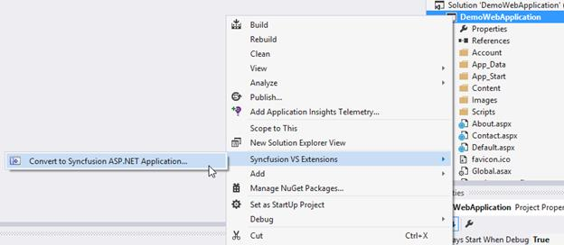
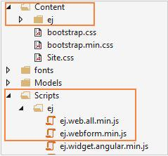
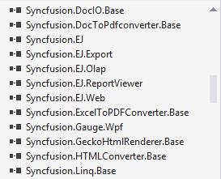

# Syncfusion Project Conversion  

Syncfusion Project Conversion is a Visual Studio add-in that converts an existing ASP.NET project into a Syncfusion ASP.NET Project by adding the required assemblies and resource files.

**Important****:** The Syncfusion ASP.NET Web Application Project Conversion utility is available from v13.1.0.30. 

## Convert into Syncfusion ASP.NET project 

The following steps help you use the Syncfusion Project Conversion in the existing ASP.NET Project.

<table>
<tr>
<td>
1. Open an existing Microsoft ASP.NET Project or create a new Microsoft ASP.NET Project. 2. Right-click on **Project** from Solution Explorer and select **Syncfusion** **VS** **Extensions** and choose the **Convert** **to** **Syncfusion** **ASP****.****NET** **Application**. Refer the following screenshot for more information. </td></tr>
</table>

3. Project Conversion Wizard opens so that you can configure the project. 

Choose the assembly location:

<table>
<tr>
<td>
i. Added From GAC - Refer the assemblies from the Global Assembly Cache  ii. Added from Installed Location - Refer the assemblies from the Syncfusion Installed locations.  </td></tr>
</table>
1. Click the **Next** button to choose the required controls from the Wizard as follows. Click the **Convert** button to convert it into a Syncfusion Project.

2. The required Syncfusion Reference Assemblies, Scripts and CSS are included in the ASP.NET Project. Refer the following screenshots for more information.

