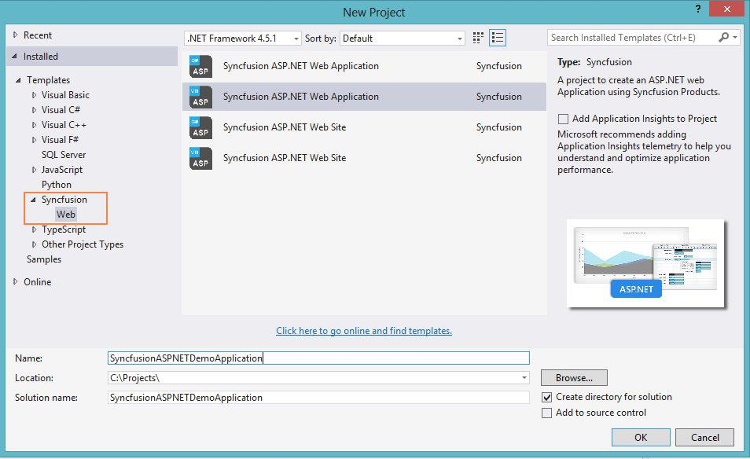
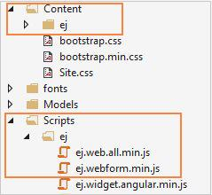

# Syncfusion Project Templates

Syncfusion provides the **Visual** **Studio** **Project** **Templates** for the Syncfusion ASP.NET platform to create Syncfusion ASP.NET Web Application or Syncfusion ASP.NET Web Site. 

**Important****:** The Syncfusion ASP.NET Website templates are available from v12.2.0.36 and the Syncfusion ASP.NET Web Application templates are available from v13.3.0.7. 

## Create Syncfusion ASP.NET Project

The following steps help you create the **Syncfusion** **ASP****.****NET** **project** via the **Visual** **Studio** **Project** **Template**.

1. To create a Syncfusion ASP.NET project, choose **New** **Project****->** **Syncfusion****->****Web****->****Syncfusion** **ASP****.****NET** **Web** **Application** **or** **Syncfusion** **ASP****.****NET** **Web** **Site** from **Visual** **Studio**.

<table>
<tr>
<td>
2. Name the **Project**, choose the destination location if required and set the Framework of the project then click **OK**.  **Note**: Minimum target Framework is 4.0 for Syncfusion ASP.NET project Templates.  3. Once OK button is clicked, the Syncfusion ASP.NET WebSite/ Web Applicaiton project is created. 4. Syncfusion references, Scripts, CSS and required Web.config entries are added to the Project. </td></tr>
<tr>
<td>
   </td></tr>
</table>

