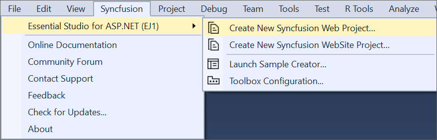
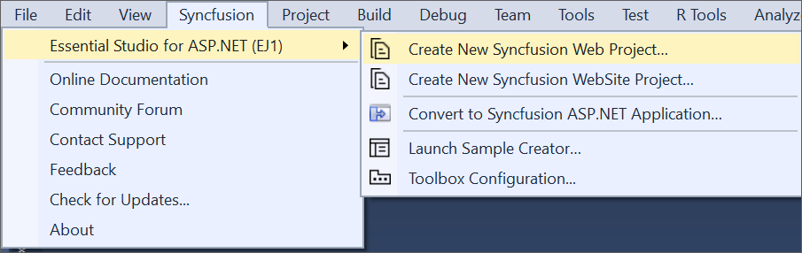
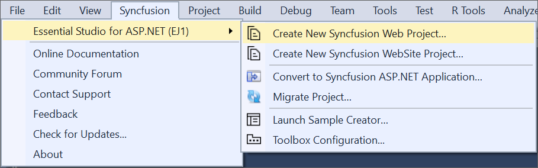

# ASP.NET Extension

## Overview

The Syncfusion® ASP.NET (Essential® JS 1) Visual Studio Extensions can be accessed through the Syncfusion® Menu to create and configure the project with Syncfusion® references in Visual Studio. The Syncfusion® ASP.NET Extensions supports Microsoft Visual Studio 2010 or higher.

I> The Syncfusion® ASP.NET (Essential® JS 1) menu option is available from v17.1.0.32.

The Syncfusion® provides the following extension supports in Visual Studio:

1.	[Syncfusion® ASP.NET (Essential® JS 1) Project Template](https://help.syncfusion.com/extension/aspnet-extension/syncfusion-project-templates): To create the Syncfusion® ASP.NET (Essential® JS 1) WebSite or Web application by adding the required Syncfusion® references, Scripts, CSS, and Web.config entries.
2.	[Project Conversion](https://help.syncfusion.com/extension/aspnet-extension/project-conversion): To convert an existing ASP.NET WebSite or Web application into the Syncfusion® ASP.NET (Essential® JS 1) WebSite or Web application by adding the required Syncfusion® assemblies and resource files.
3.	[Migrate Project](https://help.syncfusion.com/extension/aspnet-extension/project-migration): Migrate the existing Syncfusion® ASP.NET WebSite or Web Application from one Essential Studio® version to another version.
4.	[Sample Creator](https://help.syncfusion.com/extension/aspnet-extension/sample-creator): Create the Syncfusion® ASP.NET (Essential® JS 1) WebSite or Web application projects with the required Syncfusion® configuration to start development with the required Syncfusion® controls.
5.	[Troubleshooter](https://help.syncfusion.com/extension/syncfusion-troubleshooter/syncfusion-troubleshooter): Troubleshoot the project with the Syncfusion® configuration and apply the fix like, wrong Framework Syncfusion® assembly added to the project or missing any Syncfusion® dependent assembly of a referred assembly.
6.	[Toolbox Configuration](https://help.syncfusion.com/common/essential-studio/utilities#toolbox-configuration): To configure the Syncfusion® controls into the Visual Studio .NET toolbox.

**No project selected in Visual Studio**

**Selected Microsoft ASP.NET WebSite or Web application in Visual Studio**

**Selected Syncfusion® ASP.NET (Essential® JS1) WebSite or Web application in Visual Studio**

N> In Visual Studio 2019, Syncfusion® menu available under Extension in Visual Studio menu.

The Syncfusion® ASP.NET Visual Studio Extensions are installed along with the following setups,

* Essential Studio® for Enterprise Edition with the platform ASP.NET
* Essential Studio® for ASP.NET

