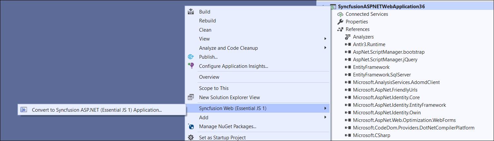
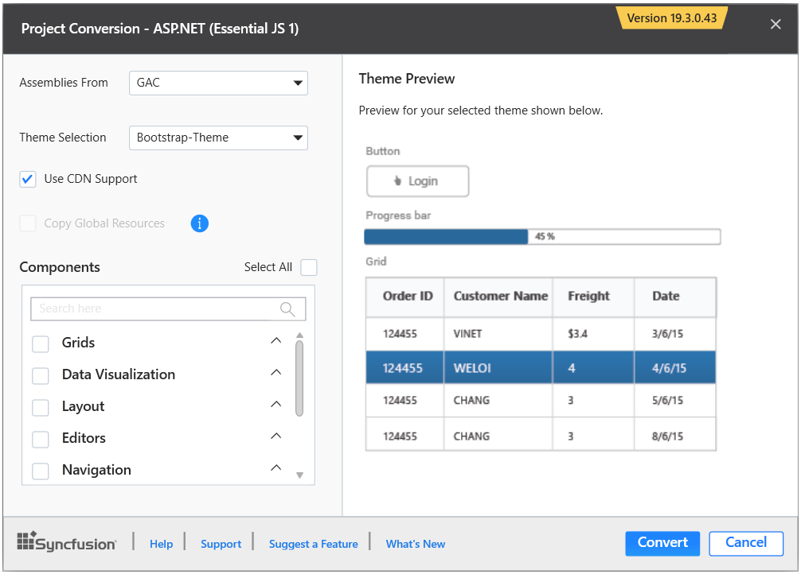
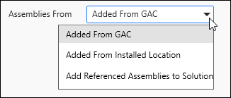
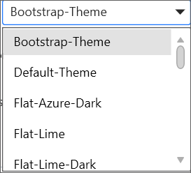
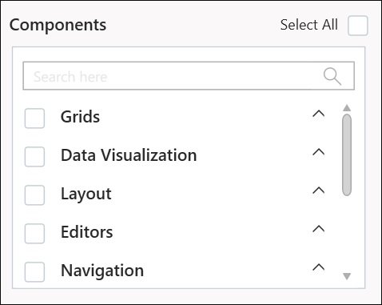
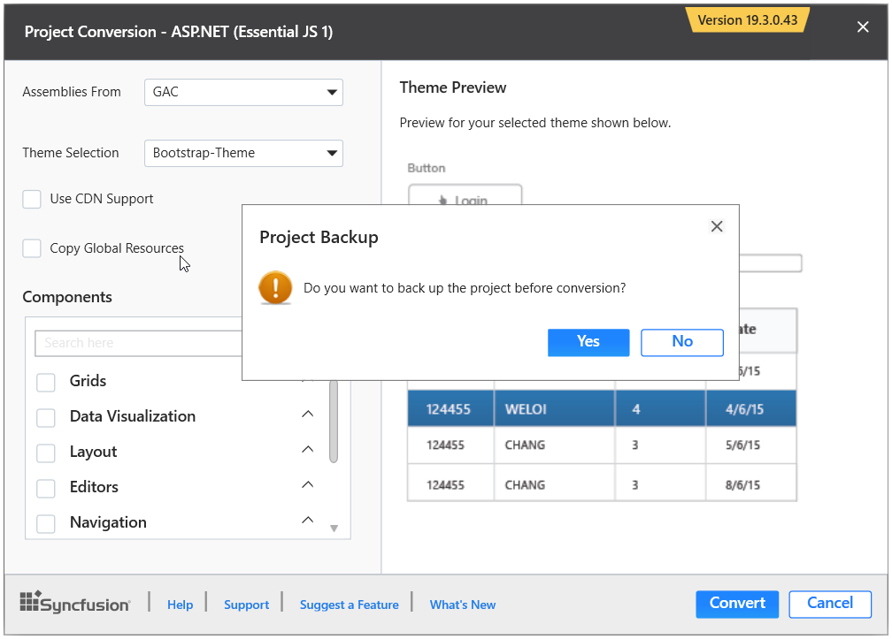
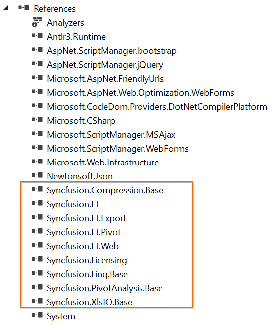
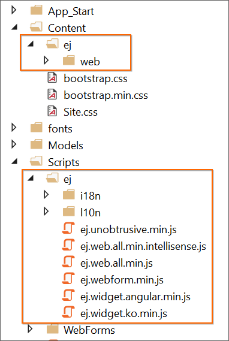
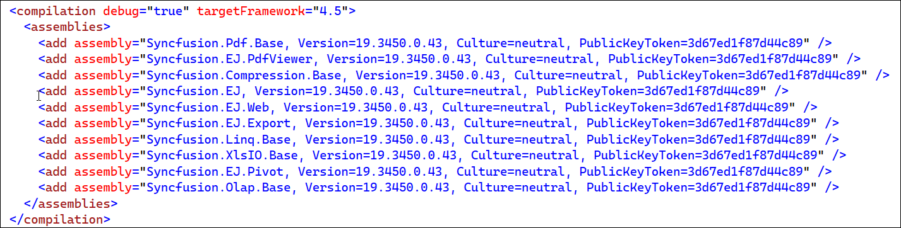

# Converting ASP.NET application to  Syncfusion&reg;   ASP.NET application

The  Syncfusion&reg;   project conversion add-in for Visual Studio converts an existing ASP.NET application into the  Syncfusion&reg;   ASP.NET (Essential JS 1) application by adding the necessary assemblies and resource files.

I> The  Syncfusion&reg;   ASP.NET Web Application Project Conversion utility is available beginning with v13.1.0.30.

The following steps will assist you to use the  Syncfusion&reg;   Project conversion in your existing ASP.NET application:

> Before use, the  Syncfusion&reg;   ASP.NET Web Forms Project Conversion, check whether the **ASP.NET Web Forms Extensions -  Syncfusion&reg;  ** installed or not in Visual Studio Extension Manager by clicking on the Tools -> Extensions and Updates -> Installed for Visual Studio 2017 or lower and for Visual Studio 2019 by clicking on the Extensions -> Manage Extensions -> Installed. Also, check whether the corresponding Essential Studio&reg;  version build installed or not. If the Essential Studio&reg;  version is not same for both the Extension and build, then the Project Conversion will not be shown.

1. Open an existing Microsoft ASP.NET Project or create a new Microsoft ASP.NET Project.

2. Open the conversion dialog by selecting one of the following options: 

   **Option 1**  
   Click ** Syncfusion&reg;   Menu** and choose **Essential Studio for ASP.NET Web Forms (EJ1) > Convert to  Syncfusion&reg;   ASP.NET Application…** in **Visual Studio**.

   

   N> In Visual Studio 2019,  Syncfusion&reg;   menu is available under Extensions in Visual Studio menu.

   **Option 2**   
   Right-click the Project from Solution Explorer, select ** Syncfusion&reg;   Web (Essential JS 1)**, and choose the **Convert to  Syncfusion&reg;   ASP.NET (Essential JS 1) Application...** Refer to the following screenshot for more information.

   

3. The Project Conversion Wizard appears, allowing you to configure the project.

   

   The following configurations are used in the Project Conversion wizard:

   **Assemblies From:** Choose the assembly location, from where the assembly will be added to the project.
   
   
   
   **Choose the Theme:** Based on the theme chosen, the project's master page will be updated. The Theme Preview section displays a preview of the components before converting them into a  Syncfusion&reg;   project.
   
   

   **Choose CDN Support:** The project's master page will be updated based on the required  Syncfusion&reg;   CDN links.

   
 
   **Copy Global Resources:** If you select the Copy Global Resources option, the  Syncfusion&reg;   localization culture files will be shipped to the project from the Installed Location.

      

   N> Copy Global Resources option will disable when choose the CDN option.

   **Components:** Choose the required components.

   

4. When you click the **Convert** button, the **Project Backup** dialog will appear. If you click **Yes** in the dialog, it will backup the current project before converting it to a  Syncfusion&reg;   project. If you choose **No**, the project will be converted to a  Syncfusion&reg;   project without a backup.

   

5. The necessary  Syncfusion&reg;   Assembly references, Scripts, and CSS, as well as the necessary Web.config entries, have been added to the project.

    

   

   

6. If you installed the trial setup or NuGet packages from nuget.org you must register the  Syncfusion&reg;   license key to your project since  Syncfusion&reg;   introduced the licensing system from 2018 Volume 2 (v16.2.0.41) Essential Studio&reg;  release. Navigate to the [help topic](https://help.syncfusion.com/common/essential-studio/licensing/license-key#how-to-generate-syncfusion-license-key) to generate and register the  Syncfusion&reg;   license key to your project. Refer to this [blog](https://blog.syncfusion.com/post/Whats-New-in-2018-Volume-2-Licensing-Changes-in-the-1620x-Version-of-Essential-Studio.aspx?_ga=2.11237684.1233358434.1587355730-230058891.1567654773) post for understanding the licensing changes introduced in Essential Studio&reg;.