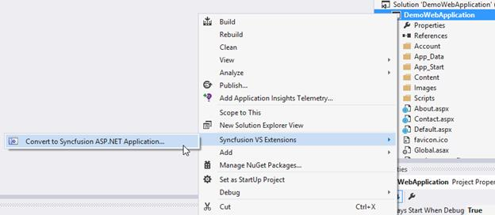
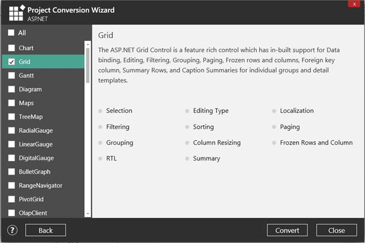
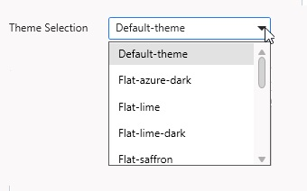

# Syncfusion Project Conversion  

Syncfusion Project Conversion is a Visual Studio add-in that converts an existing ASP.NET project into a Syncfusion ASP.NET Project by adding the required assemblies and resource files.

I> The Syncfusion ASP.NET Web Application Project Conversion utility is available from v13.1.0.30. 

## Convert into Syncfusion ASP.NET Project 

The following steps direct you to use the Syncfusion Project Conversion in the existing ASP.NET Project.

1. Open an existing Microsoft ASP.NET Project or create a new Microsoft ASP.NET Project.
2. Right-click on **Project** from Solution Explorer and select **Syncfusion VS Extensions** and choose the **Convert to Syncfusion ASP.NET Application**. Refer to the following screenshot for more information.

   

3. Project Conversion Wizard opens to configure the project.

   

   Choose the assembly location:

   i. Added From GAC - Refer to the assemblies from Global Assembly Cache. 

   ii. Added from Installed Location - Refer to the assemblies from Syncfusion Installed locations.

4. Click the **Next** button to choose the required controls from Wizard as follows. Click the **Convert** button to convert it into a Syncfusion Project.

   

5. The required Syncfusion Reference Assemblies, Scripts and CSS are included in the ASP.NET Project. Refer to the following screenshots for more information.

   

   

   

## Rendering Control after Syncfusion ASP.NET Conversion

Once you converted your ASP.NET Project to Syncfusion ASP.NET Project using Syncfusion Visual Studio Extension, Perform the following steps to render the Syncfusion controls to your project.
1. The CSS, Scripts, Syncfusion References and required Web.config file entries are added to your project by the Syncfusion ASP.NET Conversion.  

2. Add the required CSS and Script files references in master page (Site.Master file) of the project. Please refer to the below screenshot for more information.

   
   
3. Now, include the Syncfusion controls to your project. Refer the following screenshot for more information.

   

4. Run the project and the following output will be displayed.

   