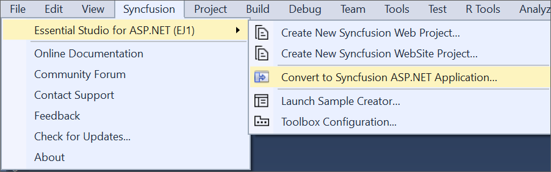
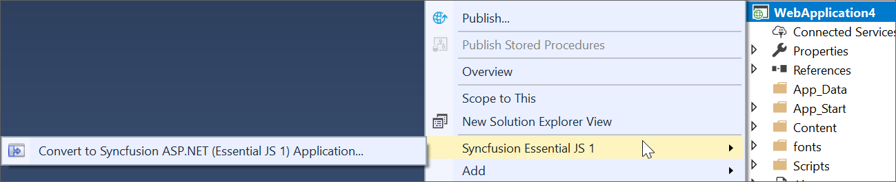
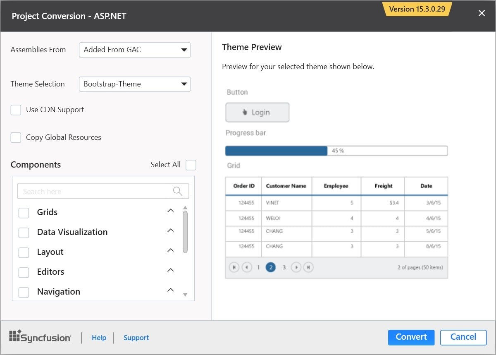
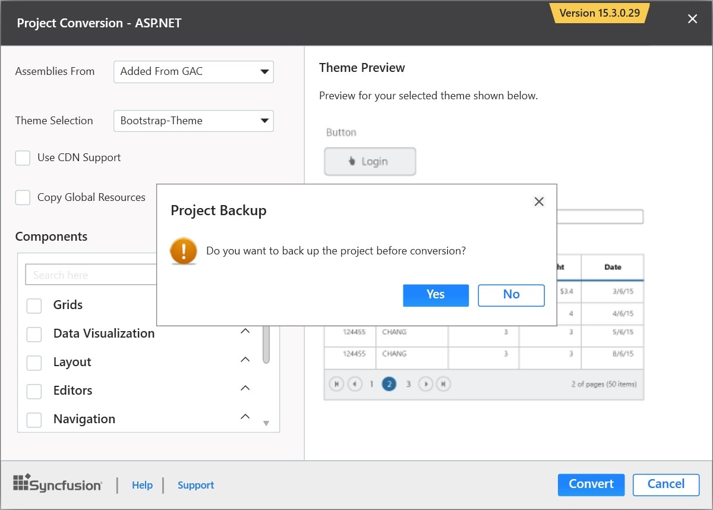
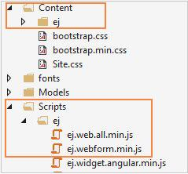
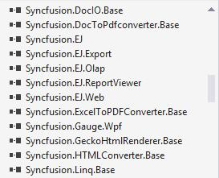

# Syncfusion Project Conversion  

Syncfusion Project Conversion is a Visual Studio add-in that converts an existing ASP.NET project into a Syncfusion ASP.NET Project by adding the required assemblies and resource files.

I> The Syncfusion ASP.NET Web Application Project Conversion utility is available from v13.1.0.30. 

## Convert into Syncfusion ASP.NET Project 

The following steps help you to use the Syncfusion Project Conversion in the existing ASP.NET Project.

> Before use, the Syncfusion ASP.NET Web Forms Project Conversion, check whether the **ASP.NET Web Forms Extensions - Syncfusion** installed or not in Visual Studio Extension Manager by clicking on the Tools -> Extensions and Updates -> Installed for Visual Studio 2017 or lower and for Visual Studio 2019 by clicking on the Extensions -> Manage Extensions -> Installed. Also, check whether the corresponding Essential Studio version build installed or not. If the Essential Studio version is not same for both the Extension and build, then the Project Conversion will not be shown.

1. Open an existing Microsoft ASP.NET Project or create a new Microsoft ASP.NET Project.

2. To open Project Conversion Wizard, follow either one of the options below: 

   **Option 1:**  
   Click **Syncfusion Menu** and choose **Essential Studio for ASP.NET (EJ1) > Convert to Syncfusion ASP.NET Application…** in **Visual Studio**.

   

   N> In Visual Studio 2019, Syncfusion menu available under Extension in Visual Studio menu.

   **Option 2:**   
   Right-click the Project from Solution Explorer, select **Syncfusion Essential JS 1**, and choose the **Convert to Syncfusion ASP.NET (Essential JS 1) Application...** Refer to the following screenshot for more information.

   

3. Project Conversion Wizard opens to configure the project.

   

   Choose the assembly location:

   * Added From GAC - Refer to the assemblies from Global Assembly Cache. 

   * Added from Installed Location - Refer to the assemblies from Syncfusion Installed locations.

   * Add Referenced Assemblies to Solution - Copy and refer to the assemblies from project's solution file lib directory.     
   
   
   
   Choose the Theme:
   
   The master page of project will be updated based on selected theme. The Theme Preview section shows the controls preview before convert into a Syncfusion project
   
   

   Choose CDN Support:

   The master page of the project will be updated based on required Syncfusion CDN links.

   
 
   Choose Copy Global Resources: 
    
   The localization culture files will be shipped into Scripts\ej\i18n directory of the project.

      

4. Choose the required controls from Components section and Click the **Convert** button to convert it into a Syncfusion Project.

   
   
   The **Project Backup** dialog will be opened. If click Yes it will backup the current project before converting it to Syncfusion project. If click No it will convert the project to Syncfusion project without backup. 
   
   

5. The required Syncfusion Reference Assemblies, Scripts and CSS are included in the ASP.NET Project. Refer to the following screenshots for more information.

   

   

   

6. If you installed the trial setup or NuGet packages from nuget.org you have to register the Syncfusion license key to your project since Syncfusion introduced the licensing system from 2018 Volume 2 (v16.2.0.41) Essential Studio release. Navigate to the [help topic](https://help.syncfusion.com/common/essential-studio/licensing/license-key#how-to-generate-syncfusion-license-key) to generate and register the Syncfusion license key to your project. Refer to this [blog](https://blog.syncfusion.com/post/Whats-New-in-2018-Volume-2-Licensing-Changes-in-the-1620x-Version-of-Essential-Studio.aspx?_ga=2.11237684.1233358434.1587355730-230058891.1567654773) post for understanding the licensing changes introduced in Essential Studio.

## Rendering Control after Syncfusion ASP.NET Conversion

Once you converted your ASP.NET Project to Syncfusion ASP.NET Project using Syncfusion Visual Studio Extension, Perform the following steps to render the Syncfusion controls to your project.
1. The CSS, Scripts, Syncfusion References and required Web.config file entries are added to your project by the Syncfusion ASP.NET Conversion.  

2. Add the required CSS and Script files references in master page (Site.Master file) of the project. Please refer to the below screenshot for more information.

   
   
3. Now, include the Syncfusion controls to your project. Refer the following screenshot for more information.

   

4. Run the project and the following output will be displayed.

   