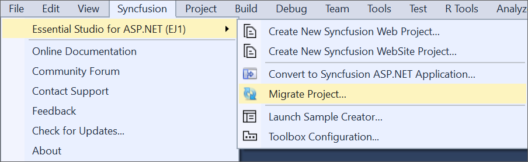
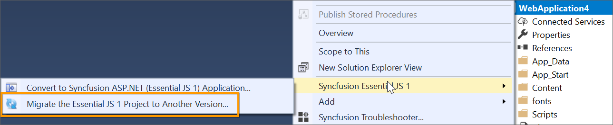
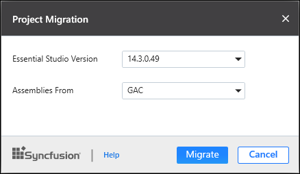

# Syncfusion Project Migration

Syncfusion Project Migration is a Visual Studio add-in that allows you to migrate the existing Syncfusion ASP.NET project from one Essential Studio version to another version.

I> The Syncfusion ASP.NET Web Application Project Migration utility is available from v13.1.0.30. 

## Migrate Syncfusion Project 

The following steps help you to migrate your existing Syncfusion ASP.NET application.

> Before use, the Syncfusion ASP.NET Web Forms Project Migration, check whether the **ASP.NET Web Forms Extensions - Syncfusion** installed or not in Visual Studio Extension Manager by clicking on the Tools -> Extensions and Updates -> Installed for Visual Studio 2017 or lower and for Visual Studio 2019 by clicking on the Extensions -> Manage Extensions -> Installed. Also, check whether the corresponding Essential Studio version build installed or not. If the Essential Studio version is not same for both the Extension and build, then the Project Migration will not be shown.

1. To open Migration Wizard, follow either one of the options below: 

   **Option 1:**   
   Click **Syncfusion Menu** and choose **Essential Studio for ASP.NET (EJ1) > Migrate Project…** in **Visual Studio**.

   

   N> In Visual Studio 2019, Syncfusion menu available under Extension in Visual Studio menu.

   **Option 2:**  
   Right-click the **Syncfusion ASP.NET Application** from Solution Explorer and select **Syncfusion Essential JS 1**. Choose **Migrate the Essential JS 1 Project to Another version…**

   

2. The **Project Migration** window appears. You can choose the required Essential Studio version that is installed in the machine. 

   

3. The **Project Migration** window allows you to configure the following options:

   i. **Essential Studio Version:** Select any version from the list of installed versions.
   
   ii. **Assemblies From:** Choose the assembly location from where it is going to be added to the project.
   
4. Click the Migrate Button. The **Project Backup** dialog will be opened. If click Yes it will backup the current project before migrate the Syncfusion project. If click No it will migrate the project to required Syncfusion version without backup
   
   
   
   
5. The Syncfusion Reference Assemblies, Scripts and CSS are updated to the corresponding version in the project.

6. If you installed the trial setup or NuGet packages from nuget.org you have to register the Syncfusion license key to your project since Syncfusion introduced the licensing system from 2018 Volume 2 (v16.2.0.41) Essential Studio release. Navigate to the [help topic](https://help.syncfusion.com/common/essential-studio/licensing/license-key#how-to-generate-syncfusion-license-key) to generate and register the Syncfusion license key to your project. Refer to this [blog](https://blog.syncfusion.com/post/Whats-New-in-2018-Volume-2-Licensing-Changes-in-the-1620x-Version-of-Essential-Studio.aspx?_ga=2.11237684.1233358434.1587355730-230058891.1567654773) post for understanding the licensing changes introduced in Essential Studio.