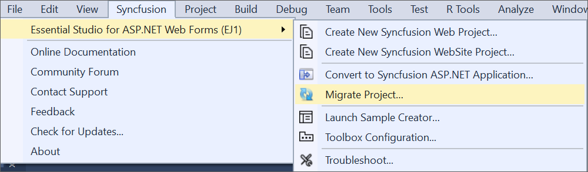
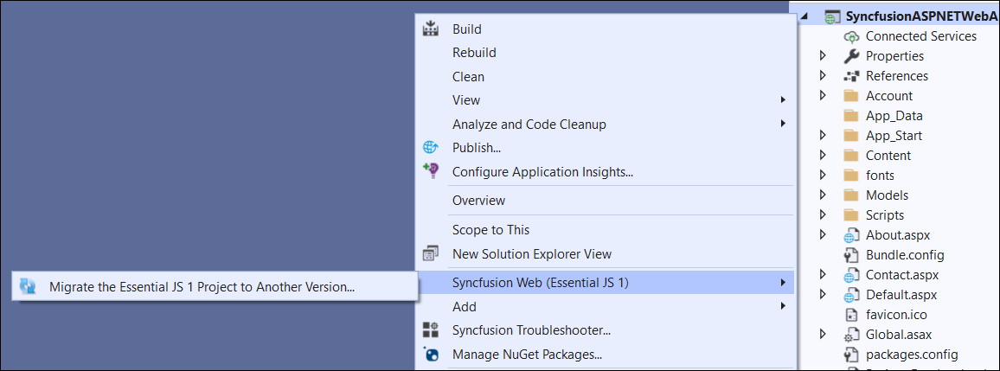
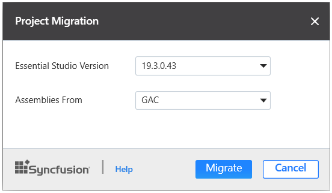
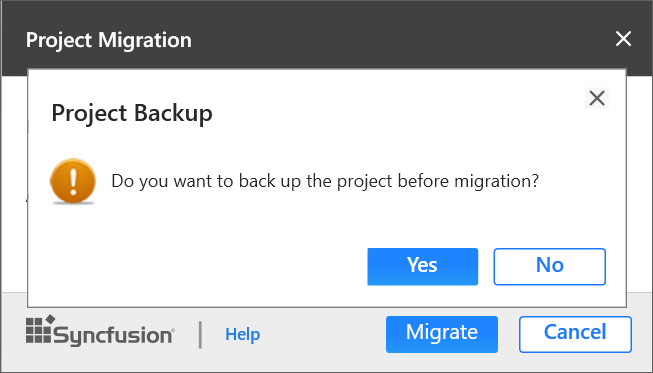

# Upgrading Syncfusion&reg; ASP.NET application to latest version

The Syncfusion&reg; ASP.NET migration add-in for Visual Studio allows you to migrate an existing Syncfusion&reg; ASP.NET application from one version of Essential Studio&reg; version to another version. This reduces the amount of manual work required when migrating the Syncfusion&reg; version.

I> The Syncfusion&reg; ASP.NET Web Application Project Migration utility is available beginning with v13.1.0.30.

To migrate you’re existing Syncfusion&reg; ASP.NET application, follow the steps below.

> Before use, the Syncfusion&reg; ASP.NET Web Forms Project Migration, check whether the **ASP.NET Web Forms Extensions - Syncfusion&reg;** installed or not in Visual Studio Extension Manager by clicking on the Tools -> Extensions and Updates -> Installed for Visual Studio 2017 or lower and for Visual Studio 2019 by clicking on the Extensions -> Manage Extensions -> Installed. Also, check whether the corresponding Essential Studio&reg; version build installed or not. If the Essential Studio&reg; version is not same for both the Extension and build, then the Project Migration will not be shown.

1. To launch Migration Wizard, select one of the following options:

   **Option 1**   
   Click **Syncfusion&reg; Menu** and choose **Essential Studio&reg; for ASP.NET Web Forms (EJ1) > Migrate Project…** in **Visual Studio**.

   

   N> From Visual Studio 2019, Syncfusion&reg; menu is available under Extensions in Visual Studio menu.

   **Option 2**  
   Right-click the **Syncfusion&reg; ASP.NET Application** from Solution Explorer and select **Syncfusion&reg; Web (Essential&reg; JS 1)**. Choose **Migrate the Essential&reg; JS 1 Project to Another version…**

   

2. The **Project Migration** window appears. You can choose the required Essential Studio&reg; version that is installed in the machine.

   

3. The **Project Migration** window allows you to configure the following options:

   i. **Essential Studio&reg; Version:** Choose a version from the list of Syncfusion&reg; versions that have been installed.
   
   ii. **Assemblies From:** Choose the assembly location, from where the assembly will be added to the project.

    
   
4. Click the **Migrate** Button. The **Project Backup** dialogue box appears. If you select **Yes** in the dialog, it will backup the current project before migrating the Syncfusion&reg; project. If you select **No**, the project will be migrated to the required Syncfusion&reg; version without a backup.
   
   
   
   
5. The Syncfusion&reg; Reference Assemblies, Scripts, and CSS, Web. Config entries in the project are updated to the corresponding version.

6. If you installed the trial setup or NuGet packages from nuget.org you must register the Syncfusion&reg; license key to your project since Syncfusion&reg; introduced the licensing system from 2018 Volume 2 (v16.2.0.41) Essential Studio&reg; release. Navigate to the [help topic](https://help.syncfusion.com/common/essential-studio/licensing/license-key#how-to-generate-syncfusion-license-key) to generate and register the Syncfusion&reg; license key to your project. Refer to this [blog](https://blog.syncfusion.com/post/Whats-New-in-2018-Volume-2-Licensing-Changes-in-the-1620x-Version-of-Essential-Studio.aspx?_ga=2.11237684.1233358434.1587355730-230058891.1567654773) post for understanding the licensing changes introduced in Essential Studio&reg;.