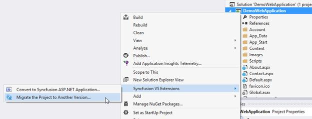
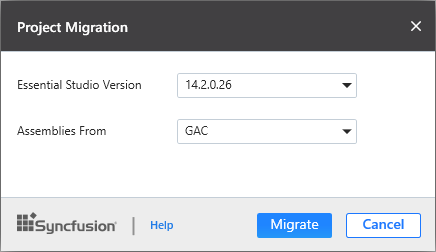

# Syncfusion Project Migration

Syncfusion Project Migration is a Visual Studio add-in that allows you to migrate the existing Syncfusion ASP.NET project from one Essential Studio version to another version.

I> The Syncfusion ASP.NET Web Application Project Migration utility is available from v13.1.0.30. 

## Migrate Syncfusion Project 

The following steps direct you to migrate your existing Syncfusion ASP.NET application. 

1. Right-click on **Syncfusion ASP.NET Project** from Solution Explorer and select **Syncfusion VS Extensions**. Choose **Migrate the Project to Another version**

   

2. The **Project Migration** window appears. You can choose the required Essential Studio version that is installed in the machine. 

   

3. The **Project Migration** window allows you to configure the following options:

   i. **Essential Studio Version:** Select any version from the list of installed versions.
   
   ii. **Assemblies From:** Choose the assembly location from where it is going to be added to the project.
   
4. Click the Migrate Button. The **Project Backup** dialog will be opened. If click Yes it will backup the current project before migrate the Syncfusion project. If click No it will migrate the project to required Syncfusion version without backup
   
   
   
   
5. The Syncfusion Reference Assemblies, Scripts and CSS are updated to the corresponding version in the project.

