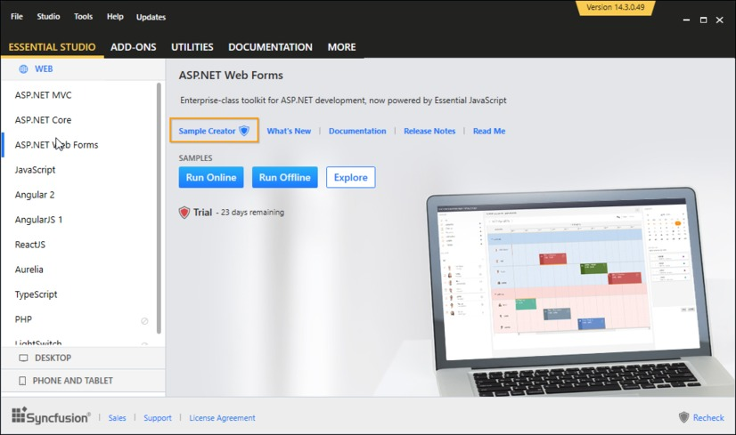
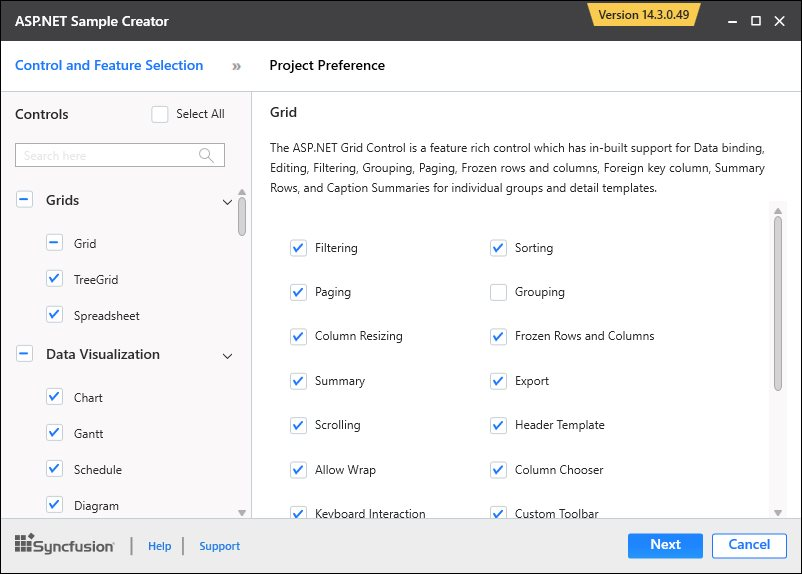
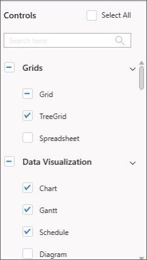
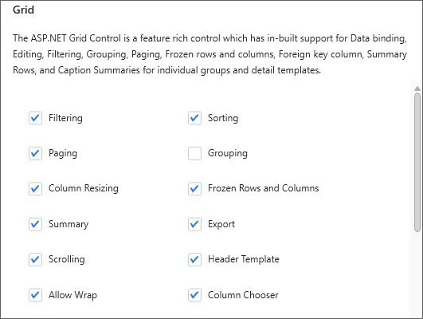
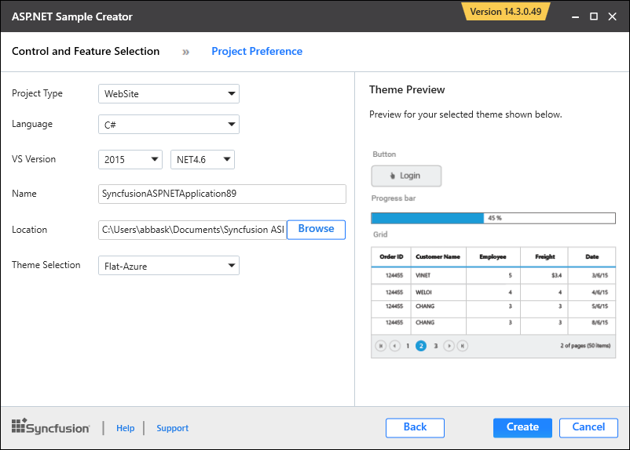
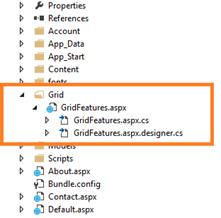
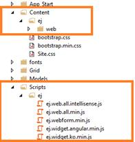
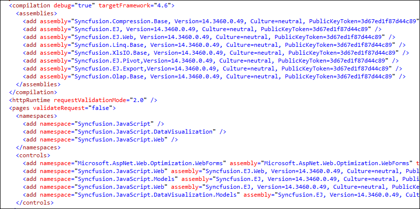
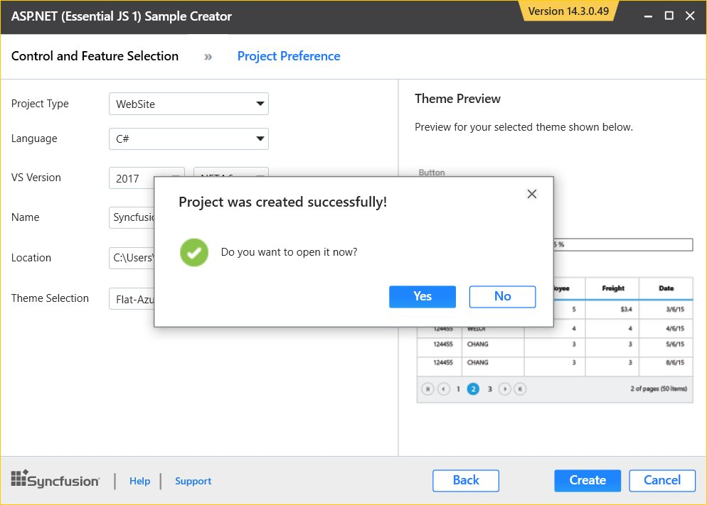

# Sample Creator

Sample Creator is the utility that allows you to create Syncfusion ASP.NET Projects along with the samples based on Controls and Features selection.

## Create Syncfusion ASP.NET Web Project from Sample Creator

The following steps help you to create the Syncfusion ASP.NET Web Project via the Sample Creator utility.

1. Launch the Syncfusion Essential Studio Dashboard and select the ASP.NET platform. Select the SAMPLE CREATOR button to launch the ASP.NET Sample Creator Wizard. Refer the following screenshot for more information.

   

2. Syncfusion Sample Creator Wizard displaying the **Controls and its Feature Selection** section

   

### Controls Selection

Listed here are the Syncfusion ASP.NET controls so you can choose the required controls.

   

### Feature Selection

Based on the controls, the Feature is enabled to choose the features of the corresponding controls.

   

### Project Configuration

1. You can configure the following project details in the Sample Creator.

   * Project Type – Select the type of ASP.NET Project, either Web Application or Web Site.

   * Language – Select the language, either C# or VB.

   * VS Version – Choose the Visual Studio version.

   * .NET Framework – Choose the .NET Framework version.

   * Name – Name your Syncfusion ASP.NET Application.

   * Location – Choose the target location of your project.

   * Theme Selection – Choose the required theme.The Theme Preview section shows the controls preview before create the Syncfusion project.

   

2. When you click the Create button, the new Syncfusion ASP.NET project is created. The following resources are added in the project:

   * Added the required ASPX and Class files in the project.

     

   * Included the required Syncfusion ASP.NET scripts and themes files.

     

   * The required Syncfusion assemblies are added for selected controls under Project Reference.

     

   * Configure the Web.Config file by adding the Syncfusion reference assemblies, namespaces and controls.

     

3. Once the project is created you can open the project by clicking the Yes button. If you click No button the corresponding location of the project will be opened. Refer the following screenshot for more information.

   
