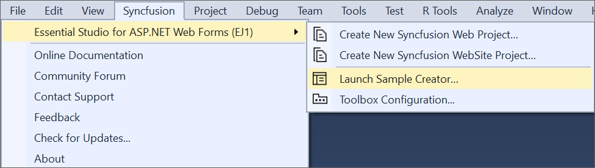
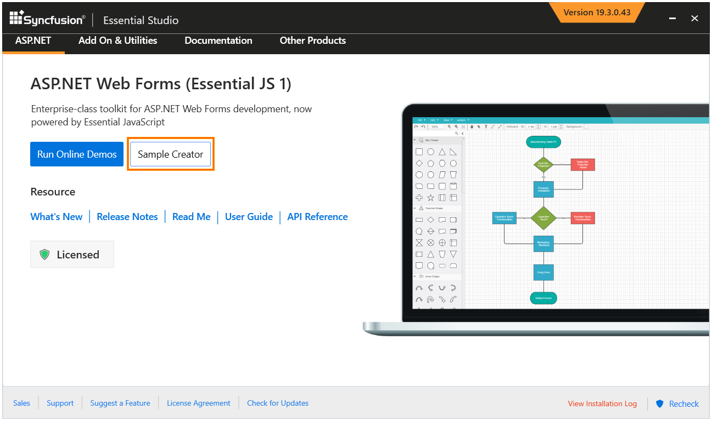
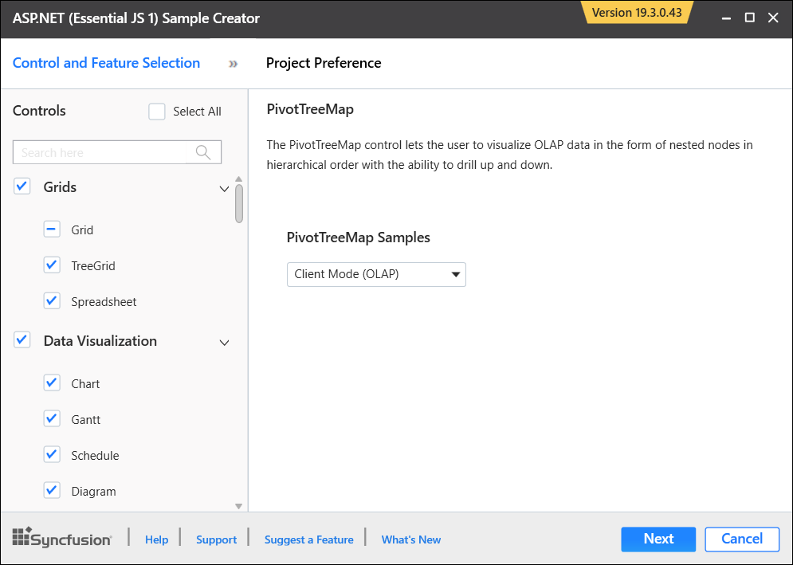
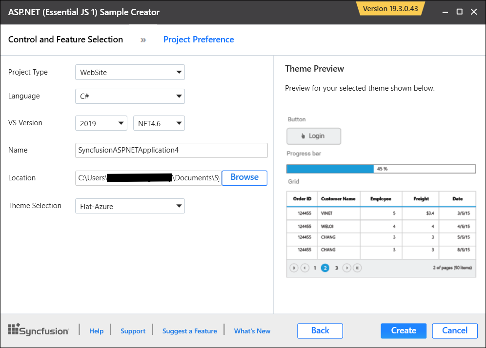
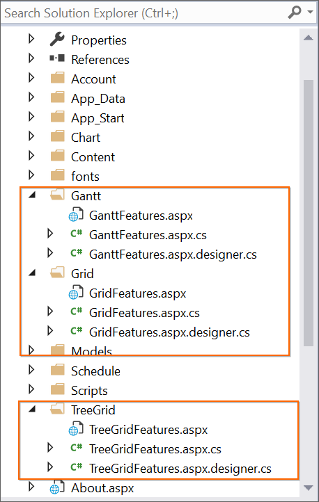
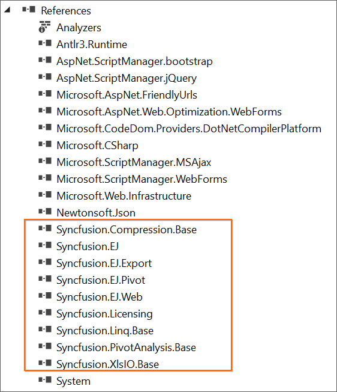
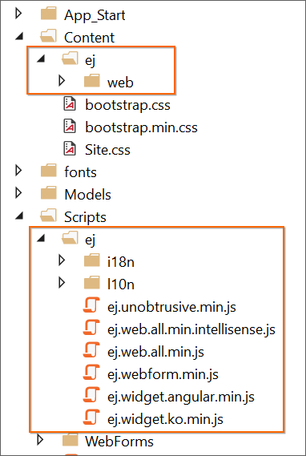
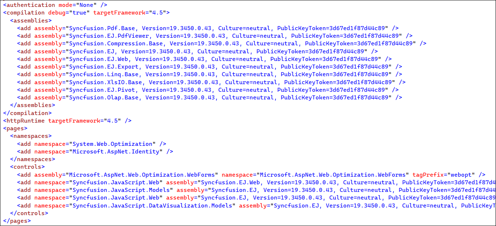

# Creating ASP.NET Samples through the Syncfusion&reg; ASP.NET Sample Creator

The Syncfusion&reg; Sample Creator is a utility that allows you to create Syncfusion&reg; ASP.NET (Essential&reg; JS 1) Projects with sample code for required Syncfusion&reg; component features and configuration of Syncfusion&reg; components.

To create the Syncfusion&reg; ASP.NET (Essential&reg; JS 1) Application using the Sample Creator utility, follow the steps below:

1. To launch the ASP.NET (Essential&reg; JS 1) Sample Creator, select one of the following options:

   **Option 1:**  
   Click **Syncfusion&reg; Menu** and choose **Essential Studio&reg; for ASP.NET Web Forms (EJ1) > Launch Sample Creator…** in **Visual Studio**.

   

   N> From Visual Studio 2019, Syncfusion&reg; menu is available under Extensions in Visual Studio menu.

   **Option 2:**
   Launch the Syncfusion&reg; ASP.NET (Essential&reg; JS 1) Control Panel. To run the ASP.NET (Essential&reg; JS 1) Sample Creator, click the Sample Creator button. More information can be found in the screenshot below.

   

2. The Syncfusion&reg; components and their features are listed in the ASP.NET (Essential&reg; JS 1) Sample Creator.

   

   **Components Selection:** Choose the required components. The components are grouped with Syncfusion&reg; products, and the components are grouped by product.

   

   **Feature Selection:** Based on the components, the feature is enabled to choose the features of the corresponding components.

   

   **Project Configuration**

   1. You can configure the following project details in the Sample Creator.

      * **Project Type:** Select the type of ASP.NET Project, either Web Application or Web Site.

      * **Language:** Select the language, either C# or VB.

      * **VS Version:** Choose the Visual Studio version and Framework.

      * **Name:** Name your Syncfusion&reg; ASP.NET Web Forms (Essential&reg; JS 1) Application.

      * **Location:** Choose the target location of your project.

      * **Theme Selection:** Choose the required theme. This section shows the controls preview before creating the Syncfusion&reg; project.

      

   2. Click the **Create** button. After you've finished creating the project, open it by clicking **Yes**. If you click **No**, the project's corresponding location will be opened. For more information, see the screenshot below.

      

   3. The new Syncfusion&reg; ASP.NET (Essential&reg; JS 1) project is created with the resources.

      * Added the required Controllers and View files in the project.

        

      * Under Project Reference, the necessary Syncfusion&reg; assemblies are added for selected components.

        

      * Syncfusion&reg; ASP.NET (Essential&reg; JS 1) scripts and theme files were included.

        

      * Configure the Web.Config file by adding the Syncfusion&reg; reference assemblies, namespaces and controls.

        

   
