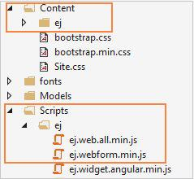

# Syncfusion Project Templates

Syncfusion provides the **Visual** **Studio** **Project** **Templates** for the Syncfusion ASP.NET platform to create Syncfusion ASP.NET Web Application or Syncfusion ASP.NET Web Site. 

I> The Syncfusion ASP.NET Website templates are available from v12.2.0.36 and the Syncfusion ASP.NET Web Application templates are available from v13.3.0.7. 

## Create Syncfusion ASP.NET Project

The following steps direct you to create the **Syncfusion** **ASP****.****NET** **project** through the **Visual** **Studio** **Project** **Template**.

1. To create a Syncfusion ASP.NET project, choose **New** **Project****->** **Syncfusion****->****Web****->****Syncfusion** **ASP****.****NET** **Web** **Application** **or** **Syncfusion** **ASP****.****NET** **Web** **Site** from **Visual** **Studio**.

   

2. Name the **Project**, choose the destination location when required and set the Framework of the project, then click **OK**.

   N> Minimum target Framework is 3.5 for Syncfusion ASP.NET Project Templates.
   
3. Once you click OK button, the Syncfusion ASP.NET WebSite or Web Application project is created.

4. Syncfusion references, Scripts, CSS and required Web.config entries are added to the Project.

   

   

   

