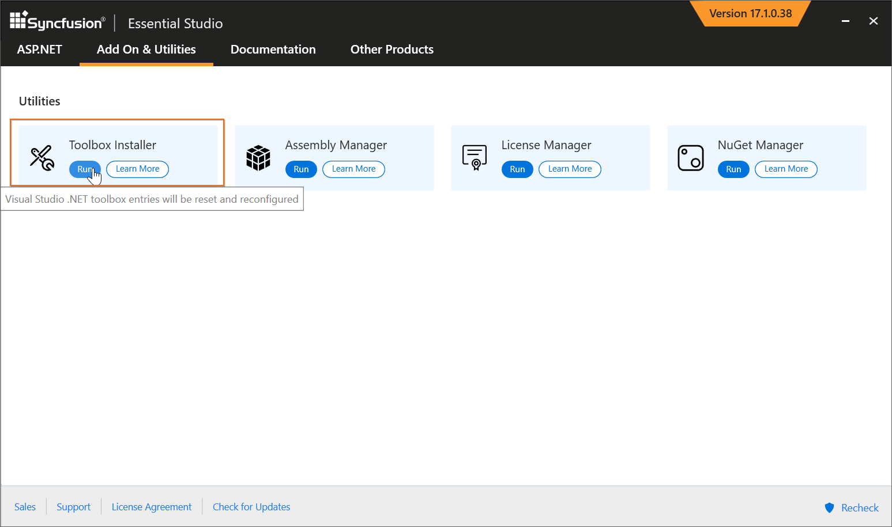
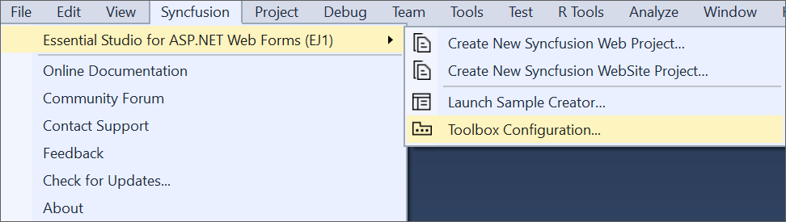
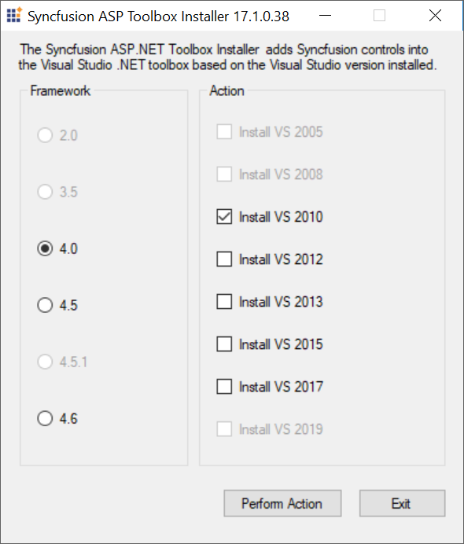
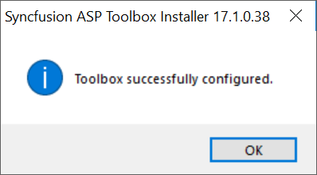

# Toolbox Configuration

The Syncfusion&reg; Toolbox Installer utility incorporates the Syncfusion&reg; ASP.NET Web Forms components into the Visual Studio.NET toolbox.

N> Toolbox configuration support is not available in the Visual Studio Express Edition. However, you can manually configure the Syncfusion&reg; components in the Visual Studio Express Toolbox. To do so, see [Manual Toolbox Configuration](https://help.syncfusion.com/common/faq/how-to-configure-the-toolbox-of-visual-studio-manually).

If the <b>“Configure Syncfusion&reg; components in Visual Studio”</b> checkbox is selected from the installer UI while installing the Syncfusion&reg; ASP.NET Web Forms installer, Syncfusion&reg; components will be automatically configured in the Visual Studio toolbox.

To add the Syncfusion&reg; ASP.NET Web Forms components via the Syncfusion&reg; Toolbox Installer, perform the following steps:

1. To launch the Toolbox configuration utility, select one of the following options:

   **Option 1:**   
   Open the Syncfusion&reg; Control Panel, click **Add On and Utilities > Toolbox Installer**.
   
   
   
   **Option 2:**  
   Click **Syncfusion&reg; menu** and choose **Essential Studio&reg; for ASP.NET Web Forms (EJ1) > Toolbox Configuration...** in **Visual Studio**

   

   N> From Visual Studio 2019, Syncfusion&reg; menu is available under Extensions in Visual Studio menu.

2. Toolbox Installer will be opened.

   

   The following options are available in Toolbox Configuration:

   * Install VS2005 – Configures Framework 2.0 Syncfusion&reg; controls in VS 2005 toolbox.
   * Install VS2008 – Configures Framework 3.5 Syncfusion&reg; controls in VS 2008 toolbox.
   * Install VS2010 – Configures Framework 4.0 Syncfusion&reg; controls in VS 2010 toolbox.
   * Install VS2012 – Configures Framework 4.5 Syncfusion&reg; controls in VS 2012 toolbox.
   * Install VS2013 – Configures Framework 4.5.1 Syncfusion&reg; controls in VS 2013 toolbox.
   * Install VS2015 – Configures Framework 4.6 Syncfusion&reg; controls in VS 2015 toolbox.
   * Install VS2017 – Configures Framework 4.6 Syncfusion&reg; controls in VS 2017 toolbox.
   * Install VS2019 – Configures Framework 4.6 Syncfusion&reg; controls in VS 2019 toolbox.
   * Install VS2022 – Configures Framework 4.6 Syncfusion&reg; components in VS 2022 toolbox.
   
    N> You can also configure Syncfusion&reg; components from a lower version Framework assembly to higher version of Visual Studio.
   
3. An Information message is displayed, indicating that Toolbox has been successfully configured. Click OK.

   
   
   
   N> * You must reset the toolbox, when the installed components  are not reflected properly in the Toolbox. * This tool configures only the components  that are located under {Installed Location}\Assemblies\{Framework version}.
   
