# Troubleshoot the project

Troubleshoot the project with the Syncfusion&reg; configuration and apply the fix, such as wrong.NET Framework version of a Syncfusion&reg; assembly to the project or missing any Syncfusion&reg; dependent assembly of a referred assembly. The Syncfusion&reg; Troubleshooter can perform the following tasks:

* Report the Configuration issues.  

* Apply the solution

## Report the Configuration issues

The steps below will assist you in using the Syncfusion&reg; Troubleshooter by Visual Studio.

> Before use the Syncfusion&reg; Troubleshooter for ASP.NET Web Forms, check whether the **ASP.NET Web Forms Extensions - Syncfusion&reg;** installed or not in Visual Studio Extension Manager by clicking on the Tools -> Extensions and Updates -> Installed for Visual Studio 2017 or lower and for Visual Studio 2019 by clicking on the Extensions -> Manage Extensions -> Installed. 

1. To launch the Syncfusion&reg; Troubleshooter Wizard, select one of the options below:
   
   **Option 1**  
   Open an existing Syncfusion&reg; ASP.NET Web Forms Application, Click **Syncfusion&reg; Menu** and choose **Essential Studio&reg; for ASP.NET Web Forms (EJ1) > Troubleshoot…** in Visual Studio.

   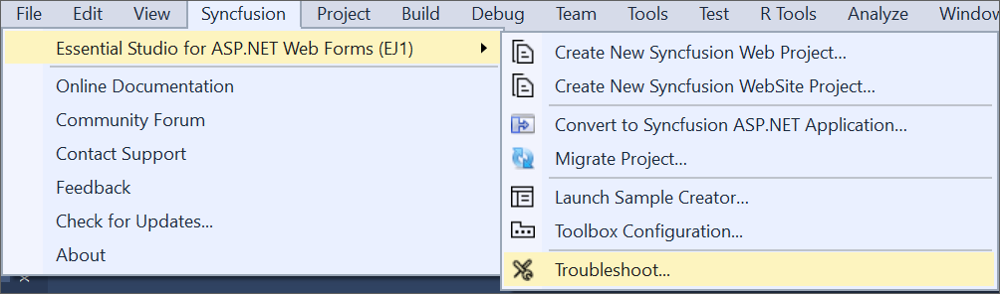

   N> In Visual Studio 2019, Syncfusion&reg; menu is available under Extensions in Visual Studio menu.

   **Option 2**  
   Right-click the Project file in Solution Explorer, then select the command **Syncfusion&reg; Troubleshooter…**

   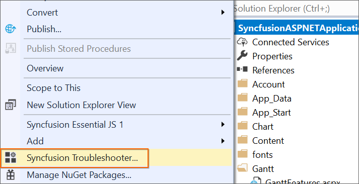

2. Now, analyze the project, and if any issues are discovered, it will report the project configuration issues of Syncfusion&reg; components in the Troubleshooter dialogue. If the project has no configuration issues, the dialogue box will indicate that no configuration changes are required in the following areas:

    * Syncfusion&reg; assembly references.

    * Syncfusion&reg; NuGet Packages. 

    * Syncfusion&reg; Web.config Entries.

    * Syncfusion&reg; Script files.

    * Toolbox Configuration.

   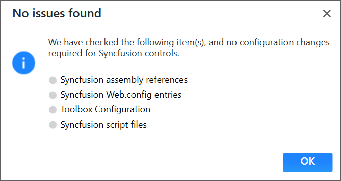

   I> The Syncfusion&reg; Troubleshooter command will be visible only for Syncfusion&reg; projects, which means the project must contain the referred Syncfusion&reg; assemblies or NuGet packages.

   The Syncfusion&reg; Troubleshooter handles the following project configuration issues: 

   1. Assembly reference issues.

   2. NuGet related issues.

   3. Web.config entries related issues.

   4. Script file related issues.

   5. Toolbox Configuration issues.

### Assembly reference issues

The Syncfusion&reg; Troubleshooter handles the assembly reference issues listed below in Syncfusion&reg; Projects.

1. Dependent assemblies are missing for referred assemblies from project. 

   **For Instance:**  If the “Syncfusion.EJ.Pivot” assembly is referenced in the project but “Syncfusion.PivotAnalysis.Base” and other dependent assemblies of Syncfusion.EJ.Pivot are not referenced in the project, the Syncfusion&reg; Troubleshooter will report that the dependent assembly is missing.

   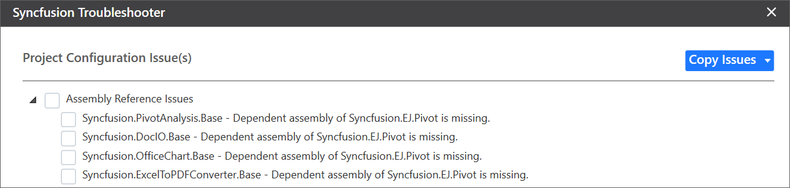

2. The Syncfusion&reg; assembly version is mismatched. In the same project, compare all Syncfusion&reg; assembly versions. If any Syncfusion&reg; assembly version inconsistency is discovered, the Syncfusion&reg; Troubleshooter will display the Syncfusion&reg; assembly’s version mismatch.

   **For Instance:** If the “Syncfusion.OfficeChart.Base” assembly (v15.2450.0.40) is referred to in the project, but the assembly version referred to by other Syncfusion&reg; assemblies is v15.2450.0.43. The Syncfusion&reg; Troubleshooter will display a mismatched Syncfusion&reg; assembly version.

   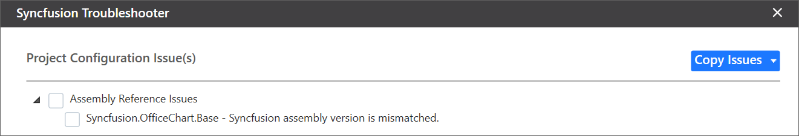

3.	.NET Framework version mismatch (Syncfusion&reg; Assemblies) with project's .NET Framework version. The details for the supported .NET Framework for Syncfusion&reg; assemblies can be found at the following link.

   <https://help.syncfusion.com/common/essential-studio/assembly-information#supported-framework-version-for-essential-studio-assemblies> 

   **For Instance:** The application's .NET Framework is v4.6, and the "Syncfusion.EJ.PdfViewer" assembly (v16.4400.0.42 & .NET Framework version 4.0) is referred to in the same application. The Syncfusion&reg; Troubleshooter will indicate that the Syncfusion&reg; assembly's .NET Framework version is incompatible with the project's .NET Framework version.

   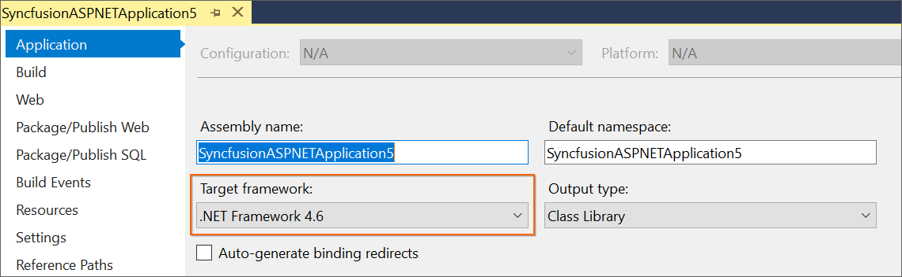

   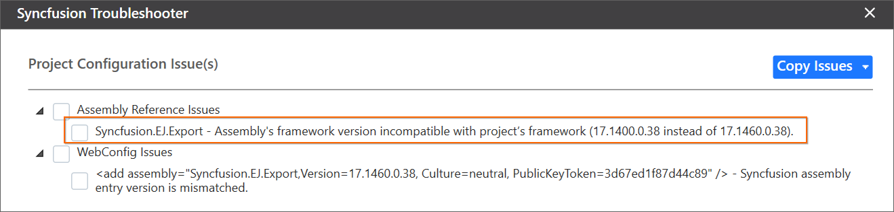

### NuGet issues

The Syncfusion&reg; Troubleshooter handles the following NuGet package issues in Syncfusion&reg; projects.

1. Syncfusion&reg; NuGet Packages are installed in multiple versions. If one Syncfusion&reg; NuGet Package version differs from another, the Syncfusion&reg; Troubleshooter will indicate that the Syncfusion&reg; NuGet package version is mismatched.

   **For Instance:** If you have multiple versions of the Syncfusion&reg; Web platform packages installed (v16.4.0.54 and v17.1.0.38), the Syncfusion&reg; Troubleshooter will display Syncfusion&reg; package version mismatch.
 
   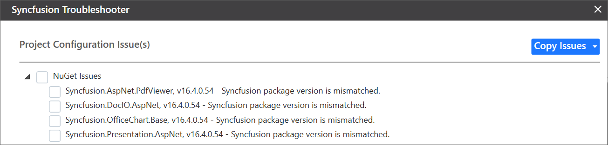

2. Dependent NuGet package of the installed Syncfusion&reg; NuGet packages is missing.

   **For Instance:** If you install the Syncfusion&reg; Web NuGet package in your project without any dependencies, the Syncfusion&reg; Troubleshooter will report that the Syncfusion.Compression.Base and other dependent NuGet packages are missing.
 
   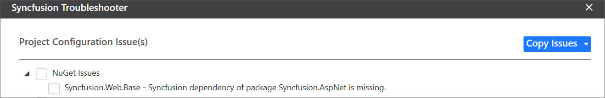

   I> To restore the missing dependent packages, an Internet connection is required. The dependent packages will not be restored if the internet is not available.

### Web.config issues

The Syncfusion&reg; Troubleshooter handles with Web.config entry-related issues in Syncfusion&reg; projects.

1. The version of the Syncfusion&reg; assembly entry was mismatched. Each Syncfusion assembly entry version/.NET Framework version will be compared to the application's corresponding referred Syncfusion&reg; assembly.

   **For Instance:** If the “Syncfusion.EJ.Pivot” assembly (v17.1450.0.38) is mentioned in the project, but the “Syncfusion.EJ.Pivot” assembly entry version (v16.4450.0.54) is mentioned in the Web.config file. The Syncfusion&reg; Troubleshooter will display a mismatched Syncfusion&reg; assembly entry version.
 
   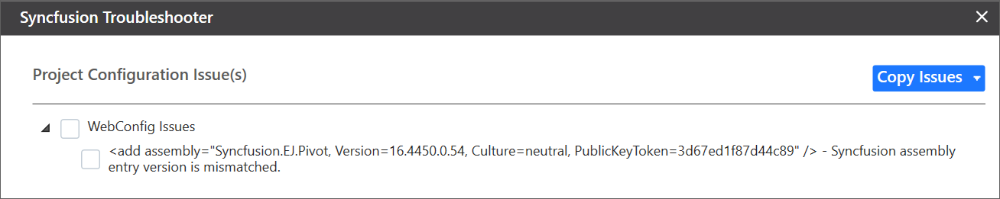

2. Syncfusion&reg; assembly entry has multiple versions and is duplicated. When a Syncfusion&reg; assembly entry is presented in Web.config that is not referred to in the project, or when multiple Syncfusion&reg; assembly entries are presented in Web.config for the same Syncfusion&reg; assembly, Syncfusion&reg; Troubleshooter will display the duplicate assembly entry.

   **For Instance:** If the project contains a “Syncfusion.EJ.Web” assembly (v17.1450.0.38) entry in the Web.config file, but the “Syncfusion.EJ.Web” assembly is not referred to in the project. Duplicate assembly entry will be displayed by Syncfusion&reg; Troubleshooter.
 
   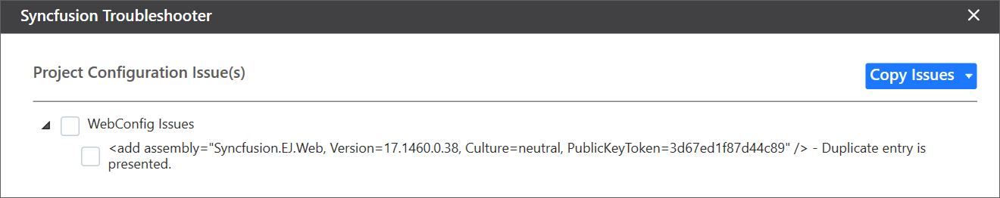

   **For Instance:** If a project contains multiple “Syncfusion.EJ.Web” assembly entries (v16.4460.0.54 && v17.1460.0.38) with mismatched assembly version/.NET Framework version in Web.config, Syncfusion&reg; Troubleshooter will display the Duplicate assembly entry and Multiple Syncfusion&reg; assembly entries.

   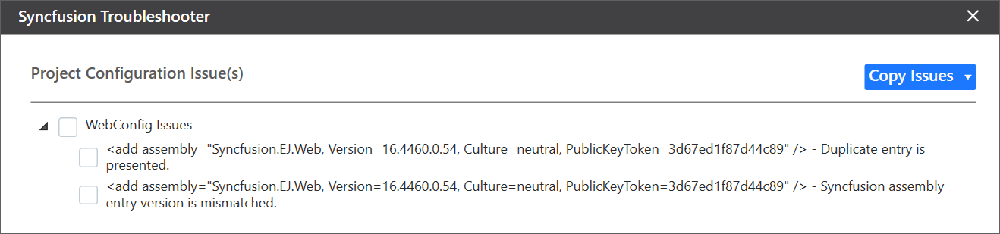

3. The version of the namespace entry was mismatched. If any Namespace entry version (assembly version) in ASP.NET Web Application is mismatched with the corresponding referred assembly version, Syncfusion&reg; Troubleshooter will display Namespace entry version mismatched.

   **For Instance:** If the “Syncfusion.EJ” assembly (v17.1450.0.38) is referenced in the project and the “Syncfusion.JavaScript.DataVisualization” Namespace entry version (v16.4450.0.54) is referenced in the Web.config file. The Syncfusion&reg; Troubleshooter will display a mismatched Syncfusion&reg; namespace entry version.
   
   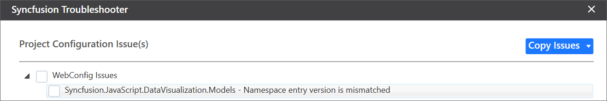

4. Mismatch HTTP/Server handler entry. If any Syncfusion&reg; HTTP/Server handler entry version is mismatched when compared to the corresponding referred assembly version in the project, the Syncfusion&reg; Troubleshooter will show HTTP/Server handler entry mismatched.

   **For Instance:** If the “Syncfusion.EJ.” assembly (v17.1450.0.38) is mentioned in the project, but the “Syncfusion.JavaScript.ImageHandler” HTTP/Server handler entry version (v16.4450.0.54) is specified in the Web.config file. The Syncfusion&reg; Troubleshooter will display a mismatched Syncfusion&reg; HTTP/Server handler entry version.
   
   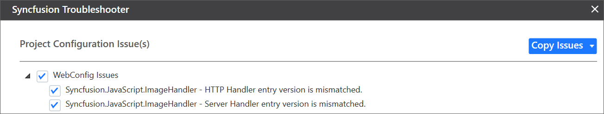

### Toolbox Configuration Issues

The Syncfusion&reg; Troubleshooter handles the Toolbox Configuration issues listed below in Syncfusion&reg; projects.

1. If the project's .NET Framework version is not installed/configured, the Syncfusion&reg; Troubleshooter will report that the Syncfusion&reg; Toolbox .NET Framework version is mismatched.

   **For Instance:** The .NET Framework version of the project is 4.5, and Syncfusion&reg; Toolbox is not installed. 4.6 framework assemblies only in the corresponding Visual Studio, the Syncfusion&reg; Troubleshooter will display Syncfusion&reg; Toolbox framework version mismatch.
 
   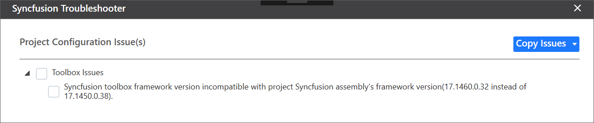

2. If the configured version of Syncfusion&reg; Toolbox differs from the most recent Syncfusion&reg; assembly reference version or NuGet package version in the same project, the Syncfusion&reg; Troubleshooter will indicate that the Syncfusion&reg; Toolbox version is mismatch.

   **For Instance:** If the most recent Syncfusion&reg; assembly reference version is v17.1.0.38 but the Toolbox assemblies are configured with v17.1.0.32, the Syncfusion Troubleshooter will report Syncfusion&reg; Toolbox version mismatch.
  
   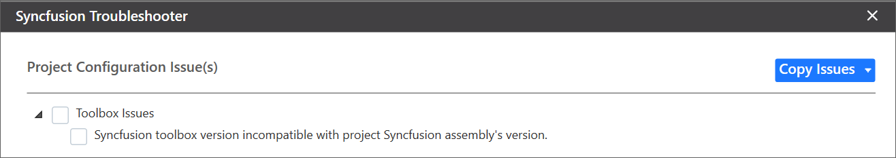

### Script file issues

The Syncfusion&reg; Troubleshooter handles the following Script file issues in Syncfusion&reg; projects.

1. The version of the Syncfusion&reg; script file is mismatch. Each Syncfusion&reg; script file version will be compared to the latest version of the corresponding referred Syncfusion&reg; assembly in the application.

   **For Instance:** If Syncfusion&reg; assemblies (v17.1450.0.38) and Syncfusion&reg; script file (v16.4.0.54) are referenced in the project. The Syncfusion&reg; Troubleshooter will display a Syncfusion&reg; script file version (v16.4.0.54) that is incompatible with the project's/package version of Syncfusion&reg; (v17.1.0.38).
 
   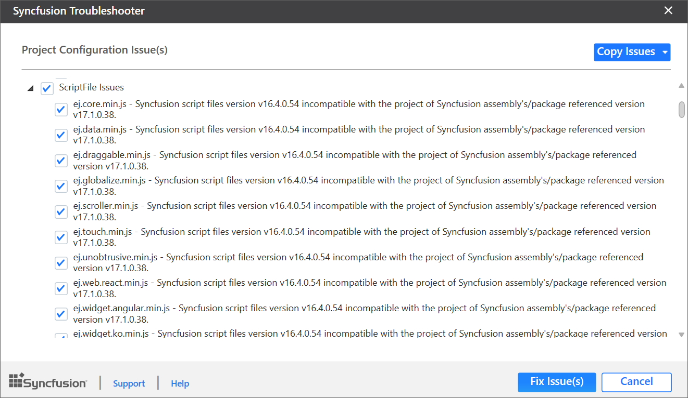

   **For Instance:** If Syncfusion&reg; assemblies (v17.1450.0.38) are referred to in the project, but Syncfusion&reg; script file version (v16.4.0.54) is referred to in View files when script files are referred to via a CDN link. The Syncfusion&reg; Troubleshooter will report that the Syncfusion&reg; script file version (v16.4.0.54) is incompatible with the project's Syncfusion&reg; assembly/package version (v17.1.0.38) from CDN.

   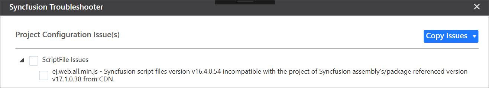

2. Syncfusion&reg; script files that are duplicates. When a Syncfusion&reg; script file is presented in the project location, which is referred to in View files by CDN link, or when Syncfusion&reg; script files are presented in multiple locations in the same project, Syncfusion&reg; Troubleshooter will display duplicate script files.

   **For Instance:** If the project has a “ej.web.all.min.js” script file entry in the View file and a “ej.web.all.min.js” script file in the project location (Scripts\ej), the Syncfusion&reg; Troubleshooter will show duplicate Syncfusion&reg; script files presented in Scripts\ej due to this script file being referred from CDN.
  
   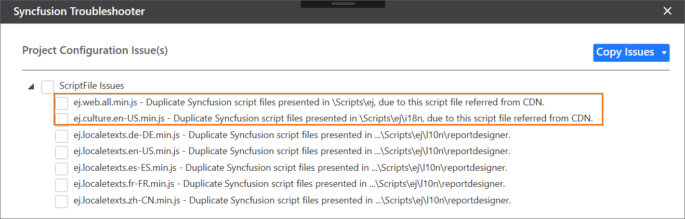

   **For Instance:** If a project has the “ej.web.all.min.js” script file available in multiple project locations ("\Scripts\ej" and "\Scripts\"), the Syncfusion&reg; Troubleshooter will display Duplicate Syncfusion&reg; script files in Scripts.
  
   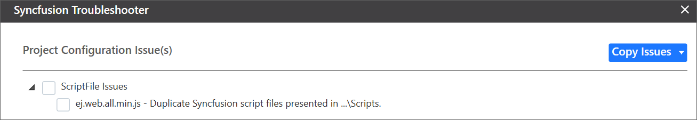

## Apply the solution

1. Check the corresponding check box of the issue to be resolved after loading the Syncfusion&reg; Troubleshooter dialog. Then, check “Fix Issue(s)” button.

   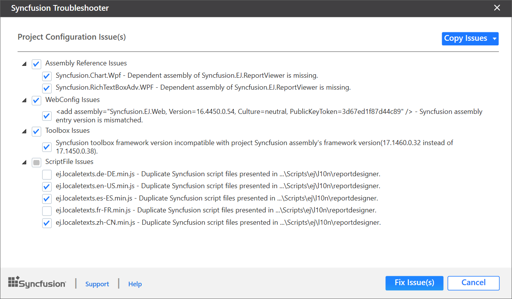

2. A dialog appears, prompting you to create a backup of the project before proceeding with the troubleshooting process. Click the "Yes" button if you need to backup the project before troubleshooting.

   

3. Wait a moment while the Syncfusion&reg; Troubleshooter resolves the issues you selected. When the troubleshooting process is finished, a message will appear in the Visual Studio status bar that says, "Troubleshooting process completed successfully."

   

4. Then, Syncfusion&reg; licensing registration required message box will be shown if you installed the trial setup or NuGet packages since Syncfusion&reg; introduced the licensing system from 2018 Volume 2 (v16.2.0.41) Essential Studio&reg; release. Navigate to the  [help topic](https://help.syncfusion.com/common/essential-studio/licensing/license-key#how-to-generate-syncfusion-license-key), which is shown in the licensing message box to generate and register the Syncfusion&reg; license key to your project. Refer to this [blog](https://blog.syncfusion.com/post/Whats-New-in-2018-Volume-2-Licensing-Changes-in-the-1620x-Version-of-Essential-Studio.aspx) post for understanding the licensing changes introduced in Essential Studio&reg;.   

   