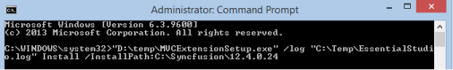

# Command Line installation

The following steps help you install the Syncfusion&reg;  Web Sample Creator setup through Command Line in Silent mode.

1. Double-click the Syncfusion Web Sample Creator Setup file. The Self-Extractor Wizard opens and extracts the package automatically.
2. The syncfusionwebsamplecreator.exe file is extracted into the Temp folder.
3. Run `%temp%`. The Temp folder opens. The `syncfusionwebsamplecreator.exe` file is available in one of the folders.
4. Copy the syncfusionwebsamplecreator.exe file to the local drive. Example: D:\temp
5. Cancel the wizard.
6. Open Command Prompt in the Administrator mode and pass the following arguments:
  
   “Setup file path\syncfusionwebsamplecreator.exe” /log “{Log file path}” Install /InstallPath:{Location to install}
   
   Example: “D:\Temp\syncfusionwebsamplecreator.exe” /log “C:\Temp\EssentialStudio.log” Install /InstallPath:C:\Syncfusion\x.x.x.x

   Refer to the following screenshot for more information.

   

I> The syncfusionessentialextension.exe setup has renamed to syncfusionwebsamplecreator.exe from 2015 Volume 4 release.