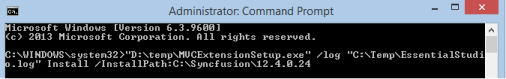

# Command Line installation

The following steps help you install the Syncufusion MVC Extension setup through Command Line in Silent mode.

1. Double-click the Syncfusion MVC Extension Setup file. The Self-Extractor Wizard opens and extracts the package automatically.
2. The MVCExtensionSetup.exe file is extracted into the Temp folder.
3. Run %temp%. The Temp folder opens. The MVCExtensionSetup.exe file is available in one of the folders.
4. Copy the MVCExtensionSetup.exe file to the local drive. Example: D:\temp
5. Cancel the wizard.
6. Open Command Prompt in the Administrator mode and pass the following arguments:

“Setup file path\MVCExtensionSetup.exe” /log “{Log file path}” Install /InstallPath:{Location to install}

Example: “D:\Temp\MVCExtensionSetup.exe” /log “C:\Temp\EssentialStudio.log” Install /InstallPath:C:\Syncfusion\x.x.x.x

Refer to the following screenshot for more information.

