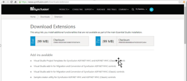
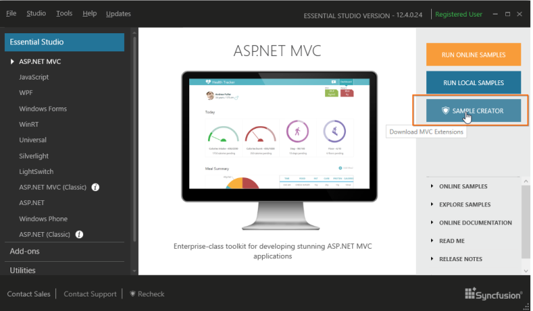

# Download ASP.NET MVC Extension 

1. Download the latest SyncfusionMVCExtension setup from the following location: [https://www.syncfusion.com/downloads/extension](https://www.syncfusion.com/downloads/extension)

   Refer the following screenshot for more information.

   

   Important: It is a prerequisite to have the complete Essential Studio suite or ASP.NET MVC or ASP.NET MVC (Classic) installed while using Syncfusion ASP.NET MVC Extension. This is applicable from v.12.1.0.43.

2. You can download the corresponding SyncfusionMVCExtension.exe Version directly from the Syncfusion Dashboard. After installing the complete Essential Studio suite or ASP.NET MVC or ASP.NET MVC (Classic) setup, follow the given steps:

* Launch the Syncfusion Dashboard 
* Navigate to the “ASP.NET MVC” tab available on the left side.
* Click the “SAMPLE CREATOR” button. It downloads the corresponding version of ASP.NET MVC Extension setup. When you have already installed the SyncfusionMVCExtension setup then it will launch the “Sample Creator” utility instead of downloading. 

  

