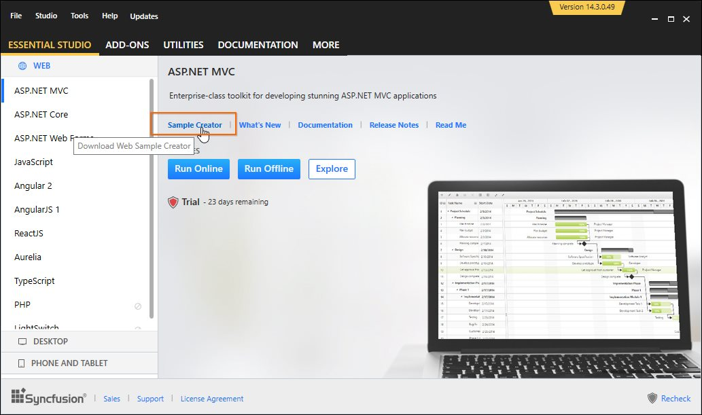

# Download Syncfusion® Web Sample Creator 

1. Download the latest Syncfusion® Web Sample Creator setup from the following location: [https://www.syncfusion.com/downloads/extension](https://www.syncfusion.com/downloads/extension)

   Refer the following screenshot for more information.

   

   I> It is a prerequisite to have the complete Essential Studio® suite or ASP.NET MVC or ASP.NET MVC (Classic) installed while using Syncfusion® ASP.NET MVC Extension. This is applicable from v.12.1.0.43.

2. You can download the corresponding syncfusionwebsamplecreator.exe Version directly from the Syncfusion® Dashboard. After installing the complete Essential Studio® suite or ASP.NET MVC or ASP.NET MVC (Classic) setup, follow the given steps:

   * Launch the Syncfusion® Dashboard 
   * Navigate to the “ASP.NET MVC” tab available on the left side.
   * Click the “SAMPLE CREATOR” button. It downloads the corresponding version of Syncfusion® Web Sample Creator setup. When you have already installed the Syncfusion® Web Sample Creator setup then it will launch the “Sample Creator” utility instead of downloading. 

    

I> The syncfusionessentialextension.exe setup has renamed to syncfusionwebsamplecreator.exe from 2015 Volume 4 release.

