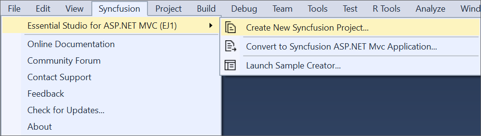
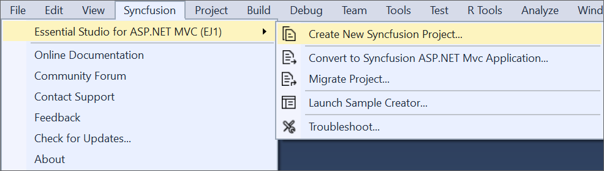

# ASPNET MVC Extension

The Syncfusion&reg; ASP.NET MVC (Essential&reg; JS 1) Visual Studio Extensions can be accessed through the Syncfusion&reg; Menu to create and configure the project with Syncfusion&reg; references in Visual Studio.The Syncfusion&reg; MVC Extension supports Microsoft Visual Studio 2010 or higher.

I> The Syncfusion&reg; ASP.NET MVC (Essential&reg; JS 1) menu option is available from v17.1.0.32.

The Syncfusion&reg; provides the following extension supports in Visual Studio:

1.	[Syncfusion&reg; ASP.NET MVC (Essential&reg; JS 1) Project Template](https://help.syncfusion.com/extension/aspnet-mvc-extension/syncfusion-project-templates): To create the Syncfusion&reg; ASP.NET MVC (Essential&reg; JS 1) or ASP.NET MVC (Classic) application by adding the required Essential&reg; JS 1 components.
2.	[Project Conversion](https://help.syncfusion.com/extension/aspnet-mvc-extension/project-conversion): To convert an existing ASP.NET MVC application into a Syncfusion&reg; ASP.NET MVC (Essential&reg; JS 1) or ASP.NET MVC (Classic) application by adding the required Syncfusion&reg; assemblies and resource files.
3.	[Migrate Project](https://help.syncfusion.com/extension/aspnet-mvc-extension/project-migration): Migrate the existing Syncfusion&reg; ASP.NET MVC or ASP.NET MVC (Classic) application from one Essential Studio&reg; version to another version.
4.	[Sample Creator](https://help.syncfusion.com/extension/aspnet-mvc-extension/sample-creator): Create the Syncfusion&reg; ASP.NET MVC (Essential&reg; JS 1) or ASP.NET MVC (Classic) Projects with the required Syncfusion&reg; configuration to start development with the required Syncfusion&reg; controls.
5.	[Troubleshooter](https://help.syncfusion.com/extension/syncfusion-troubleshooter/syncfusion-troubleshooter): Troubleshoot the project with the Syncfusion&reg; configuration and apply the fix like, wrong Framework Syncfusion&reg; assembly added to the project or missing any Syncfusion&reg; dependent assembly of a referred assembly.

**No project selected in Visual Studio**

**Selected Microsoft ASP.NET MVC application in Visual Studio**

**Selected Syncfusion&reg; ASP.NET MVC (Essential&reg; JS1) application in Visual Studio**

N> In Visual Studio 2019, Syncfusion&reg; menu available under Extension in Visual Studio menu.

