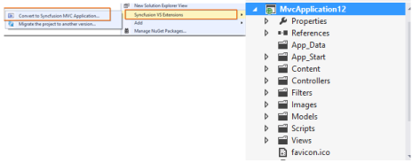
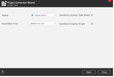
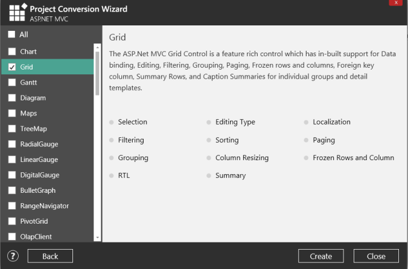
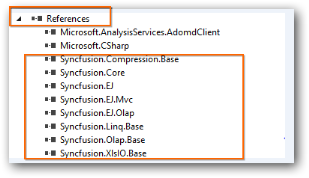
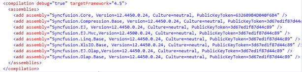

# Project Conversion  

Project Conversion is a Visual Studio add-in that converts an existing ASP.NET MVC Project into a Syncfusion ASP.NET MVC Project by adding the required assemblies and resource files.

Syncfusion ASP.NET MVC and ASP.NET MVC (Classic) Project Conversion utility is included in below setups,

* Essential Studio for Enterprise Edition with the platforms ASP.NETMVC or ASP.NET MVC(Classic)
* Essential Studio for ASP.NET MVC
* Essential Studio for ASP.NET MVC (Classic)

   Note: This is not applicable from v.12.1.0.43 to v.13.1.0.30. The Syncfusion ASP.NET MVC and ASP.NET MVC (Classic) Project Conversion utility excluded from MVC Extension setup and integrated into Essential Studio ASP.NET MVC and ASP.NET MVC (Classic) platforms. 

## ASP.NET MVC (Classic) Conversion\Migration:

By default, the Syncfusion ASP.NET MVC Extensions are configured. When you want the ASP.NET MVC (Classic) extension, you have to install it from the installed location.

## Project Conversion and Migration(ASP.NET MVC(Classic):

Location: _{Drive}\Program Files (x86)\Syncfusion\Essential Studio\&lt;Version&gt;\Utilities\Extensions\ASP.NET MVC\Project Conversion_

For Example - VS2013: _C:\Program Files (x86)\Syncfusion\Essential Studio\13.2.0.18\Utilities\Extensions\ASP.NET MVC\Project Conversion\4.5.1\Syncfusion Web (Classic) Conversion and Migration.vsix_

## Convert into Syncfusion MVC project 

The following steps help you use the Syncfusion Project Conversion in the existing ASP.NET MVC Project.

1. Open an existing Microsoft MVC Project or create a new Microsoft MVC Project.
2. Right-click on Project and select Syncfusion VS Extensions and choose the Convert to Syncfusion MVC Application. Refer the following screenshot for more information.

   

3. Project Conversion Wizard opens so that you can configure the project. 

   

The following configurations are used in the Project Conversion Wizard.

### Theme: Choose the visual theme for your Syncfusion ASP.NET MVC web application. 

### Assemblies From:

Choose the assembly location:

1. Added From GAC - Refer the assemblies from the Global Assembly Cache 
2. Added from Installed Location - Refer the assemblies from the Syncfusion Installed locations. 

### Combine/Compress style sheets: Option to compress style sheets

### Combine/Compress Scripts: Option to Compress Scripts

1. Click the Next button to choose the required controls from the Wizard as follows. Click the Create button to convert it into a Syncfusion Project.

   

2. The required Syncfusion Reference Assemblies, Scripts and CSS are included in the MVC Project. Refer the following screenshots for more information.

   

   

   

