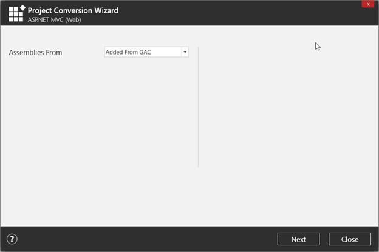
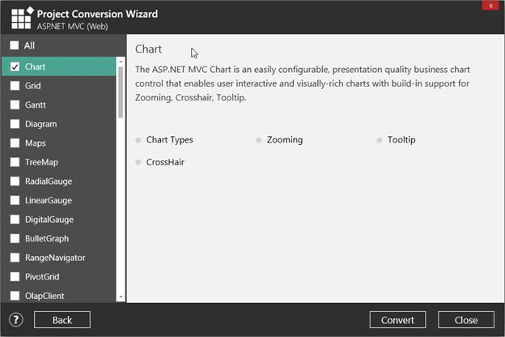
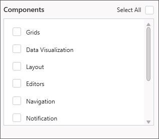
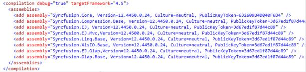
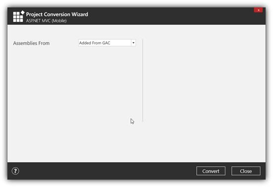
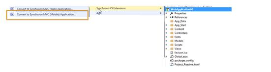
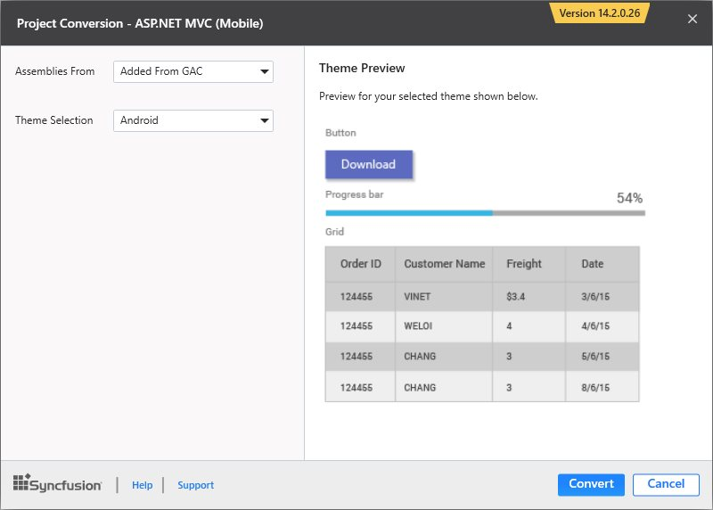

---
layout: post
title: Project Conversion | Extension | Syncfusion
description: Project Conversion
platform: extension
control: Syncfusion Extensions
documentation: ug
---

# Project Conversion

Project Conversion is a Visual Studio add-in that converts an existing ASP.NET MVC Project into a Syncfusion ASP.NET MVC Project by adding the required assemblies and resource files.

Syncfusion ASP.NET MVC and ASP.NET MVC (Classic) Project Conversion Utility is included here,

* Essential Studio for Enterprise Edition with the platforms ASP.NETMVC or ASP.NET MVC(Classic)
* Essential Studio for ASP.NET MVC
* Essential Studio for ASP.NET MVC (Classic)

NOTE

This is not applicable from v.12.1.0.43 to v.13.1.0.30. The Syncfusion ASP.NET MVC (Web) and ASP.NET MVC (Classic) Project Conversion Utilities are excluded from the MVC Extension setup and integrated into Essential Studio ASP.NET MVC and ASP.NET MVC (Classic) platforms.

## ASP.NET MVC (Classic) Conversion\Migration:

By default, the Syncfusion ASP.NET MVC Extensions are configured in Visual Studio. When you want the ASP.NET MVC (Classic) extension, you can install it from the installed location.

**Project** **Conversion** **and** **Migration** **(****ASP****.****NET** **MVC****(****Classic****):******

Location: __{____Drive____}\____Program__ __Files__ __(____x86____)\____Syncfusion____\____Essential__ __Studio____\<____Version____>\____Utilities____\____Extensions____\____ASP____.____NET__ __MVC____\____Project__ __Conversion__

For Example - VS2013: __C____:\____Program__ __Files__ __(____x86____)\____Syncfusion____\____Essential__ __Studio____\____13____.____2____.____0____.____18____\____Utilities____\____Extensions____\____ASP____.____NET__ __MVC____\____Project__ __Conversion____\____4____.____5____.____1____\____Syncfusion__ __Web__ __(____Classic____)__ __Conversion__ __and__ __Migration____.____vsix__

## Convert into Syncfusion MVC (Web) project

The following steps help you use the Syncfusion Project Conversion in the existing ASP.NET MVC (Web) Project.

1. Open an existing Microsoft MVC Project or create a new Microsoft MVC Project.
2. Right-click on Project and select Syncfusion VS Extensions and choose the Convert to Syncfusion MVC (Web) Application. Refer to the following screenshot for more information.

3. Project Conversion Wizard opens so that you can configure the project.

The following configurations are used in the Project Conversion Wizard.

**Assemblies** **From****:******

Choose the assembly location:

1. Added From GAC - Refer the assemblies from the Global Assembly Cache
2. Added from Installed Location - Refer the assemblies from the Syncfusion Installed locations.

4. Click the Next button to choose the required controls from the Wizard as follows. Click the Create button to convert it into a Syncfusion Project.

5. The required Syncfusion Reference Assemblies, Scripts and CSS are included in the MVC Project. Refer to the following screenshots for more information.

## Convert into Syncfusion MVC (Mobile) project

The following steps help you use the Syncfusion Project Conversion in the existing ASP.NET MVC Project.

1. Open an existing Microsoft MVC Project or create a new Microsoft MVC Project.
2. Right-click on Project and select Syncfusion VS Extensions and choose the Convert to Syncfusion MVC (Web) Application. Refer the following screenshot for more information.

3. Project Conversion Wizard opens so that you can configure the project.

The following configurations are used in the Project Conversion Wizard.

**Assemblies** **From****:******

Choose the assembly location:

1. Added From GAC - Refer the assemblies from the Global Assembly Cache
2. Added from Installed Location - Refer the assemblies from the Syncfusion Installed locations.
4. Click the Convert button to convert it into a Syncfusion Project.

5. The required Syncfusion Reference Assemblies, Scripts and CSS are included in the MVC Project. Refer to the following screenshots for more information.

