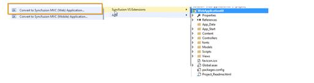
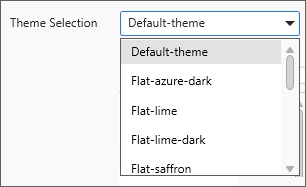
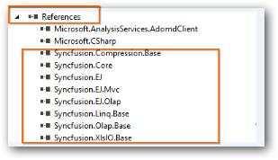
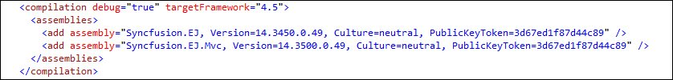

# Project Conversion

Project Conversion is a Visual Studio add-in that converts an existing ASP.NET MVC Project into a Syncfusion ASP.NET MVC Project by adding the required assemblies and resource files.

Syncfusion ASP.NET MVC and ASP.NET MVC (Classic) Project Conversion Utility is included here,

* Essential Studio for Enterprise Edition with the platforms ASP.NETMVC or ASP.NET MVC(Classic)
* Essential Studio for ASP.NET MVC
* Essential Studio for ASP.NET MVC (Classic)

I> This is not applicable from v.12.1.0.43 to v.13.1.0.30. The Syncfusion ASP.NET MVC (Web) and ASP.NET MVC (Classic) Project Conversion Utilities are excluded from the MVC Extension setup and integrated into Essential Studio ASP.NET MVC and ASP.NET MVC (Classic) platforms.

## ASP.NET MVC (Classic) Conversion\Migration:

By default, the Syncfusion ASP.NET MVC Extensions are configured in Visual Studio. When you want the ASP.NET MVC (Classic) extension, you can install it from the installed location.

### Project Conversion and Migration (ASP.NET MVC(Classic):

Location : `{Drive}\Program Files (x86)\Syncfusion\Essential Studio\<Version>\Utilities\Extensions\ASP.NET MVC\Project Conversion`
    
For Example - VS2013 : `C:\Program Files (x86)\Syncfusion\Essential Studio\13.2.0.18\Utilities\Extensions\ASP.NET MVC\Project Conversion\4.5.1\Syncfusion Web (Classic) Conversion and Migration.vsix`

## Convert into Syncfusion MVC (Web) project

The following steps help you use the Syncfusion Project Conversion in the existing ASP.NET MVC (Web) Project.

1. Open an existing Microsoft MVC Project or create a new Microsoft MVC Project.
2. Right-click on Project and select Syncfusion VS Extensions and choose the Convert to Syncfusion MVC (Web) Application. Refer to the following screenshot for more information.

   

3. Project Conversion Wizard opens so that you can configure the project.

   

   The following configurations are used in the Project Conversion Wizard.
   
   **Assemblies From:**

   Choose the assembly location:

	1. Added From GAC - Refer the assemblies from the Global Assembly Cache
	2. Added from Installed Location - Refer the assemblies from the Syncfusion Installed locations.
    3. Add Referenced Assemblies to Solution - Copy and refer to the assemblies from project's solution file lib directory.

   
    
   **Choose the Theme:**
   
   The master page of project will be updated based on selected theme. The Theme Preview section shows the controls preview before convert into a Syncfusion project.
   
   
   
   **Choose CDN Support:**

   The master page of the project will be updated based on required Syncfusion CDN links.
   
   
   
   **Choose Copy Global Resources:**
    
   The localization culture files will be shipped into Scripts\ej\i18n directory of the project.
   
   

4. Choose the required controls from Components section and Click the **Convert** button to convert it into a Syncfusion Project.

   
   
5. The **Project Backup** dialog will be opened. If click Yes it will backup the current project before converting it to Syncfusion project. If click No it will convert the project to Syncfusion project without backup. 
   
   

6. The required Syncfusion Reference Assemblies, Scripts and CSS are included in the MVC Project. Refer to the following screenshots for more information.

   

   

   

## Convert into Syncfusion MVC (Mobile) project

The following steps help you use the Syncfusion Project Conversion in the existing ASP.NET MVC Project.

1. Open an existing Microsoft MVC Project or create a new Microsoft MVC Project.

2. Right-click on Project and select Syncfusion VS Extensions and choose the Convert to Syncfusion MVC (Web) Application. Refer the following screenshot for more information.

   

3. Project Conversion Wizard opens so that you can configure the project.

   

   The following configurations are used in the Project Conversion Wizard.

   **Assemblies** **From**:
  
   Choose the assembly location:

	1. Added From GAC - Refer the assemblies from the Global Assembly Cache
	2. Added from Installed Location - Refer the assemblies from the Syncfusion Installed locations.
    3. Add Referenced Assemblies to Solution - Copy and refer to the assemblies from project's solution file lib directory.   

    
   
   **Choose the Theme:**
   
   Choose the required theme from Theme Selection Combo box. The Theme preview window will change based on your Theme selection. and also the project will be update with the selected theme.
   
   
	
   **Choose CDN Support:**

   The master page of the project will be updated based on required Syncfusion CDN links.
   
   
   
   **Choose Copy Global Resources:**
    
   The localization culture files will be shipped into Scripts\ej\i18n directory of the project.
   
   

4. Click the Convert button to convert it into a Syncfusion Project.

5. The required Syncfusion Reference Assemblies, Scripts and CSS are included in the MVC Project. Refer to the following screenshots for more information.

   

   

   

   

## Rendering Control after Syncfusion MVC (Web/Mobile) Conversion:

Once you convert your ASP.NET MVC project to Syncfusion MVC Project, perform the following steps to render the Syncfusion Controls to your project.               
1. The CSS, Scripts, Syncfusion References and required Web.config file entries are added to your project by Syncfusion ASP.NET MVC Conversion.  

2. Add the required Script and CSS files references in the master page (_Layout.cshtml/Layout.vbhtml file). Please refer to below screenshot for more information.

   

3. Now, include the Syncfusion controls to your project. Refer to the following screenshot for more information.

   

4. Run the project and the following output is displayed.

   

