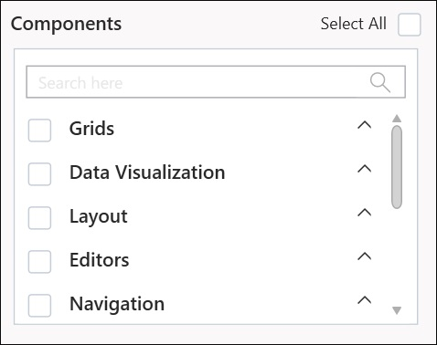

# ASP.NET MVC Project Conversion

Project Conversion is a Visual Studio add-in that converts an existing ASP.NET MVC Project into a Syncfusion ASP.NET MVC Project by adding the required assemblies and resource files.

Syncfusion ASP.NET MVC and ASP.NET MVC (Classic) Project Conversion Utility is included here,

* Essential Studio for Enterprise Edition with the platforms ASP.NETMVC or ASP.NET MVC(Classic)
* Essential Studio for ASP.NET MVC
* Essential Studio for ASP.NET MVC (Classic)

I>  The Project conversion Visual Studio add-in is available from the v11.1.0.21 and this is not applicable from v.12.1.0.43 to v.13.1.0.30. The Syncfusion ASP.NET MVC (Web) and ASP.NET MVC (Classic) Project Conversion Utilities are excluded from the MVC Extension setup and integrated into Essential Studio ASP.NET MVC and ASP.NET MVC (Classic) platforms.

## ASP.NET MVC (Classic) Conversion\Migration:

By default, the Syncfusion ASP.NET MVC Extensions are configured in Visual Studio. When you want the ASP.NET MVC (Classic) extension, you can install it from the installed location.

### Project Conversion and Migration (ASP.NET MVC(Classic):

Location : `{Drive}\Program Files (x86)\Syncfusion\Essential Studio\<Version>\Utilities\Extensions\ASP.NET MVC\Project Conversion`
    
For Example - VS2013 : `C:\Program Files (x86)\Syncfusion\Essential Studio\13.2.0.18\Utilities\Extensions\ASP.NET MVC\Project Conversion\4.5.1\Syncfusion Web (Classic) Conversion and Migration.vsix`

## Convert into Syncfusion MVC (Web) project

The following steps help you use the Syncfusion Project Conversion in the existing ASP.NET MVC (Web) Project.

> Before use, the Syncfusion ASP.NET MVC (Essential JS 1) Project Conversion, check whether the **Syncfusion Essential JS1 AspNet MVC VSExtensions** installed or not in Visual Studio Extension Manager by clicking on the Tools -> Extensions and Updates -> Installed for Visual Studio 2017 or lower and for Visual Studio 2019 by clicking on the Extensions -> Manage Extensions -> Installed. Also, check whether the corresponding Essential Studio version build installed or not. If the Essential Studio version is not same for both the Extension and build, then the Project Conversion will not be shown.

1. Open an existing Microsoft MVC Project or create a new Microsoft MVC Project.

2. To open Project Conversion Wizard, follow either one of the options below: 

   **Option 1:**  
   Click **Syncfusion Menu** and choose **Essential Studio for ASP.NET MVC (EJ1) > Convert to Syncfusion ASP.NET MVC Application…** in **Visual Studio**.

   

   N> In Visual Studio 2019, Syncfusion menu available under Extension in Visual Studio menu.

   **Option 2:**  
   Right-click the Project from Solution Explorer, select **Syncfusion Essential JS 1**, and choose **Convert to Syncfusion MVC (Essential JS 1) Application...** Refer to the following screenshot for more information.

   

3. Project Conversion Wizard opens so that you can configure the project.

   

   The following configurations are used in the Project Conversion Wizard.
   
   **Assemblies From:**

   Choose the assembly location:

	1. Added From GAC - Refer the assemblies from the Global Assembly Cache
	2. Added from Installed Location - Refer the assemblies from the Syncfusion Installed locations.
   3. Add Referenced Assemblies to Solution - Copy and refer to the assemblies from project's solution file lib directory.

   
    
   **Choose the Theme:**
   
   The master page of project will be updated based on selected theme. The Theme Preview section shows the controls preview before convert into a Syncfusion project.
   
   
   
   **Choose CDN Support:**

   The master page of the project will be updated based on required Syncfusion CDN links.
   
   
   
   **Choose Copy Global Resources:**
    
   The localization culture files will be shipped into Scripts\ej\i18n directory of the project.
   
   

4. Choose the required controls from Components section and Click the **Convert** button to convert it into a Syncfusion Project.

   
   
5. The **Project Backup** dialog will be opened. If click Yes it will backup the current project before converting it to Syncfusion project. If click No it will convert the project to Syncfusion project without backup. 
   
   

6. The required Syncfusion Reference Assemblies, Scripts and CSS are included in the MVC Project. Refer to the following screenshots for more information.

   

   

   

6. If you installed the trial setup or NuGet packages from nuget.org you have to register the Syncfusion license key to your project since Syncfusion introduced the licensing system from 2018 Volume 2 (v16.2.0.41) Essential Studio release. Navigate to the [help topic](https://help.syncfusion.com/common/essential-studio/licensing/license-key#how-to-generate-syncfusion-license-key) to generate and register the Syncfusion license key to your project. Refer to this [blog](https://www.syncfusion.com/blogs/post/whats-new-in-2018-volume-2.aspx) post for understanding the licensing changes introduced in Essential Studio.

## Convert into Syncfusion MVC (Mobile) project

The following steps help you use the Syncfusion Project Conversion in the existing ASP.NET MVC Project.

1. Open an existing Microsoft MVC Project or create a new Microsoft MVC Project.

2. Right-click on Project and select Syncfusion VS Extensions and choose the Convert to Syncfusion MVC (Web) Application. Refer the following screenshot for more information.

   

3. Project Conversion Wizard opens so that you can configure the project.

   

   The following configurations are used in the Project Conversion Wizard.

   **Assemblies** **From**:
  
   Choose the assembly location:

	1. Added From GAC - Refer the assemblies from the Global Assembly Cache
	2. Added from Installed Location - Refer the assemblies from the Syncfusion Installed locations.
   3. Add Referenced Assemblies to Solution - Copy and refer to the assemblies from project's solution file lib directory.   

    
   
   **Choose the Theme:**
   
   Choose the required theme from Theme Selection Combo box. The Theme preview window will change based on your Theme selection. and also the project will be update with the selected theme.
   
   
	
   **Choose CDN Support:**

   The master page of the project will be updated based on required Syncfusion CDN links.
   
   
   
   **Choose Copy Global Resources:**
    
   The localization culture files will be shipped into Scripts\ej\i18n directory of the project.
   
   

4. Click the Convert button to convert it into a Syncfusion Project.

5. The required Syncfusion Reference Assemblies, Scripts and CSS are included in the MVC Project. Refer to the following screenshots for more information.

   

   

   

   

## Rendering Control after Syncfusion MVC (Web/Mobile) Conversion:

Once you convert your ASP.NET MVC project to Syncfusion MVC Project, perform the following steps to render the Syncfusion Controls to your project.               
1. The CSS, Scripts, Syncfusion References and required Web.config file entries are added to your project by Syncfusion ASP.NET MVC Conversion.  

2. Add the required Script and CSS files references in the master page (_Layout.cshtml/Layout.vbhtml file). Please refer to below screenshot for more information.

   

3. Now, include the Syncfusion controls to your project. Refer to the following screenshot for more information.

   

4. Run the project and the following output is displayed.

   

