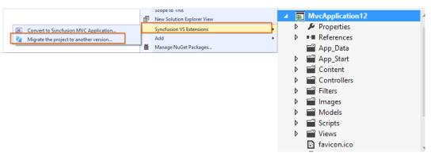
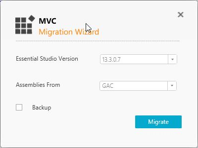

# Project Migration

Project Migration is a Visual Studio add-in that helps migrate the existing Syncfusion ASP.NET MVC (Web), Syncfusion ASP.NET MVC (Mobile) Or Syncfusion ASP.NET MVC (Classic) project from one Syncfusion version to another Syncfusion version.

Syncfusion ASP.NET MVC and ASP.NET MVC (Classic) Project Migration Utility is included here,

* Essential Studio for Enterprise Edition with the platforms ASP.NET MVC or ASP.NET MVC(Classic)
* Essential Studio for ASP.NET MVC
* Essential Studio for ASP.NET MVC (Classic)

I> This is not applicable from v.12.1.0.43 to v.13.1.0.30. The Syncfusion ASP.NET MVC and ASP.NET MVC (Classic) Project Migration Utilities are excluded from MVC Extension setup and integrated into Essential Studio ASP.NET MVC and ASP.NET MVC (Classic) platforms.

## ASP.NET MVC (Classic) Conversion\Migration:

By default, the Syncfusion ASP.NET MVC Extensions are configured in Visual Studio. When you want the ASP.NET MVC (Classic) extension, you can install it from the installed location.

Project Conversion and Migration (ASP.NET MVC(Classic):

Location: `{Drive}\Program Files (x86)\Syncfusion\Essential Studio\<Version>\Utilities\Extensions\ASP.NET MVC\Project Conversion`

For Example - VS2013: `C:\Program Files (x86)\Syncfusion\Essential Studio\13.2.0.18\Utilities\Extensions\ASP.NET MVC\Project Conversion\4.5.1\Syncfusion Web (Classic) Conversion and Migration.vsix`

## Migrate Syncfusion MVC Project

The following steps help you migrate from one version to another version of your existing Syncfusion ASP.NET MVC application.

1. Right-click on Syncfusion MVC Project and select Syncfusion VS Extensions. Choose Migrate the project to another version.

   

2. The Project Migration window appears. You can choose the required Syncfusion version that is installed in the machine that is either Syncfusion ASP.NET 
MVC or Syncfusion ASP.NET MVC (Classic).

   

3. The Project Migration window allows you to configure the following options:

   * Essential Studio Version: Select any version from the list of Installed Versions.
	  
   * Assemblies From: The option Assemblies from add the assembly to project from the following locations.
	  
	    1. Added From GAC - Refer the assemblies from the Global Assembly Cache
		2. Added from Installed Location - Refer the assemblies from the Syncfusion Installed locations.
        3. Add Referenced Assemblies to Solution - Copy and refer to the assemblies from project's solution file lib directory.  

4. Click the Migrate Button. The **Project Backup** dialog will be opened. If click Yes it will backup the current project before migrate the Syncfusion project. If click No it will migrate the project to required Syncfusion version without backup. 

     
      
5. The Syncfusion Reference Assemblies, Scripts and CSS are updated to the corresponding version in the project.
