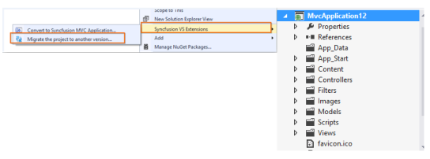
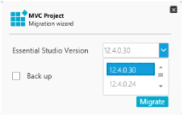

# Project Migration

Project Migration is a Visual Studio add-in that helps migrate the existing Syncfusion ASP.NET MVC/Syncfusion ASP.NET MVC (Classic) project from one Syncfusion version to another Syncfusion version. 

Syncfusion ASP.NET MVC and ASP.NET MVC (Classic) Project Migration utility is included in the given setups,

* Essential Studio for Enterprise Edition with the platforms ASP.NETMVC or ASP.NET MVC(Classic)
* Essential Studio for ASP.NET MVC
* Essential Studio for ASP.NET MVC (Classic)

N> This is not applicable from v.12.1.0.43 to v.13.1.0.30. The Syncfusion ASP.NET MVC and ASP.NET MVC (Classic) Project Migration utility excluded from MVC Extension setup and integrated into Essential Studio ASP.NET MVC and ASP.NET MVC (Classic) platforms. 

### ASP.NET MVC (Classic) Conversion\Migration:

By default, the Syncfusion ASP.NET MVC Extensions are configured. When you want the ASP.NET MVC (Classic) extension, you have to install from the installed location.

### Project Conversion and Migration(ASP.NET MVC(Classic):

   Location: _{Drive}\Program Files (x86)\Syncfusion\Essential Studio\&lt;Version&gt;\Utilities\Extensions\ASP.NET MVC\Project Conversion_

For Example – VS2013: _C:\Program Files (x86)\Syncfusion\Essential Studio\13.2.0.18\Utilities\Extensions\ASP.NET MVC\Project Conversion\4.5.1\Syncfusion Web (Classic) Conversion and Migration.vsix_

## Migrate Syncfusion Project 

The following steps help you to migrate from one version to another version of your existing Syncfusion ASP.NET MVC application. 

1. Right-click on Syncfusion MVC Project and select Syncfusion VS Extensions. Choose Migrate the project to another version.

   

2. The Project Migration window appears. You can choose the required Syncfusion version that is installed in the machine, that is either Syncfusion ASP.NET    
   MVC or Syncfusion ASP.NET MVC (Classic). 

   

3. The Project Migration window allows you to configure the following options:

   i.  Essential Studio Version: Select any version from the list of Installed Versions.
   
   ii. Backup: The option Back up copies the original project into the Backup folder in the same project location before migration.
	  
4. Press the Migrate button corresponding to the Syncfusion References, CSS, Script files and Web.Config version changes to update it in the project.

