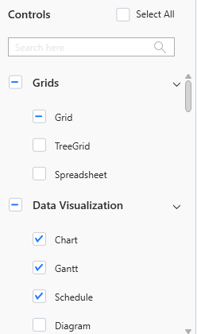
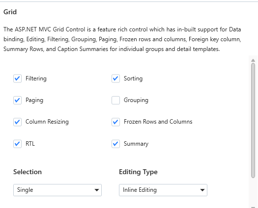
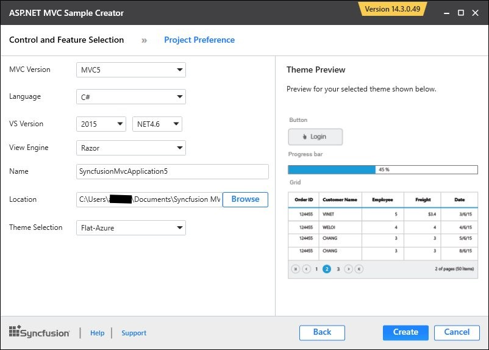
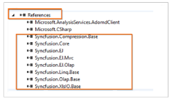

# Sample Creator

Sample Creator is the utility that allows you to create Syncfusion ASP.NET MVC/Syncfusion ASP.NET MVC (Classic) Projects along with the samples based on Controls and Features selection.

## Create Syncfusion MVC Project from Sample Creator

The following steps help you to create the Syncfusion ASP.NET MVC Project via the Sample Creator utility.

1. Launch the Syncfusion Essential Studio Dashboard and select the ASP.NET MVC/ASP.NET MVC (Classic) platform. Select the SAMPLE CREATOR button to launch the Sample Creator Wizard. Refer the following screenshot for more information. 

   

2. Syncfusion Sample Creator Wizard displaying the **Controls and its Feature Selection** section. 

   

### Controls Selection

 Listed here are the Syncfusion ASP.NET MVC controls so you can choose the required controls. And the controls are grouped product wise.

 

### Feature Selection

Based on the controls, the Feature is enabled to choose the features of the corresponding controls.

### Project Configuration

You can configure the following project details in the Sample Creator.

* MVC Version – Choose the required MVC Version. 
* Language – Select the language, either C# or VB.
* VS Version – Choose the Project version
* .NET Framework – Choose the .NET Framework version.
* View Engine – Select either Razor or ASPX. By default, Syncfusion supports only Razor view engine for ASP.NET MVC projects.
* Compress Style Sheets – Option to compress style sheets.
* Compress Scripts – Option to compress the scripts.
* Name – Name your Syncfusion MVC Application.
* Location – Choose the target location of your project.
* Theme Selection – Choose the required theme. The Theme Preview section shows the controls preview before create the Syncfusion project.

When you click the Create button, the new Syncfusion ASP.NET MVC project is created. The following is added in the project:

* Added the required Controller and View files in the project.
  
  

* Included the required Syncfusion ASP.NET MVC scripts and themes files.
  
  

* The required Syncfusion assemblies are added for selected controls under Project Reference.
 
  

* Configure the Web.Config file by adding the Syncfusion reference assemblies.

  

* Once the project is created you can open the project by clicking the Yes button. Refer the following screenshot for more information.

  