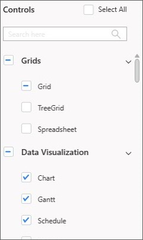
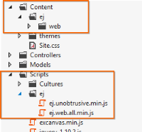

# Sample Creator in ASP.NET MVC Extensions

Sample Creator is the utility that allows you to create Syncfusion&reg; ASP.NET MVC/Syncfusion&reg; ASP.NET MVC (Classic) Projects along with the samples based on Controls and Features selection.

## Create Syncfusion&reg; MVC Project from Sample Creator

The following steps help you to create the Syncfusion&reg; ASP.NET MVC Project via the Sample Creator utility.

1. To launch ASP.NET MVC (Essential&reg; JS 1) Sample Creator application, follow either one of the options below: 

   **Option 1:**  
   Click **Syncfusion&reg; Menu** and choose **Essential Studio&reg; for ASP.NET MVC (EJ1) > Launch Sample Creator…** in **Visual Studio**.

   

   N> In Visual Studio 2019, Syncfusion&reg; menu available under Extension in Visual Studio menu.

   **Option 2:**  
   Launch the Syncfusion&reg; Essential Studio&reg; Dashboard and select the ASP.NET MVC (Essential&reg; JS 1)/ASP.NET MVC (Classic) platform. Select the Sample Creator button to launch the ASP.NET MVC (Essential&reg; JS 1) Sample Creator application. Refer to the following screenshot for more information.
 
   

2. Syncfusion&reg; Sample Creator Wizard displaying the **Controls and its Feature Selection** section. 

   

### Controls Selection

 Listed here are the Syncfusion&reg; ASP.NET MVC controls so you can choose the required controls. And the controls are grouped product wise.

 

### Feature Selection

Based on the controls, the Feature is enabled to choose the features of the corresponding controls.

### Project Configuration

You can configure the following project details in the Sample Creator.

* MVC Version – Choose the required MVC Version. 
* Language – Select the language, either C# or VB.
* VS Version – Choose the Project version
* .NET Framework – Choose the .NET Framework version.
* View Engine – Select either Razor or ASPX. By default, Syncfusion&reg; supports only Razor view engine for ASP.NET MVC projects.
* Compress Style Sheets – Option to compress style sheets.
* Compress Scripts – Option to compress the scripts.
* Name – Name your Syncfusion&reg; MVC Application.
* Location – Choose the target location of your project.
* Theme Selection – Choose the required theme. The Theme Preview section shows the controls preview before create the Syncfusion&reg; project.

When you click the Create button, the new Syncfusion&reg; ASP.NET MVC project is created. The following is added in the project:

* Added the required Controller and View files in the project.
  
  

* Included the required Syncfusion&reg; ASP.NET MVC scripts and themes files.
  
  

* The required Syncfusion&reg; assemblies are added for selected controls under Project Reference.
 
  

* Configure the Web.Config file by adding the Syncfusion&reg; reference assemblies.

  

* Once the project is created you can open the project by clicking the Yes button. Refer the following screenshot for more information.

  