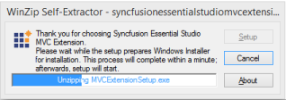
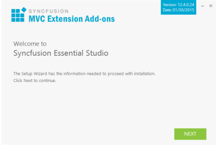
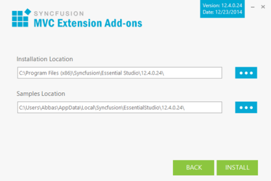
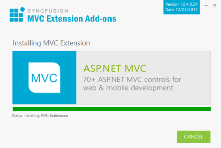
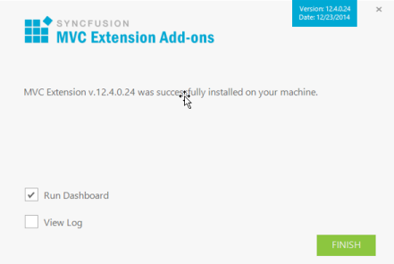

# Step-by-Step Installation  

The following procedure illustrates how to install Syncfusion Essential Studio MVC Extension. 

1. Double-click the Syncfusion Essential Studio MVC Extension Setup file. The Self-Extractor Wizard opens and extracts the package automatically.

   

   > Note: The WinZip Self-Extractor extracts the syncfusionessentialstudiomvcextension_(version).exe dialog, displaying the unzip operation of the package.

   

2. Click the Next button.

   

   _Setup information_

3. After reading the terms, click the I accept the terms and conditions check box.
4. Click the Next button. The Installation location window opens. It shows the Syncfusion Essential studio setup installed location.

   

   > Note: It does not allow you to change the install path since its Add on setup for Syncfusion Essential Studio.

5. To install it in the displayed default location, click the Install button.

   

   > Note: The Completed screen is displayed once the selected package is installed.

   

6. Select the Run Dashboard check box to launch the Dashboard after installed.
7. Click Finish button. Syncfusion MVC Extension is installed in your system and the Syncfusion Essential Studio [Dashboard](http://help.syncfusion.com/ug/common/Documents/dashboard.htm) is launched automatically.

