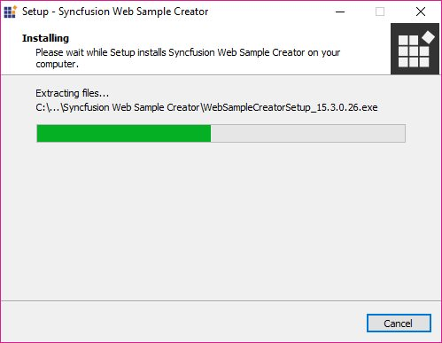
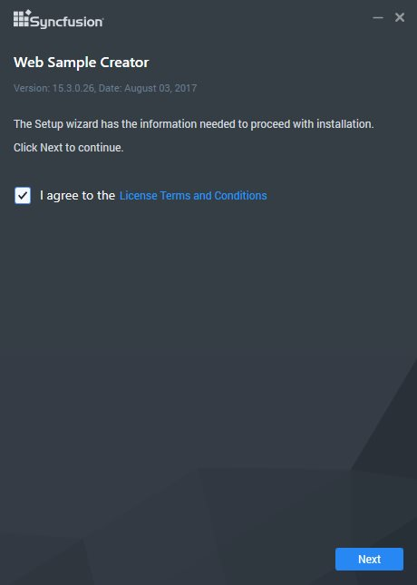
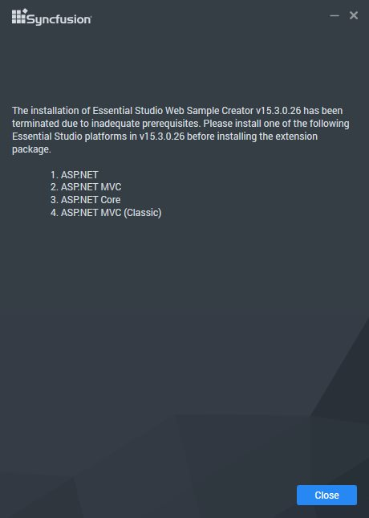
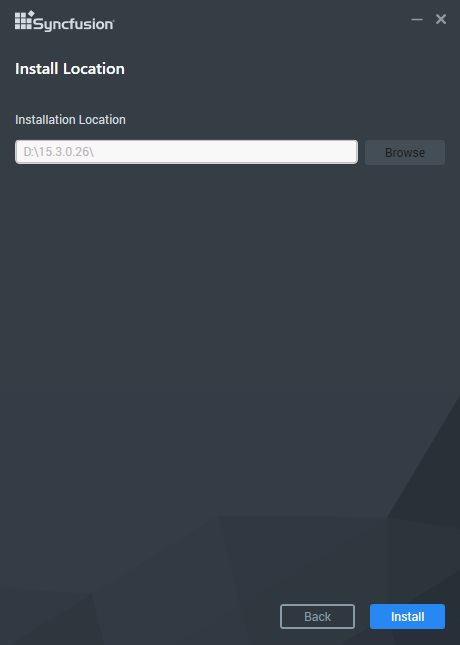
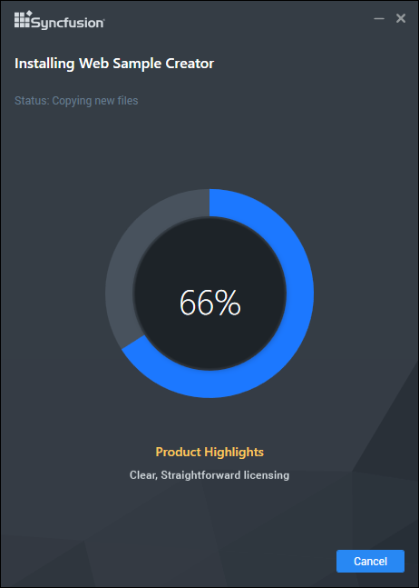
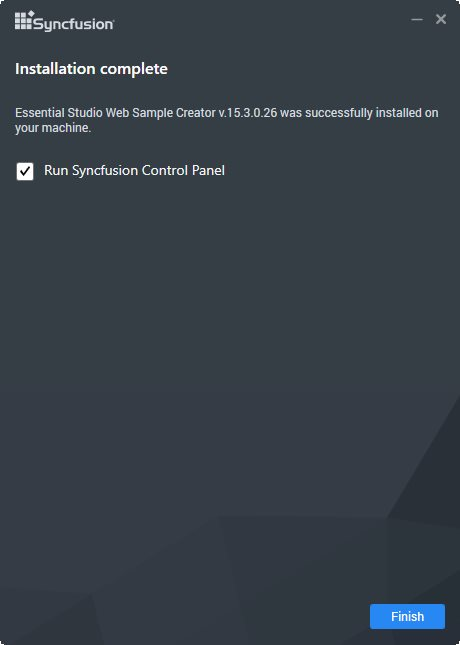

# Step-by-Step Installation  

The following procedure illustrates how to install Syncfusion Web Sample Creator. Before install the Syncfusion Web Sample Creator, make sure any of the following setups are installed. 

   * Essential Studio for Enterprise Edition with all platforms
   * Essential Studio for ASP.NET MVC
   * Essential Studio for ASP.NET
   * Essential Studio for ASP.NET Core
   * Essential Studio for ASP.NET MVC(Classic)

1. Double-click the Syncfusion Web Sample Creator Setup file. The Self-Extractor Wizard opens and extracts the package automatically.

   

   N> The WinZip Self-Extractor extracts the syncfusionwebsamplecreator_(version).exe dialog, displaying the unzip operation of the package.

   If complete Essential Studio suite or any of the required Essential Studio platform setups are installed, Syncfusion Web Sample Creator setup will be installed.
   
   

   If complete Essential Studio suite or any of the required Essential Studio platform setups are not installed, Syncfusion Web Sample Creator setup will show the below message.
   
   

2. After reading the terms, click the I accept the terms and conditions check box. 

3. Click the Next button. The Installation location window opens. It shows the Syncfusion Essential Studio setup installed location.

   

   N> It does not allow you to change the install path since its Add on setup for Syncfusion Essential Studio.

4. To install it in the displayed default location, click the Install button.

   

5. The Completed screen will be displayed once the selected package is installed.

   

5. Select the `Run Syncfusion Control Panel` check box to launch the `Syncfusion Control Panel` after installed.

6. Click Finish button. Syncfusion Web Sample Creator is installed in your system and the [Syncfusion Control Panel](https://help.syncfusion.com/extension/aspnet-mvc-extension/sample-creator) is launched automatically.

I>The syncfusionessentialextension.exe setup has renamed to syncfusionwebsamplecreator.exe from 2015 Volume 4 release.
