---
layout: post
title: Syncfusion Project Templates | Extension | Syncfusion
description: Syncfusion Project Templates
platform: extension
control: Syncfusion Extensions
documentation: ug
---

# Syncfusion Project Templates

Syncfusion provides the Visual Studio Project Templates for the Syncfusion ASP.NET MVC, Syncfusion ASP.NET MVC (Mobile) and ASP.NET MVC (Classic) platforms to create a Syncfusion MVC application.

Syncfusion ASP.NET MVC and ASP.NET MVC (Classic) Project Templates are included here,

* Essential Studio for Enterprise Edition with the platforms ASP.NETMVC or ASP.NET MVC(Classic)
* Essential Studio for ASP.NET MVC
* Essential Studio for ASP.NET MVC (Classic)

**NOTE******

This is not applicable from v.12.1.0.43 to v.13.1.0.30. Syncfusion ASP.NET MVC and ASP.NET MVC (Classic) Project Templates are excluded from MVC Extension setup and integrated into Essential Studio ASP.NET MVC and ASP.NET MVC (Classic) platforms.

## ASP.NET MVC (Classic) Extensions:

By default, the Syncfusion ASP.NET MVC extensions are configured in Visual Studio. When you want the ASP.NET MVC (Classic) extension, you can install it from the installed location.

Project Templates (ASP.NET MVC (Classic):

Location: __{____Drive____}\____Program__ __Files__ __(____x86____)\____Syncfusion____\____Essential__ __Studio____\<____Version____>\____Utilities____\____Extensions____\____ASP____.____NET__ __MVC__ __\____Classic__

For Example – VS2013:__C____:\____Program__ __Files__ __(____x86____)\____Syncfusion____\____Essential__ __Studio____\____13____.____2____.____0____.____18____\____Utilities____\____Extensions____\____ASP____.____NET__ __MVC____\____Classic____\____4____.____5____.____1____\____Syncfusion____.____MVC____.____VSPackage____.____Web____.____Classic____.____vsix__

Refer to the following steps to create the Syncfusion ASP.NET MVC and ASP.NET MVC (Classic) applications.

## Create Syncfusion MVC (Web) Project    

The following steps help you create the Syncfusion ASP.NET MVC Project via the Visual Studio Project Template.

1. To create a Syncfusion Project, choose New Project-> Syncfusion->Web->Syncfusion ASP.NET MVC Web Application from Visual Studio.

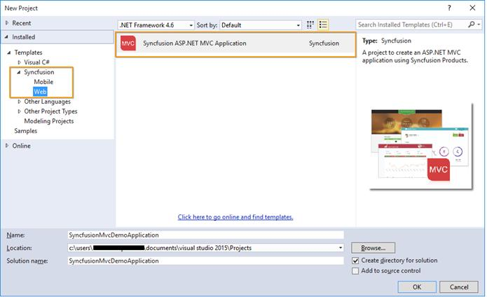

2. Name the Project, choose the destination location as required and set the Framework of the project then click OK. The Project Configuration Wizard appears.  
3. Choose the options to configure the Syncfusion ASP.NET MVC Application by using the following Project Configuration window.

Project configurations:

Target MVC Version: Choose the required MVC Version.

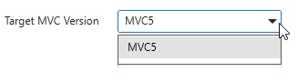

View Engine: Choose the View Engine of the Sample.

Theme: Choose the Required Theme.

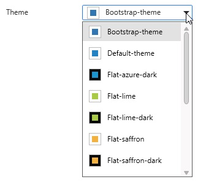

Language: Select the language, either C# or VB.

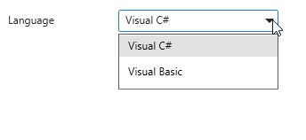

Assemblies From: Choose the assembly location from where it is going to be added to the project.

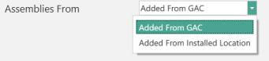

Combine/Compress style sheets: Option to compress style sheets.

Combine/Compress Scripts: Option to Compress Scripts.

When you have not chosen the Add Samples option then the Syncfusion ASP.NET MVC/ Syncfusion ASP.NET MVC (Classic) project is created with required assemblies, CSS and Script files only.

By choosing the Add Samples option you can add the code examples for your selected controls and its features.

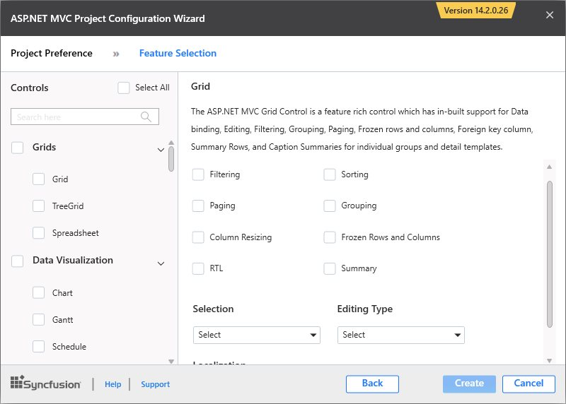

Select Control: Choose the control based on your need.

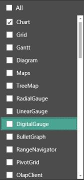

Select Feature: Choose Feature based on your need.

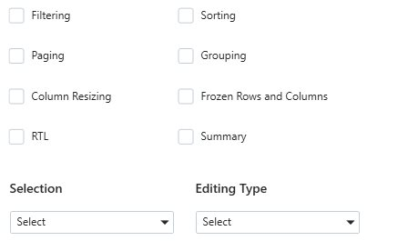

Once the Project Configuration Wizard is done, the Syncfusion MVC Project is created.

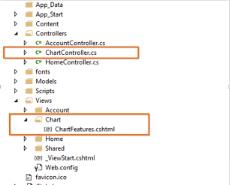

Syncfusion references, Scripts, CSS and required Web.config entries are added to the Project.

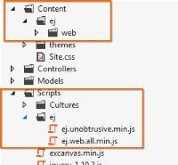

## Create Syncfusion MVC (Mobile) Project

The following steps help you create the Syncfusion ASP.NET MVC (Mobile) Project via the Visual Studio Project Template.

1. To create a Syncfusion Project, choose **New** **Project****->** **Syncfusion****->****Mobile****->****Syncfusion** **ASP****.****NET** **MVC** **(****Mobile****)** **Application** from Visual Studio.

2. Name the Project, choose the destination location as required and set the Framework of the project then click OK. The Project Configuration Wizard appears.  
3. Choose the options to configure the Syncfusion ASP.NET MVC Application by using the following Project Configuration window.

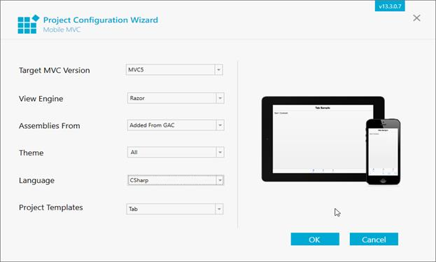

### Project configurations:

Target MVC Version: Choose the required MVC Version.

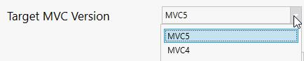

View Engine: Choose the View Engine of the Sample.

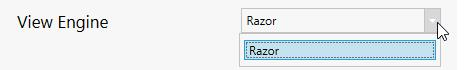

Theme: Choose the Required Theme.

Language: Select the language, either C# or VB.

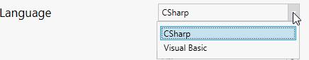

Assemblies From: Choose the assembly location from where it is going to be added to the project.

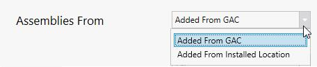

Project templates: Choose the required Control.

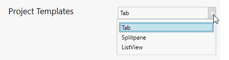

4. Once the Project Configuration Wizard is done, the Syncfusion MVC Project is created.

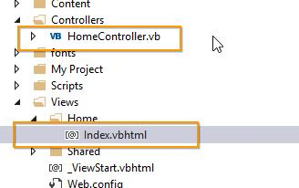

5. Syncfusion references, Scripts, CSS and required Web.config entries are added to the Project.

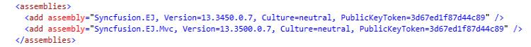

