# Syncfusion Project Templates

Syncfusion provides the Visual Studio Project Templates for the Syncfusion ASP.NET MVC, Syncfusion ASP.NET MVC (Classic) and ASP.NET MVC (Mobile) platforms to create a Syncfusion MVC application.

Syncfusion ASP.NET MVC and ASP.NET MVC (Classic) Project Templates are included here,

* Essential Studio for Enterprise Edition with the platforms ASP.NETMVC or ASP.NET MVC(Classic)
* Essential Studio for ASP.NET MVC
* Essential Studio for ASP.NET MVC (Classic)

I> This is not applicable from v.12.1.0.43 to v.13.1.0.30. Syncfusion ASP.NET MVC and ASP.NET MVC (Classic) Project Templates are excluded from MVC Extension setup and integrated into Essential Studio ASP.NET MVC and ASP.NET MVC (Classic) platforms.

## ASP.NET MVC Extensions:

By default, the Syncfusion ASP.NET MVC extensions are configured in Visual Studio. When you want the ASP.NET MVC (Classic) extension, you can install it from the installed location.

Project Templates (ASP.NET MVC (Classic):

Location: `{Drive}\Program Files (x86)\Syncfusion\Essential Studio\<Version>\Utilities\Extensions\ASP.NET MVC \Classic`

For Example – VS2013:`C:\Program Files (x86)\Syncfusion\Essential Studio\13.2.0.18\Utilities\Extensions\ASP.NET MVC\Classic\4.5.1\Syncfusion.MVC.VSPackage.Web.Classic.vsix`

Refer to the following steps to create the Syncfusion ASP.NET MVC and ASP.NET MVC (Classic) applications.

## Create Syncfusion MVC (Web) Project    

The following steps help you create the Syncfusion ASP.NET MVC Project via the Visual Studio Project Template.

1. To create a Syncfusion Project, choose New Project-> Syncfusion->Web->Syncfusion ASP.NET MVC Web Application from Visual Studio.

   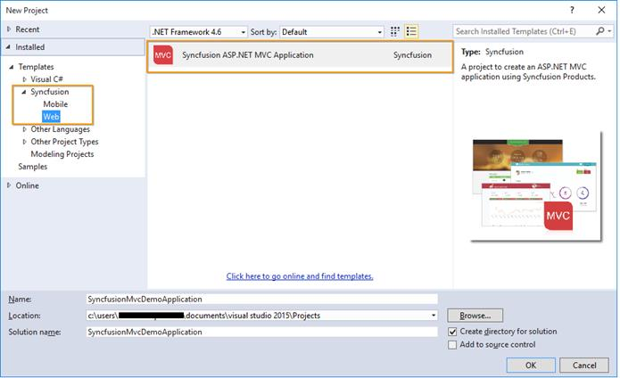

2. Name the Project, choose the destination location as required and set the Framework of the project then click OK. The Project Configuration Wizard appears.  

3. Choose the options to configure the Syncfusion ASP.NET MVC Application by using the following Project Configuration window.

   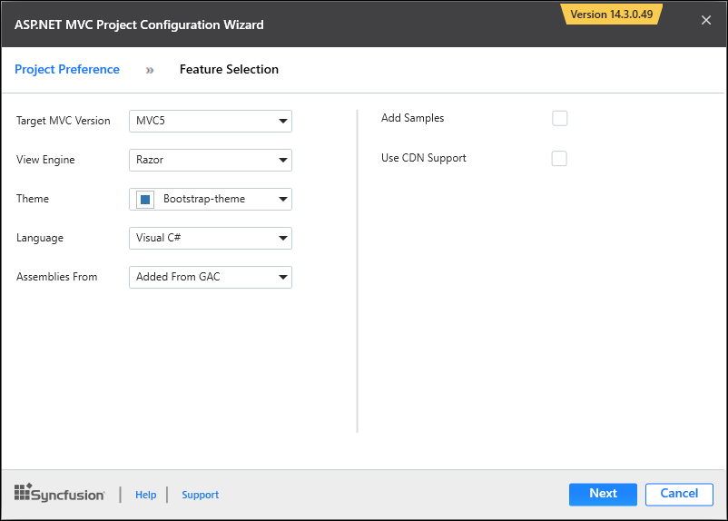

   ### Project configurations:

   **Target MVC Version:** Choose the required MVC Version.

   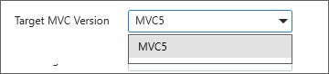

   **View Engine:** Choose the View Engine of the Sample.

   

   **Theme:** Choose the Required Theme.

   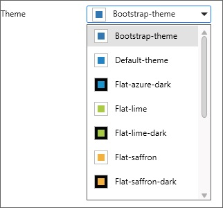

   **Language:** Select the language, either C# or VB.

   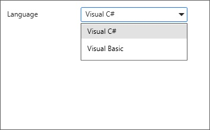

   **Assemblies From:** Choose the assembly location from where it is going to be added to the project.

   

   **Use CDN Support:** The master page of the project will be updated based on required Syncfusion CDN links.

   

4. When you have not chosen the Add Samples option then the Syncfusion ASP.NET MVC/ Syncfusion ASP.NET MVC (Classic) project is created with required assemblies, CSS and Script files only.

5. By choosing the Add Samples option you can add the code examples for your selected controls and its features.

   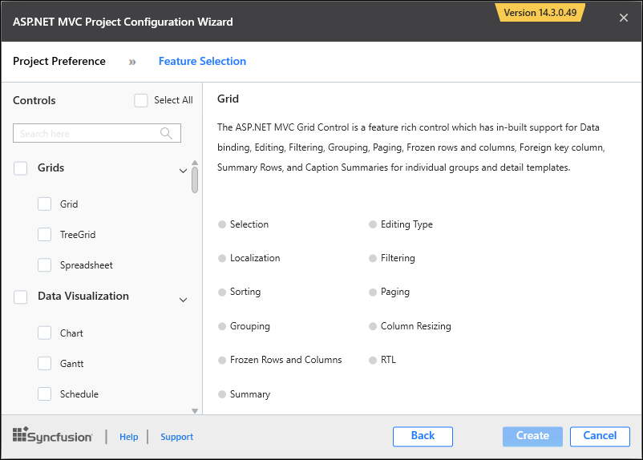

   **Select Control:** Choose the control based on your need.

   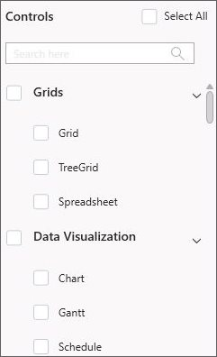

   **Select Feature:** Choose Feature based on your need.

   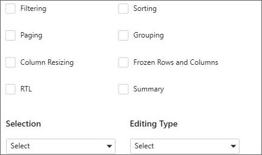

6. Once the Project Configuration Wizard is done, the Syncfusion MVC Project is created.

   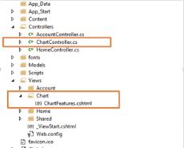

7. Syncfusion references, Scripts, CSS and required Web.config entries are added to the Project.

   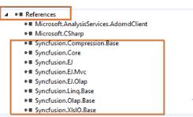

   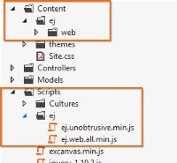

   

8. Then, Syncfusion licensing registration required message box will be shown as follow, if you are installed the trial setup or NuGet packages since Syncfusion introduced the licensing system from 2018 Volume 2 (v16.2.0.41) Essential Studio release. Please navigate to the [help topic](https://help.syncfusion.com/common/essential-studio/licensing/license-key#how-to-generate-syncfusion-license-key) which is shown in the licensing message box to generate and register the Syncfusion license key to your project. Refer to this [blog](https://blog.syncfusion.com/post/Whats-New-in-2018-Volume-2-Licensing-Changes-in-the-1620x-Version-of-Essential-Studio.aspx) post for understanding the licensing changes introduced in Essential Studio.

   

## Create Syncfusion MVC (Mobile) Project

The following steps help you create the Syncfusion ASP.NET MVC (Mobile) Project via the Visual Studio Project Template.

1. To create a Syncfusion Project, choose **New Project -> Syncfusion -> Mobile -> Syncfusion ASP.NET MVC(Mobile) Application** from Visual Studio.

   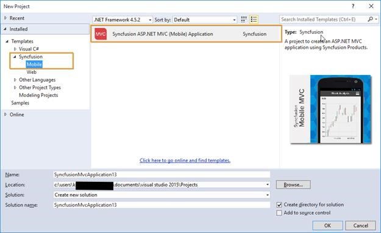

2. Name the Project, choose the destination location as required and set the Framework of the project then click OK. The Project Configuration Wizard appears.  
3. Choose the options to configure the Syncfusion ASP.NET MVC Application by using the following Project Configuration window.

   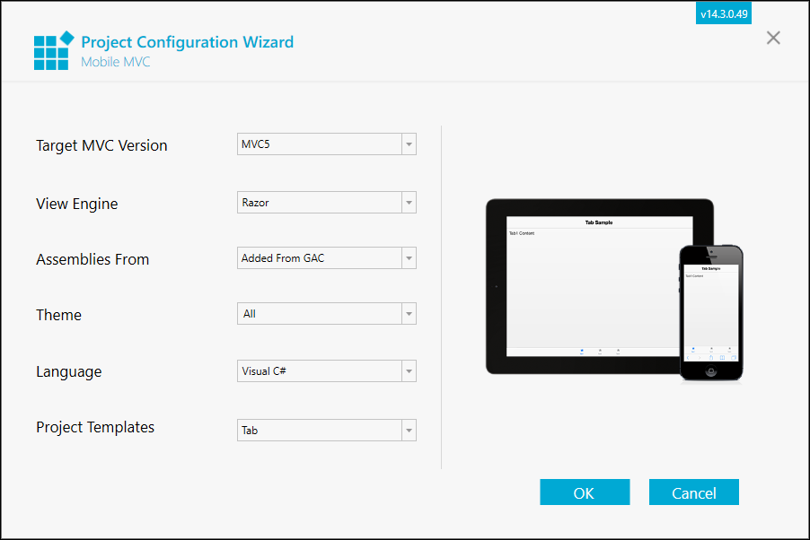

   ### Project configurations:

   **Target MVC Version:** Choose the required MVC Version.

   

   **View Engine:** Choose the View Engine of the Sample.

   

   **Theme:** Choose the Required Theme.

   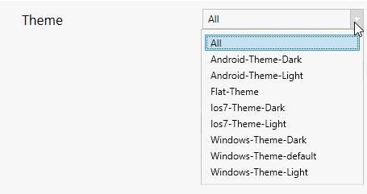

   **Language:** Select the language, either C# or VB.

   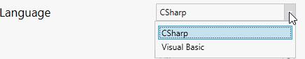

   **Assemblies From:** Choose the assembly location from where it is going to be added to the project.

   

   **Project templates:** Choose the required Control.

   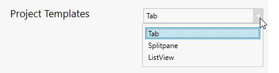

4. Once the Project Configuration Wizard is done, the Syncfusion MVC Project is created.

   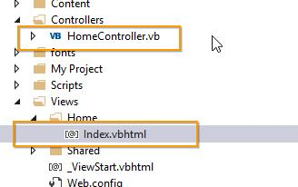

5. Syncfusion references, Scripts, CSS and required Web.config entries are added to the Project.

   

   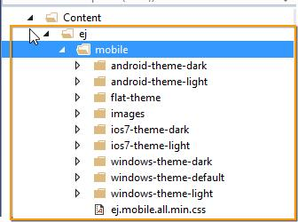
 
   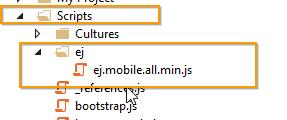

   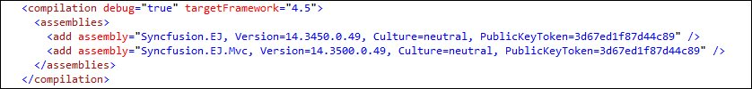

