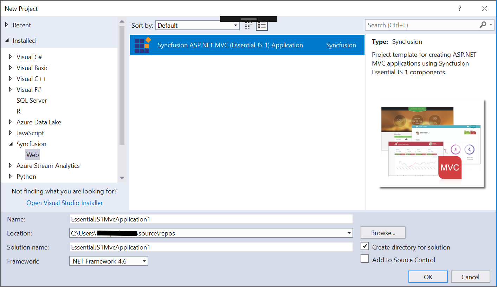
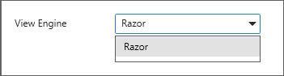
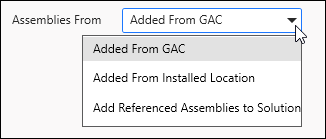

# Syncfusion&reg; Project Templates for ASP.NET MVC (Essential&reg; JS 1)

Syncfusion&reg; provides the Visual Studio Project Templates for the Syncfusion&reg; ASP.NET MVC, Syncfusion&reg; ASP.NET MVC (Classic) and ASP.NET MVC (Mobile) platforms to create a Syncfusion&reg; MVC application.

Syncfusion&reg; ASP.NET MVC and ASP.NET MVC (Classic) Project Templates are included here,

* Essential Studio&reg; for Enterprise Edition with the platforms ASP.NETMVC or ASP.NET MVC(Classic)
* Essential Studio&reg; for ASP.NET MVC
* Essential Studio&reg; for ASP.NET MVC (Classic)

I> This is not applicable from v.12.1.0.43 to v.13.1.0.30. Syncfusion&reg; ASP.NET MVC and ASP.NET MVC (Classic) Project Templates are excluded from MVC Extension setup and integrated into Essential Studio&reg; ASP.NET MVC and ASP.NET MVC (Classic) platforms.

## ASP.NET MVC Extensions:

By default, the Syncfusion&reg; ASP.NET MVC extensions are configured in Visual Studio. When you want the ASP.NET MVC (Classic) extension, you can install it from the installed location.

Project Templates (ASP.NET MVC (Classic):

Location: `{Drive}\Program Files (x86)\Syncfusion\Essential Studio\<Version>\Utilities\Extensions\ASP.NET MVC \Classic`

For Example – VS2013:`C:\Program Files (x86)\Syncfusion\Essential Studio\13.2.0.18\Utilities\Extensions\ASP.NET MVC\Classic\4.5.1\Syncfusion.MVC.VSPackage.Web.Classic.vsix`

Refer to the following steps to create the Syncfusion&reg; ASP.NET MVC and ASP.NET MVC (Classic) applications.

## Create Syncfusion&reg; MVC (Web) Project    

The following steps help you create the Syncfusion&reg; ASP.NET MVC (Essential&reg; JS 1) Application via the Visual Studio Project Template:

> Before use the Syncfusion&reg; ASP.NET MVC (Essential&reg; JS 1) Project Template, check whether the **Syncfusion&reg; Essential&reg; JS1 AspNet MVC VSExtensions** installed or not in Visual Studio Extension Manager by clicking on the Tools -> Extensions and Updates -> Installed for Visual Studio 2017 or lower and for Visual Studio 2019 by clicking on the Extensions -> Manage Extensions -> Installed.

1. To create a Syncfusion&reg; ASP.NET MVC (Essential&reg; JS 1) project, follow either one of the options below:

   **Option 1:**  
    Click **Syncfusion&reg; Menu** and choose **Essential Studio&reg; for ASP.NET MVC (EJ1) > Create New Syncfusion&reg; Project…** in **Visual Studio**.

    

    N> In Visual Studio 2019, Syncfusion&reg; menu available under Extension in Visual Studio menu.

   **Option 2:**  
   Choose **File > New > Project** and navigate to **Syncfusion&reg; > Web > Syncfusion&reg; ASP.NET MVC (Essential&reg; JS 1) Application** in **Visual Studio**.
   
   

2. Name the Project, choose the destination location as required and set the Framework of the project then click OK. The Project Configuration Wizard appears.  

3. Choose the options to configure the Syncfusion&reg; ASP.NET MVC Application by using the following Project Configuration window.

   

   ### Project configurations:

   **Target MVC Version:** Choose the required MVC Version.

   

   **View Engine:** Choose the View Engine of the Sample.

   

   **Theme:** Choose the Required Theme.

   

   **Language:** Select the language, either C# or VB.

   

   **Assemblies From:** Choose the assembly location from where it is going to be added to the project.

   

   **Use CDN Support:** The master page of the project will be updated based on required Syncfusion&reg; CDN links.

   

4. When you have not chosen the Add Samples option then the Syncfusion&reg; ASP.NET MVC/ Syncfusion&reg; ASP.NET MVC (Classic) project is created with required assemblies, CSS and Script files only.

5. By choosing the Add Samples option you can add the code examples for your selected controls and its features.

   

   **Select Control:** Choose the control based on your need.

   

   **Select Feature:** Choose Feature based on your need.

   

6. Once the Project Configuration Wizard is done, the Syncfusion&reg; MVC Project is created.

   

7. Syncfusion&reg; references, Scripts, CSS and required Web.config entries are added to the Project.

   

   

   

8. Then, Syncfusion&reg; licensing registration required message box will be shown as follow, if you are installed the trial setup or NuGet packages since Syncfusion&reg; introduced the licensing system from 2018 Volume 2 (v16.2.0.41) Essential Studio&reg; release. Please navigate to the [help topic](https://help.syncfusion.com/common/essential-studio/licensing/overview#how-to-generate-syncfusion-license-key) which is shown in the licensing message box to generate and register the Syncfusion&reg; license key to your project. Refer to this [blog](https://www.syncfusion.com/blogs/post/whats-new-in-2018-volume-2.aspx) post for understanding the licensing changes introduced in Essential Studio&reg;.

   

## Create Syncfusion&reg; MVC (Mobile) Project

The following steps help you create the Syncfusion&reg; ASP.NET MVC (Mobile) Project via the Visual Studio Project Template.

1. To create a Syncfusion&reg; Project, choose **New Project -> Syncfusion&reg; -> Mobile -> Syncfusion&reg; ASP.NET MVC(Mobile) Application** from Visual Studio.

   

2. Name the Project, choose the destination location as required and set the Framework of the project then click OK. The Project Configuration Wizard appears.  
3. Choose the options to configure the Syncfusion&reg; ASP.NET MVC Application by using the following Project Configuration window.

   

   ### Project configurations:

   **Target MVC Version:** Choose the required MVC Version.

   

   **View Engine:** Choose the View Engine of the Sample.

   

   **Theme:** Choose the Required Theme.

   

   **Language:** Select the language, either C# or VB.

   

   **Assemblies From:** Choose the assembly location from where it is going to be added to the project.

   

   **Project templates:** Choose the required Control.

   

4. Once the Project Configuration Wizard is done, the Syncfusion&reg; MVC Project is created.

   

5. Syncfusion&reg; references, Scripts, CSS and required Web.config entries are added to the Project.

   

   
 
   

   

