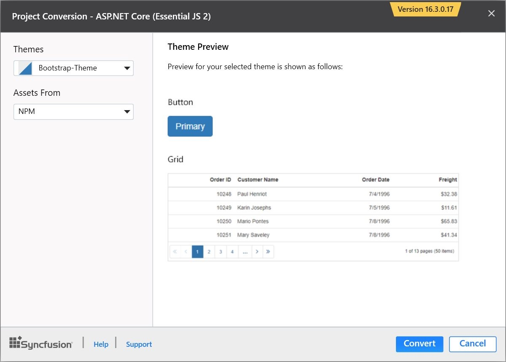

# Syncfusion Project Conversion  

Syncfusion Project Conversion is a Visual Studio add-in that converts an existing ASP.NET Core application into a Syncfusion ASP.NET Core (Essential JS 2) Web application by adding the required assemblies and resource files

I> The Syncfusion ASP.NET Core (Essential JS 2) Web Application Project Conversion utility is available from v16.3.0.17. 

## Convert into Syncfusion ASP.NET Core (Essential JS 2) Web Application 

The following steps direct you to use the Syncfusion Project Conversion in the existing ASP.NET Core Web Application.

1. Open an existing Microsoft ASP.NET Core Web Application or create a new Microsoft ASP.NET Core Web Application. 

2. Right-click on **Project** from Solution Explorer and select **Syncfusion Essential JS 2** and choose the **Convert to Syncfusion ASP.NET Core (Essential JS 2) Application**. Refer to the following screenshot for more information.

   

3. Project Conversion Wizard opens to configure the project.

   

   **Choose the assets from:**

   * **NPM** - Refer to the assets from NPM package manager. 

   * **CDN** - Refer to the assets from Syncfusion CDN links.

   * **Installed Location** - Refer to the assets from Syncfusion installed locations.    

   N> *Installed location option will be available only when the Syncfusion Essential JavaScript 2 setup has been installed*.   
   
   
   
   **Choose the Theme:**
   
   Choose the required theme. The Theme Preview section shows the controls preview before convert into a Syncfusion project.
   
   

   The **Project Backup** dialog will be opened. If click **Yes**, it will backup the current project before converting it to Syncfusion project. If click **No**, it will convert the project to Syncfusion project without backup.
    
      

4. The required Syncfusion NuGet packages, Scripts and CSS are included in the ASP.NET Core Web Application. Refer to the following screenshots for more information.

   

   
   
   

   
## Rendering Control after Syncfusion ASP.NET Core Conversion

Once you converted your ASP.NET Core Web Application to Syncfusion ASP.NET Core (Essential JS 2) Web Application using Syncfusion Visual Studio Extension, perform the following steps to render the Syncfusion controls to your project.

1. Include the Syncfusion control snippets to any of the view page of your project. Refer the following screenshot for more information.

   

2. Then run the project and the following output will be displayed.

   
   
   