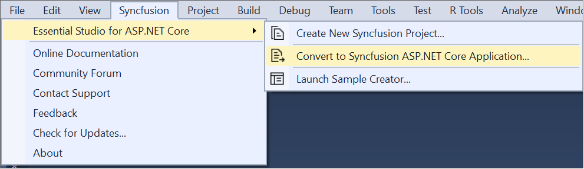

# Syncfusion Project Conversion

Syncfusion ASP.NET Core conversion is a Visual Studio add-in that converts an existing ASP.NET Core application into a Syncfusion ASP.NET Core (Essential JS 2) Web application by adding the required assemblies and resource files.

I> The Syncfusion ASP.NET Core (Essential JS 2) Web Application Project Conversion utility is available from v16.3.0.17. 

## Convert into Syncfusion ASP.NET Core (Essential JS 2) Web Application 

The steps below help you to convert the ASP.NET Core application to the Syncfusion ASP.NET Core application via the Visual Studio 2019:

> Before use, the Syncfusion ASP.NET Core Project Conversion, check whether the **ASP.NET Core Extensions - Syncfusion** installed or not in Visual Studio Extension Manager by clicking on the Tools -> Extensions and Updates -> Installed for Visual Studio 2017 or lower and for Visual Studio 2019 by clicking on the Extensions -> Manage Extensions -> Installed. Also, check whether the corresponding Essential Studio version build installed or not. If the Essential Studio version is not same for both the Extension and build, then the Project Conversion will not be shown.

1. Open an existing Microsoft ASP.NET Core Web Application or create a new Microsoft ASP.NET Core Web Application. 

2. To open Project Conversion Wizard, follow either one of the options below:

   **Option 1:**

   Click **Syncfusion Menu** and choose **Essential Studio for ASP.NET Core > Convert to Syncfusion ASP.NET Core Application…** in **Visual Studio Menu**.

   

   N> In Visual Studio 2019, Syncfusion menu available under **Extensions** in Visual Studio menu.

   **Option 2:**

   Right-click the **Project** from Solution Explorer, select **Syncfusion Web**, and choose the **Convert to Syncfusion ASP.NET Core Application...**

   

3. The Syncfusion ASP.NET Core Project Conversion window will appear. You can choose the required version of Syncfusion ASP.NET Core, Assets from, and Themes to convert the application.

   

   **Choose the assets from:**

   * **NPM** - Refer to the assets from NPM package manager. 

   * **CDN** - Refer to the assets from Syncfusion CDN links.

   * **Installed Location** - Refer to the assets from Syncfusion installed locations.    

   N> *Installed location option will be available only when the Syncfusion Essential JavaScript 2 setup has been installed*.      
   
   **Choose the Theme:** Choose the required theme.

4. Check the **“Enable a backup before converting”** checkbox if you want to take the project backup and choose the location.

5. The required Syncfusion NuGet packages, Scripts and CSS are included in the ASP.NET Core Web Application. Refer to the following screenshots for more information.

   

   
   
   

   If you enabled project backup before converting, the old project was saved in the specified backup path location, as shown below once the conversion process completed.

   

5. If you installed the trial setup or NuGet packages from nuget.org you must register the Syncfusion license key to your project since Syncfusion introduced the licensing system from 2018 Volume 2 (v16.2.0.41) Essential Studio release. Navigate to the [help topic](https://help.syncfusion.com/common/essential-studio/licensing/license-key#how-to-generate-syncfusion-license-key) to generate and register the Syncfusion license key to your project. Refer to this [blog](https://blog.syncfusion.com/post/Whats-New-in-2018-Volume-2-Licensing-Changes-in-the-1620x-Version-of-Essential-Studio.aspx?_ga=2.11237684.1233358434.1587355730-230058891.1567654773) post for understanding the licensing changes introduced in Essential Studio.
   
## Rendering Control after Syncfusion ASP.NET Core Conversion

Once you convert your ASP.NET Core Web Application to Syncfusion ASP.NET Core (Essential JS 2) Web Application using Syncfusion Visual Studio Extension, perform the following steps to render the Syncfusion controls to your project.

1. Include the Syncfusion control snippets to any of the view page of your project. Refer the following screenshot for more information.

   

2. Then run the project and the following output will be displayed.

   
   
   