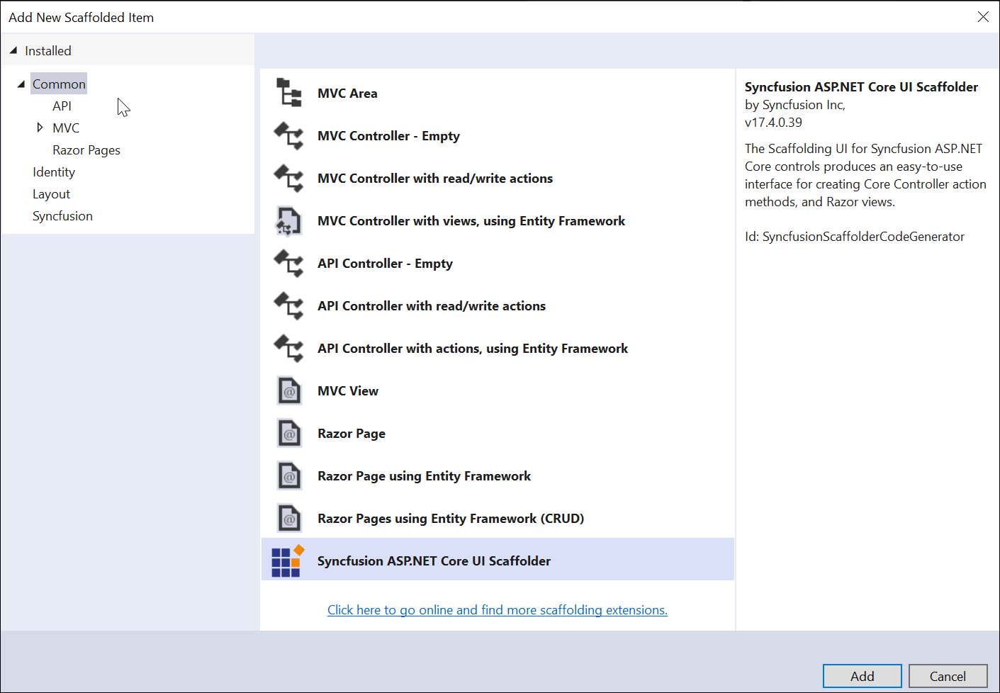
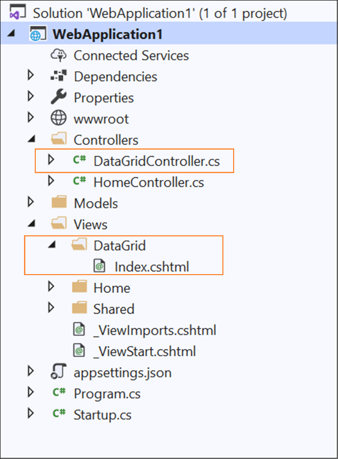

# Scaffolding

Syncfusion provides **Visual Studio Scaffolding** for Syncfusion ASP.NET Core platform to quickly add code that interacts with data models and reduce the amount of time to develop with data operation in your project. Scaffolding provides an easier way to create Views and Controller action methods for Syncfusion ASP.NET Core DataGrid, Charts, Scheduler, Diagram, Tree Grid, Rich Text Editor, Document Editor, and PDF Viewer controls.

N>Check that at least one Entity Framework model exists, and the application has been compiled once. If no Entity Framework model exist in your application, refer to this [documentation](https://docs.microsoft.com/en-us/aspnet/core/tutorials/first-mvc-app/adding-model?view=aspnetcore-3.1) to generate the Entity Framework model. After the model file has been added, check that the required DBContext and properties have been added. Build the application before try scaffolding. If any changes have been done in the model properties, rebuild the application once before performing scaffolding. 

I> The Syncfusion ASP.NET Core UI Scaffolder is available from v17.4.0.39.

## Add a scaffolded item

The following steps explain you how to add a scaffolded item to your ASP.NET Core Web application.

1. Right-click the **Controllers** folder in the Solution Explorer, click **Add**, and then select **New Scaffolded Item…**

   

2. In the **Add Scaffold dialog**, select **Syncfusion ASP.NET Core UI Scaffolder**, and then click **‘Add’**.

   

3. In the Syncfusion UI Scaffolder dialog, select the desired Syncfusion control to perform scaffolding, and then click **Next**.

   

4. Syncfusion UI Scaffolder for the selected control dialog will be opened. Enter the **Controller Name** and **View Name** as application requirements, and then select the required **Model Class** of the active project and its relevant **Data Context Class**, and then click **Next**.

   

5. Syncfusion UI Scaffolder for the selected control feature dialog will be opened. Select the required features, update the required data field, and then click **Add**.

   

6. The **Controller** and the corresponding **View** files are created into the application  with the selected features of Syncfusion control code snippet.

   

7. Then, add navigation to the created view file based on your requirement to open in the webpage.

## How to render Syncfusion control?

Refer to the following UG links to render Syncfusion control after performed scaffolding. 

[Configure  using Syncfusion.EJ2.AspNet.Core package](https://ej2.syncfusion.com/aspnetcore/documentation/getting-started/visual-studio-2017/)

