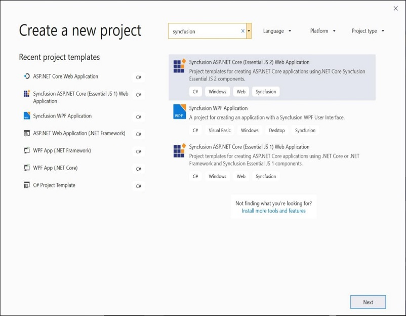
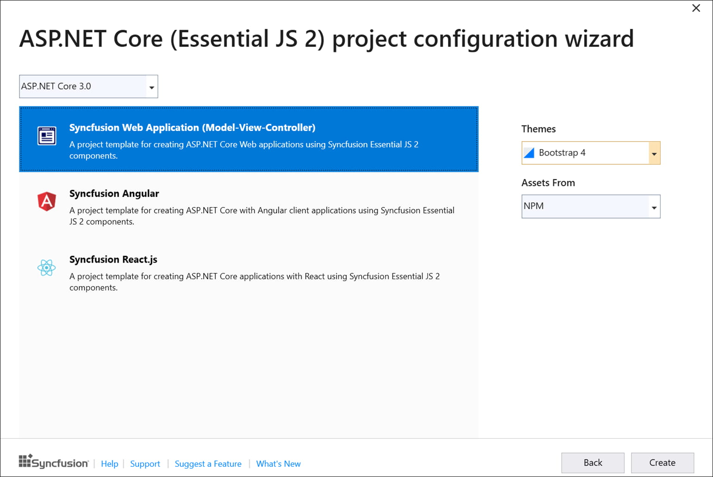
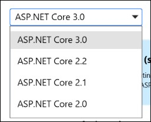
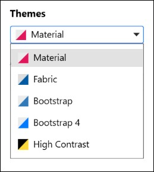

# Syncfusion Project Templates

Syncfusion provides the **Visual** **Studio** **Project** **Templates** for the Syncfusion ASP.NET Core platform to create the Syncfusion ASP.NET Core Web Application using Essential JS 2 components.  

I> The Syncfusion ASP.NET Core (Essential JS 2) project templates are available from v16.2.0.41.  

## Create Syncfusion ASP.NET Core (Essential JS 2) Application

The following steps help you to create the **Syncfusion** **ASP****.****NET** **Core** **(Essential JS 2)** **Application** through the **Visual** **Studio** **Project** **Template:**

1. To create a Syncfusion ASP.NET Core (Essential JS 2) project, follow either one of the options below:

     **Option 1:**   
     Click **Syncfusion Menu** and choose **Essential Studio for ASP.NET Core (EJ2)** **>** **Create New Syncfusion Project...** in **Visual Studio**.
    
     

     N> In Visual Studio 2019, Syncfusion menu available under Extension in Visual Studio menu.
    
     **Option 2:**    
     Choose **File > New > Project** and navigate to **Syncfusion > .NET Core > Syncfusion ASP.NET Core (Essential JS 2) Web Application** in **Visual Studio**.

    

2. Name the **Project**, choose the destination location, and set the framework of the project, and then click **OK**. The Project Configuration Wizard appears.

    N> *Minimum target framework is 4.5 for Syncfusion ASP.NET Core (Essential JS 2) Project Templates*.
   
3. Choose the options to configure the Syncfusion ASP.NET Core (Essential JS 2) Application by using the following Project Configuration dialog.
  
   

   ### Project Configuration:
   
   Supported .NET Core versions, Themes, and Assets From for each project type have been shown as follows.

   |Project Type       |.NET Core Version|Themes|Assets From|
   |-------------------|-------------|------|-----------|
   |Blazor (server-side, ASP.NET Core hosted, client-side)|3.0 Preview 5|Material, Fabric, Bootstrap, Bootstrap 4, High Contrast|CDN|
   |Web Application (Model-View-Controller)|2.0, 2.1, 2.2, and 3.0 Preview 5|Material, Fabric, Bootstrap, High Contrast|CND, NPM, Installed Location|
   |Angular|2.0, 2.1, 2.2, and 3.0 Preview 5|Material, Fabric, Bootstrap, Bootstrap 4, High Contrast|CDN, NPM|
   |React|2.0, 2.1, 2.2, and 3.0 Preview 5|Material, Fabric, Bootstrap, Bootstrap 4, High Contrast|CND, NPM|

   N> *The Syncfusion ASP.NET Core (Essential JS 2) Project Template provides Blazor, Angular, and React project templates support from v17.1.0.47*.      
	
   **.NET Core Version:** Select the version of ASP.NET Core Project
   
   
 
   N> *The ASP.NET Core version 2.2 and 3.0 option will be listed only when the latest .NET Core 3.0 setup has been installed*.

   **Assets From:** Load the Syncfusion Essential JS 2 assets to ASP.NET Core Project, either NPM, CDN or Installed Location.

   N> *Installed location option will be available only when the Syncfusion Essential JavaScript 2 setup has been installed*.

   **Theme Selection:** Themes will be listed out based on the selected project type and choose the required theme from the available list.

   

4. Click **Create**, the Syncfusion ASP.NET Core (Essential JS 2) Application has been created.

5. Required Syncfusion NuGet/NPM packages, Scripts, and CSS have been added to the Project.

   #### Blazor (server-side, ASP.NET Core hosted, client-side):
        
      **NuGet:** Syncfusion.EJ2.AspNet.Core.RazorComponents NuGet package will be installed for all the Blazor projects.
     
      **Scripts/Styles:** Scripts and CSS entries will be added in _Host.cshtml or index.html based on the Blazor project types.
     
   #### Web Application (Model-View-Controller):
                    
      **NuGet:** Syncfusion.EJ2.AspNet.Core NuGet package will be installed.
  
      **Scripts/Styles:** Scripts and CSS entries will be added in _Layout.cshtml
    
   #### Angular:
              
      **NPM:** All the Syncfusion Angular NPM packages entries will be added in   package.json, it will automatically restore while build the application or save the  package.json file before compile the project.   
  
      **Styles:** CSS entries will be added in _Layout.cshtml or index.html based on the selected .NET Core version. 
           
   #### React:

      **NPM:** All the Syncfusion React NPM packages entries will be added in package.json, it will automatically restore while build the application or save the package.json file before compile the project. 
                    
      **Styles:** CSS entries will be added in _Layout.cshtml or index.html based on the selected project .Net Core version.

6. Then, Syncfusion licensing registration required message box will be shown as follow, if you are installed the trial setup or NuGet packages since Syncfusion introduced the licensing system from 2018 Volume 2 (v16.2.0.41) Essential Studio release. Please navigate to the [help topic](https://help.syncfusion.com/common/essential-studio/licensing/license-key#how-to-generate-syncfusion-license-key) which is shown in the licensing message box to generate and register the Syncfusion license key to your project. Refer to this [blog](https://blog.syncfusion.com/post/whats-new-in-2018-volume-2-licensing-changes-in-the-1620x-version-of-essential-studio.aspx) post for understanding the licensing changes introduced in Essential Studio.

   