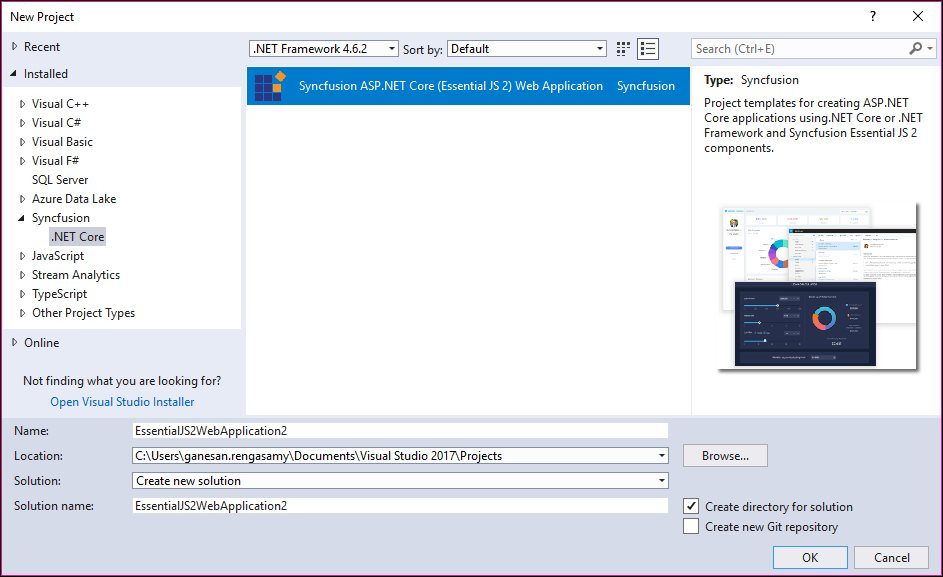
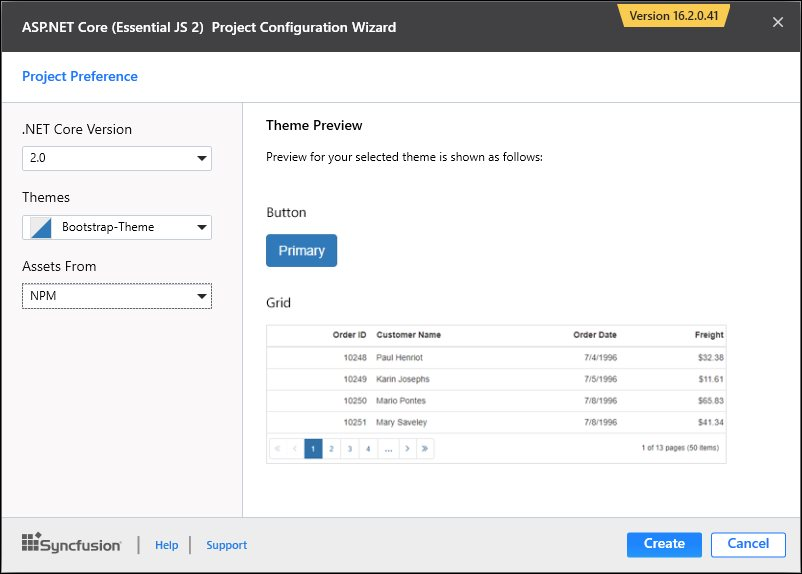
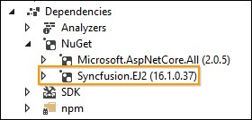
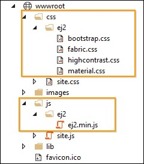

# Syncfusion Project Templates

Syncfusion provides the **Visual** **Studio** **Project** **Templates** for the Syncfusion ASP.NET Core platform to create the Syncfusion ASP.NET Core Web Application using Essential JS 2 components.  

I> The Syncfusion ASP.NET Core (Essential JS 2) project templates are available from v16.2.0.41.  

## Create Syncfusion ASP.NET Core (Essential JS 2) Application

The following steps direct you to create the **Syncfusion** **ASP****.****NET** **Core** **(Essential JS 2)** **Application** through the **Visual** **Studio** **Project** **Template:**

1. To create a Syncfusion ASP.NET Core (Essential JS 2) project, choose  **New** **Project****->** **Syncfusion****->** **.NET** **Core****->** **Syncfusion** **ASP****.****NET** **Core** **(Essential JS 2)** **Web** **Application** from **Visual** **Studio**.

   

2. Name the **Project**, choose the destination location, and set the framework of the project, and then click **OK**. The Project Configuration Wizard appears.

   N> *Minimum target framework is 4.5 for Syncfusion ASP.NET Core (Essential JS 2) Project Templates*.
   
3. Choose the options to configure the Syncfusion ASP.NET Core (Essential JS 2) Application by using the following Project Configuration dialog.

   ### Project Configuration:

   **.NET Core Version:** Select the version of ASP.NET Core Project, either ASP.NET Core 1.0, ASP.NET Core 1.1 or ASP.NET Core 2.0.

   **Assets From:** Load the Syncfusion Essential JS 2 assets to ASP.NET Core Project, either NPM, CDN or Installed Location.

   N> *Installed location option will be available only when the Syncfusion Essential JavaScript 2 setup has been installed*.

   **Theme Selection:** Choose the required Theme.

   
   
4. Click **Create**, the Syncfusion ASP.NET Core (Essential JS 2) Application has been created.

5. Required Syncfusion NuGet/NPM packages, Scripts, and CSS have been added to the Project.

   

   

6. Then, Syncfusion licensing registration required message box will be shown as follow, if you are installed the trial setup or NuGet packages since Syncfusion introduced the licensing system from 2018 Volume 2 (v16.2.0.41) Essential Studio release. Please navigate to the [help topic](https://help.syncfusion.com/common/essential-studio/licensing/license-key#how-to-generate-syncfusion-license-key) which is shown in the licensing message box to generate and register the Syncfusion license key to your project. Refer to this [blog](https://blog.syncfusion.com/post/Whats-New-in-2018-Volume-2-Licensing-Changes-in-the-1620x-Version-of-Essential-Studio.aspx) post for understanding the licensing changes introduced in Essential Studio.

   

