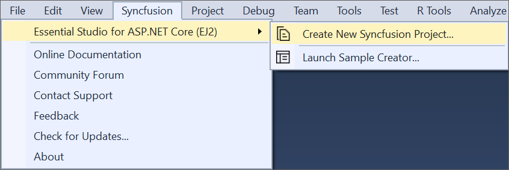
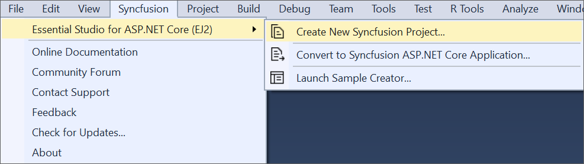
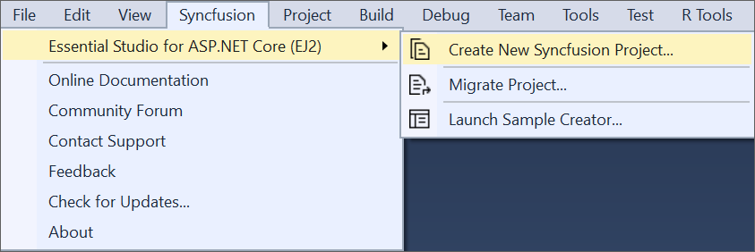

# Visual Studio Integration

## Overview

The Syncfusion&reg; ASP.NET Core Visual Studio Extensions can be accessed through the Syncfusion&reg; Menu to create and configure the project with Syncfusion&reg; references in Visual Studio.

> Syncfusion&reg; Extension is published in Visual Studio Marketplace. You can download ASP.NET Core Extensions [here](https://marketplace.visualstudio.com/items?itemName=SyncfusionInc.ASPNETCoreExtensions)

## IMPORTANT

The Syncfusion&reg; ASP.NET Core (Essential&reg; JS 2) menu option is available from v17.1.0.32.

The Syncfusion&reg; provides the following supports in Visual Studio:

1. [Project-Template](syncfusion-project-templates):  Creates the Syncfusion&reg; ASP.NET Core (Essential&reg; JS 2) application by adding the required Essential&reg; JS 2 components.
2. [Convert project](project-conversion): Converts an existing ASP.NET Core application into a Syncfusion&reg; ASP.NET Core (Essential&reg; JS 2) application by adding the required Syncfusion&reg; assemblies and resource files.
3. [Upgrade project](project-migration): Upgrades the existing Syncfusion&reg; ASP.NET Core (Essential&reg; JS 2) application from one Essential Studio&reg; version to another version.
4. [Creator sample](sample-creator): Creates the Syncfusion&reg; ASP.NET Core (Essential&reg; JS2) application with the sample code of required controls and features.

### No project selected in Visual Studio

### Selected Microsoft ASP.NET Core Web application in Visual Studio

### Selected Syncfusion&reg; ASP.NET Core (Essential&reg; JS2) application in Visual Studio

