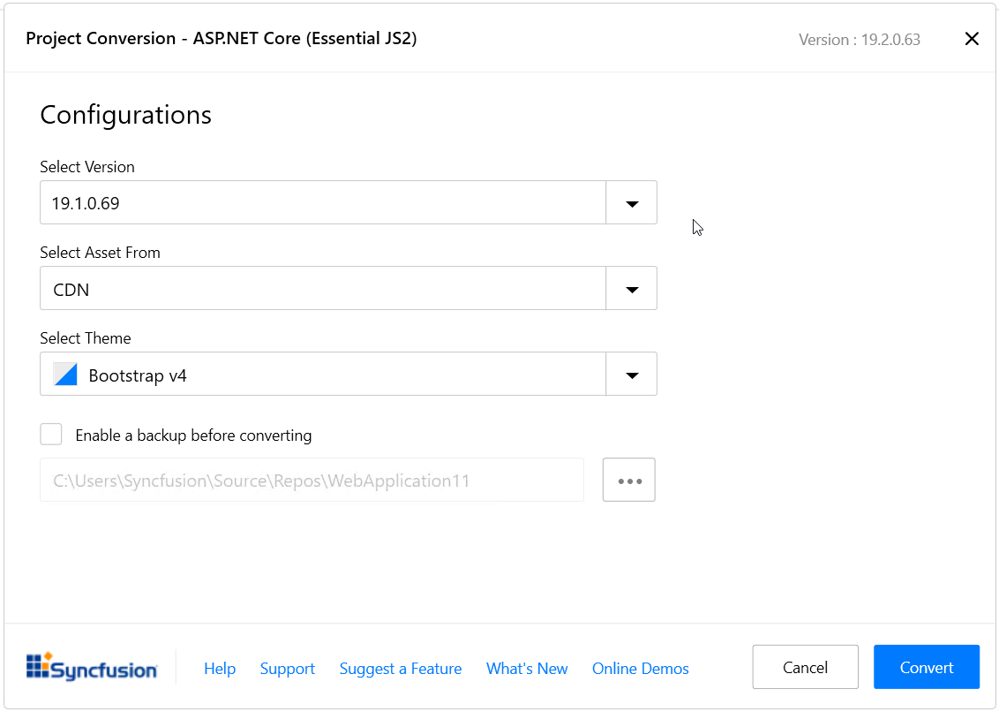
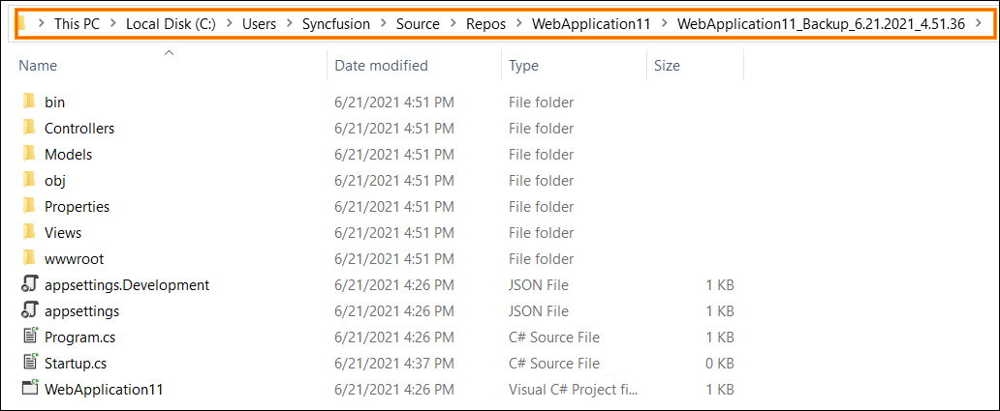

# Syncfusion&reg; Project Conversion

Syncfusion&reg; ASP.NET Core conversion is a Visual Studio add-in that converts an existing ASP.NET Core application into a Syncfusion&reg; ASP.NET Core (Essential&reg; JS 2) Web application by adding the required assemblies and resource files.

> The Syncfusion&reg; ASP.NET Core (Essential&reg; JS 2) Web Application Project conversion utility is available from v16.3.0.17. Before use, the Syncfusion&reg; ASP.NET Core Project Conversion, check whether the **ASP.NET Core Extensions - Syncfusion&reg;** installed or not in Visual Studio Extension Manager by clicking on the Tools -> Extensions and Updates -> Installed for Visual Studio 2017 and for Visual Studio 2019 by clicking on the Extensions -> Manage Extensions -> Installed. If this extension not installed, please install the extension by follow the steps from the [download and installation](https://ej2.syncfusion.com/aspnetcore/documentation/visual-studio-integration/download-and-installation) help topic. Also, check whether the corresponding Essential Studio&reg; version build installed or not. If the Essential Studio&reg; version is not same for both the Extension and build, then the Project Conversion will not be shown.

The steps below help you to convert the ASP.NET Core application to the Syncfusion&reg; ASP.NET Core application via the Visual Studio 2019:

1. Open an existing Microsoft ASP.NET Core Web Application or create a new Microsoft ASP.NET Core Web Application.

2. To open the Syncfusion&reg; Project Conversion Wizard, follow either one of the options below:

    **Option 1:**

    Click **Syncfusion&reg; Menu** and choose **Essential Studio&reg; for ASP.NET Core > Convert to Syncfusion&reg; ASP.NET Core Application…** in **Visual Studio Menu**.

    

    > From Visual Studio 2019, Syncfusion&reg; menu is available under **Extensions** in Visual Studio menu.

    

    **Option 2:**

    Right-click the **Project** from Solution Explorer, select **Syncfusion&reg; Web**, and choose the **Convert to Syncfusion&reg; ASP.NET Core Application…**

    

3. The Syncfusion&reg; ASP.NET Core Project Conversion window will appear. You can choose the required version of Syncfusion&reg; ASP.NET Core, Assets from, and Themes to convert the application.

    

    The following configurations are used in the Project conversion wizard.

    **Assets From:** Load the Syncfusion&reg; Essential&reg; JS 2 assets to ASP.NET Core Project, from either NPM, CDN, or Installed Location.

    > Installed location option will be available only when the Syncfusion&reg; Essential&reg; JavaScript 2 setup has been installed.

    **Choose the Theme:** Choose the required theme.

4. Check the **“Enable a backup before converting”** checkbox if you want to take the project backup and choose the location.

5. The required Syncfusion&reg; NuGet packages, Scripts and CSS are included in the ASP.NET Core Web application. Refer to the following screenshots for more information.

    

    

    

    If you enabled project backup before converting, the old project was saved in the specified backup path location, as shown below once the conversion process completed.

    

6. If you installed the trial setup or NuGet packages from nuget.org you must register the Syncfusion&reg; license key to your application since Syncfusion&reg; introduced the licensing system from 2018 Volume 2 (v16.2.0.41) Essential Studio&reg; release. Navigate to the [help topic](https://help.syncfusion.com/common/essential-studio/licensing/overview#how-to-generate-syncfusion-license-key) to generate and register the Syncfusion&reg; license key to your project. Refer to this [blog](https://www.syncfusion.com/blogs/post/whats-new-in-2018-volume-2.aspx) post for understanding the licensing changes introduced in Essential Studio&reg;.