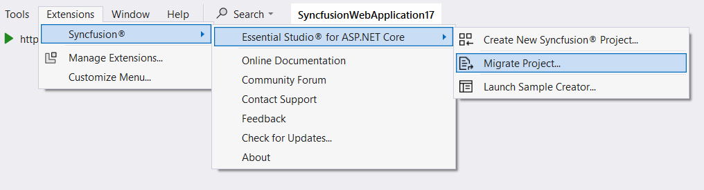
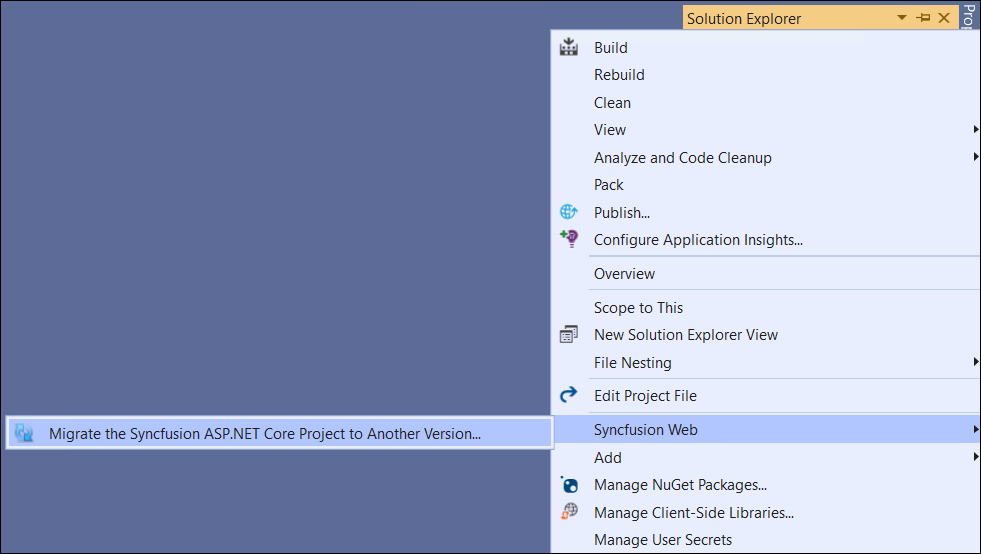
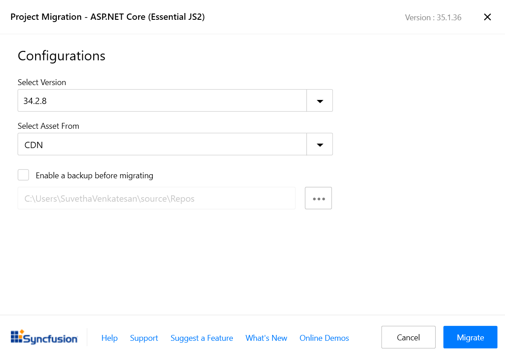
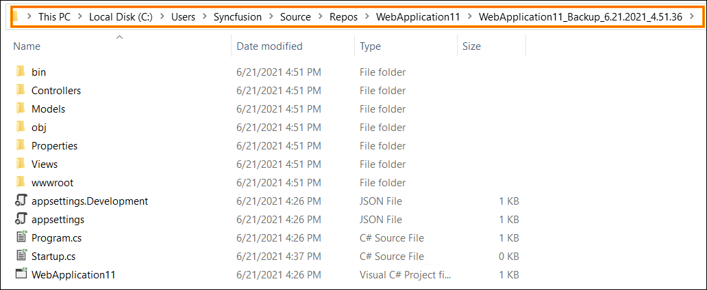

# Upgrading Syncfusion® ASP.NET Core application to latest version

The Syncfusion® ASP.NET Core migration add-in for Visual Studio allows you to migrate an existing Syncfusion® ASP.NET Core application from one Essential Studio® version to another version. This reduces the amount of manual work required when migrating the Syncfusion® version.

## IMPORTANT

The Syncfusion® ASP.NET Core (Essential® JS 2) Web Application Project Migration utility is available from v16.3.0.17.

> Before using the Syncfusion® ASP.NET Core Project Migration, check whether the **ASP.NET Core Extensions - Syncfusion®** is installed or not in Visual Studio Extension Manager by clicking **Extensions > Manage Extensions > Installed** for Visual Studio 2022 or later. If this extension is not installed, please install the extension by following the steps from the [download and installation](https://help.syncfusion.com/extension/aspnetcore-essentialjs2-extension/visual-studio/download-and-installation) help topic. Also, check whether the corresponding Essential Studio® version build is installed or not. If the Essential Studio® version is not the same for both the Extension and build, then the Project Migration will not be shown.

The steps below will assist you to upgrade the Syncfusion® version in the Syncfusion® ASP.NET Core application via Visual Studio:

1. Open the Syncfusion® ASP.NET Core application that uses the Syncfusion® component.

2. To open the Migration Wizard, either one of the following options should be followed:

    **Option 1**

    Click **Extensions > Syncfusion®** and choose **Essential Studio® for ASP.NET Core > Migrate Project…** in **Visual Studio Menu**.

    

    **Option 2**

    Right-click the **Syncfusion® ASP.NET Core Application** from Solution Explorer and select **Syncfusion® Web**. Choose **Migrate the Syncfusion® ASP.NET Core Project to Another Version…**

    

3. The Syncfusion® Project Migration window will appear. You can choose the required version of Syncfusion® ASP.NET Core to migrate.

    

    > The versions are loaded from the Syncfusion® ASP.NET Core NuGet packages which published in [NuGet.org](https://www.nuget.org/packages?q=Tags%3A%22aspnetcore%22syncfusion) and it requires internet connectivity.

    **Assets From:** Load the Syncfusion® Essential® JS 2 assets to ASP.NET Core Project, from either NPM, CDN or Installed Location.

    > Installed location option will be available only when the Syncfusion® Essential® JavaScript 2 setup has been installed.

4. Check the **“Enable a backup before migrating”** checkbox if you want to take the project backup and choose location.

5. The Syncfusion® Reference Assemblies, Scripts, and CSS are updated to the corresponding version in the project.

    If you enabled project backup before migrating, the old project is saved in the specified backup path location, as shown below once the migration process is completed.

    

6. If you installed the trial setup or NuGet packages from nuget.org you must register the Syncfusion® license key to your project since Syncfusion® introduced the licensing system from 2018 Volume 2 (v16.2.0.41) Essential Studio® release. Navigate to the [help topic](https://help.syncfusion.com/common/essential-studio/licensing/overview#how-to-generate-syncfusion-license-key) to generate and register the Syncfusion® license key to your project. Refer to this [blog](https://www.syncfusion.com/blogs/post/whats-new-in-2018-volume-2.aspx) post for understanding the licensing changes introduced in Essential Studio®.