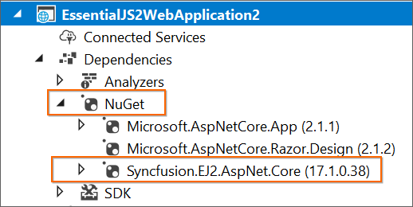

# Creating Syncfusion&reg; ASP.NET Core application

The Syncfusion&reg; Sample Creator is a tool that lets you make Syncfusion&reg; ASP.NET Core (Essential&reg; JS 2) projects with sample code for required Syncfusion&reg; component features and Syncfusion&reg; control configuration.

> The Syncfusion&reg; ASP.NET Core Sample Creator utility is available from v16.3.0.17.

The following steps is used to create the Syncfusion&reg; ASP.NET Core (Essential&reg; JS 2) Application by using the Sample Creator utility:

1. Follow one of the options below to launch the ASP.NET Core (Essential&reg; JS 2) Sample Creator application:

    **Option 1:**

    Click **Syncfusion&reg; Menu** and choose **Essential Studio&reg; for ASP.NET Core > Launch Sample Creator…** in **Visual Studio.**

    

    **Option 2:**

    Launch the Syncfusion&reg; ASP.NET Core Control Panel and click the Sample Creator button to launch the ASP.NET Core Sample Creator utility. For further information, see the screenshot below.

    

2. Syncfusion&reg; controls and features are listed in the ASP.NET Core Sample Creator.

    

    **Controls Selection:** Choose the required controls. The controls are grouped with Syncfusion&reg; products.

    

    **Feature Selection:** Based on the controls, the feature is enabled to choose the features of the corresponding controls.

    

## Project Configuration

1. You can configure the project with following details.

    **VS Version**: Choose the Visual Studio version.

    **.NET Core Version**: Select the version of ASP.NET Core Project.

    

    **Assets From**: Choose the Syncfusion&reg; Essential&reg; JS 2 assets to ASP.NET Core Project, either NPM, CDN, or Installed Location.

    > Installed location option will be available only when the Syncfusion&reg; Essential&reg; JavaScript 2 setup has been installed.

    **Name**: Name your Syncfusion&reg; ASP.NET Core (Essential&reg; JS 2) Application.

    **Location**: Choose the target location of your project.

    **Theme Selection**: Choose the required theme. This section shows the controls preview before creating the Syncfusion&reg; project.

    

2. Click **Create** button. After creating the project, open the project by clicking **Yes**. If you click **No**, the corresponding location of the project will be opened. Refer to the following screenshot for more information.

    

3. The new Syncfusion&reg; ASP.NET Core (Essential&reg; JS 2) project is created with the resources.

    * Added the required Controllers and View files in the project.

    

    * Included the required Syncfusion&reg; ASP.NET Core (Essential&reg; JS 2) scripts and theme files.

    

    * Restored the required Syncfusion&reg; NuGet packages for selected controls under dependencies.

    