# Syncfusion® Project Templates - ASP.NET Core

Syncfusion&reg; provides the **Visual Studio Project Templates** for the Syncfusion&reg; ASP.NET Core platform to create the Syncfusion&reg; ASP.NET Core Web Application using Essential&reg; JS 2 components.

> The Syncfusion&reg; ASP.NET Core (Essential&reg; JS 2) project templates are available from v16.2.0.41.

The following steps is used to create the **Syncfusion&reg; ASP.NET Core (Essential&reg; JS 2) Web Application** through the **Visual Studio Project Template**.

> Before use the Syncfusion&reg; ASP.NET Core Project Template, check whether the **ASP.NET Core Extensions - Syncfusion&reg;** installed or not in Visual Studio Extension Manager by clicking on the Tools -> Extensions and Updates -> Installed for Visual Studio 2022 or later by clicking on the Extensions -> Manage Extensions -> Installed. If this extension not installed, please install the extension by follow the steps from the [download and installation](https://ej2.syncfusion.com/aspnetcore/documentation/visual-studio-integration/download-and-installation) help topic.

1. To create the Syncfusion&reg; ASP.NET Core (Essential&reg; JS 2) project, follow either one of the options below:

    **Option 1**

    Click **Extensions > Syncfusion&reg;** and choose **Essential Studio&reg; for ASP.NET Core > Create New Syncfusion&reg; Project…** in **Visual Studio**.

    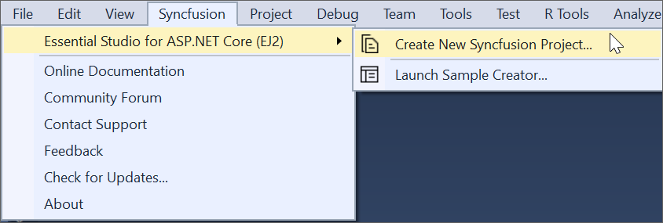

    **Option 2**

    Choose **File > New > Project** and navigate to **Syncfusion&reg; > .NET Core > Syncfusion&reg; ASP.NET Core Web Application** in **Visual Studio**.

    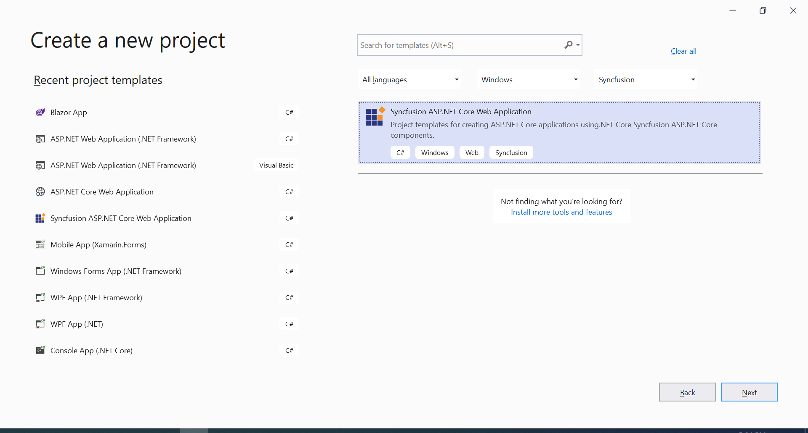

2. Name the **Project**, choose the destination location, and then click **OK**. The Project Configuration Wizard appears.

3. Choose the options to configure the Syncfusion&reg; ASP.NET Core (Essential&reg; JS 2) Application in the following Project Configuration dialog.

    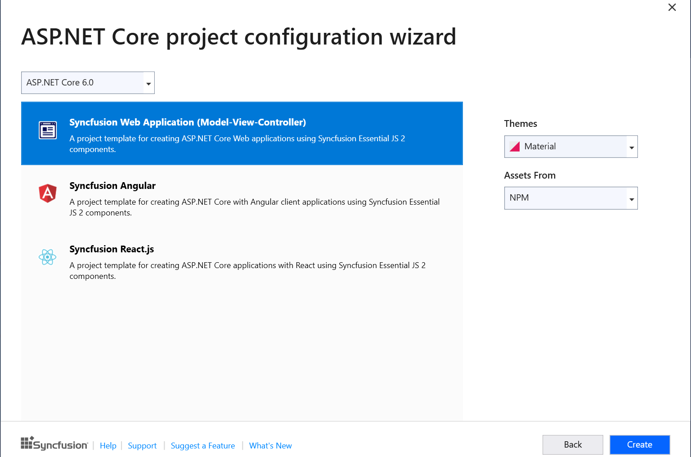

    **Project configurations**

    | <b>Project Type</b> | <b>.NET Core Version</b> | <b>Themes</b> | <b>Assets From</b> |
    |---------------------|--------------------------|---------------|--------------------|
    | ASP.NET Core Web App | .NET 8.0, .NET 9.0 and NET 10.0 | Material, Fabric, Fluent, Bootstrap, Bootstrap 4, Bootstrap 5, High Contrast, Tailwind CSS | CDN, NPM, Installed Location |
    | ASP.NET Core Web App (Model-View-Controller) | .NET 8.0, .NET 9.0 and NET 10.0 | Material, Fabric, Fluent, Bootstrap, Bootstrap 4, Bootstrap 5, High Contrast, Tailwind CSS | CDN, NPM, Installed Location |
    | Angular | .NET 8.0, .NET 9.0 and NET 10.0 | Material, Fabric, Fluent, Bootstrap, Bootstrap 4, Bootstrap 5, High Contrast, Tailwind CSS | CDN, NPM |
    | React | .NET 8.0, .NET 9.0 and NET 10.0 | Material, Fabric, Fluent, Bootstrap, Bootstrap 4, Bootstrap 5, High Contrast, Tailwind CSS | CDN, NPM |

    > The Syncfusion&reg; ASP.NET Core (Essential&reg; JS 2) Project Template provides ASP.NET Core, Angular, and React project templates support from v17.1.0.47.

    **.NET Core Version**: Select the version of ASP.NET Core Project.

    

    **Assets From**: Load the Syncfusion&reg; Essential&reg; JS 2 assets to ASP.NET Core Project, either NPM, CDN, or Installed Location.

    > Installed location option will be available only when the Syncfusion&reg; Essential&reg; JavaScript 2 setup has been installed.

    **Theme Selection**: Themes will be listed out based on the selected project type and choose the required theme from the available list.

    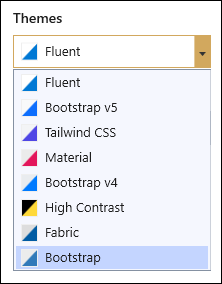

    **Authentication Type**: Authentication will be listed out based on the selected project type and choose the required authentication from the available list.

    > For **Angular** and **React** Project **None** and **Individual Authentication** only supported.

    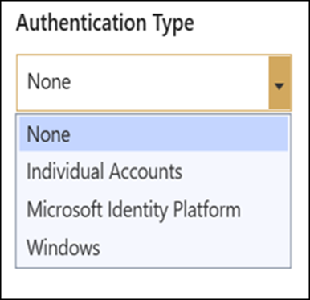

4. Click Create, the Syncfusion&reg; ASP.NET Core (Essential&reg; JS 2) Application has been created.

    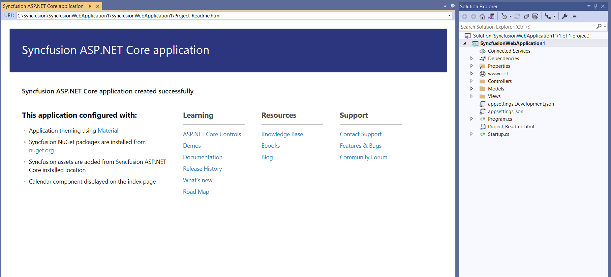

5. The required Syncfusion&reg; NuGet/NPM packages, Scripts, and CSS have been added to the Project.

    **Web App and Web App (Model-View-Controller):**

    **NuGet**: Syncfusion.EJ2.AspNet.Core NuGet package will be installed.

    **Scripts/Styles**: Scripts and CSS entries will be added in _Layout.cshtml.

    **Angular:**

    **NPM**: All the Syncfusion&reg; Angular NPM packages entries will be added in   package.json, it will automatically restore while build the application or save the  package.json file before compile the project.

    **Styles**: CSS entries will be added in index.html based on the selected .NET Core version.

    **React:**

    **NPM**: All the Syncfusion&reg; React NPM packages entries will be added in package.json, it will automatically restore while build the application or save the package.json file before compile the project.

    **Styles**: CSS entries will be added in or index.html based on the selected project .Net Core version.

    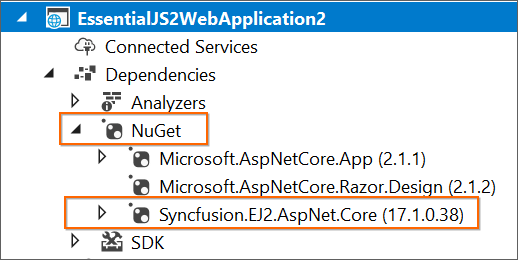

    

6. Then, Syncfusion&reg; licensing registration required message box will be shown, if you installed the trial setup or NuGet packages since Syncfusion&reg; introduced the licensing system from 2018 Volume 2 (v16.2.0.41) Essential Studio&reg; release. Navigate to the [help topic](https://help.syncfusion.com/common/essential-studio/licensing/overview#how-to-generate-syncfusion-license-key), which is shown in the licensing message box to generate and register the Syncfusion&reg; license key to your project. Refer to this [blog](https://blog.syncfusion.com/post/whats-new-in-2018-volume-2-licensing-changes-in-the-1620x-version-of-essential-studio.aspx) post for understanding the licensing changes introduced in Essential Studio&reg;.

    

## Authentication Configuration

We need to register the created application in Azure Active Directory for **Microsoft Identity Platform**. From Azure Active Directory registration, we can get the tenant id and application client id for Microsoft Identity Platform. We need to configure these id values in created applications then only application will be run correctly with authentication support.

### Microsoft Identity Platform Authentication

**Step:1** Go to Azure Active Directory App Registration page ->
           [Azure Active Directory Link](https://portal.azure.com/#blade/Microsoft_AAD_IAM/ActiveDirectoryMenuBlade/RegisteredApps)

**Step:2** Click New Registration in App Registration page.

             
**Step:3** Give name of the application and selected supported type as single tenant.

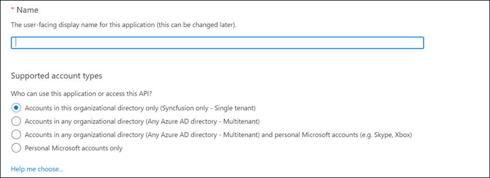

**Step:4** Dropdown the page, select platform as web and give your application Redirect URI like {Redirect URI}/signin-oidc and click Register.

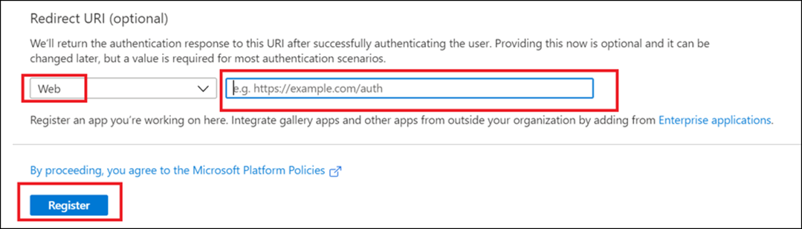

**Step:5** App will be registered, go to the Authentication page and tick Id token check box.

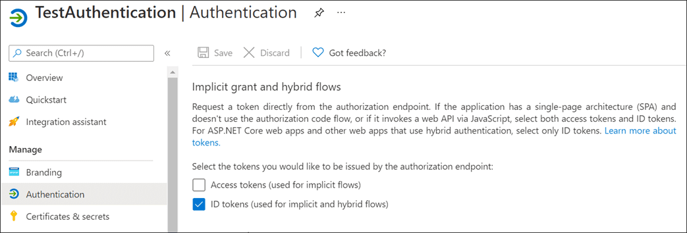

**Step:6** Get client tenant id and application id form overview page.

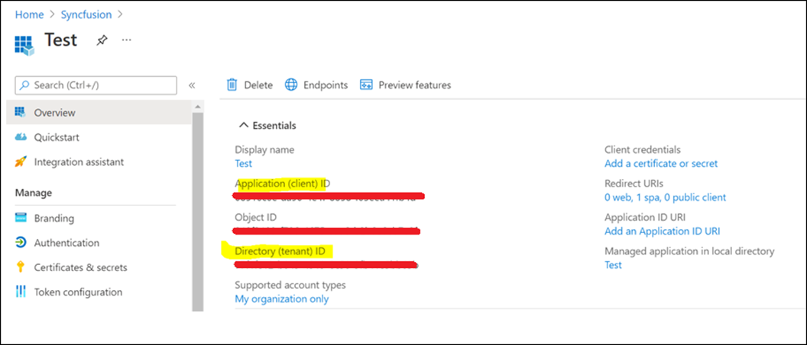

**Step:7** Configure those client tenant id, application id, and domain in your application appsettings.json file.

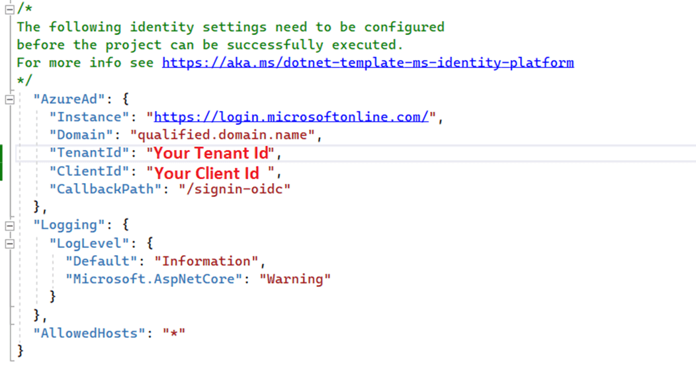

## Register and Login Application

### Individual Authentication

**Step:1** For register the application, submit your email address and create a password.

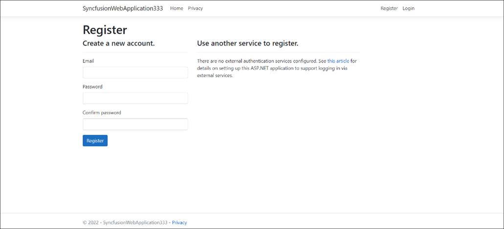

**Step:2** Confirming registration by clicking **Click here to confirm your account**.

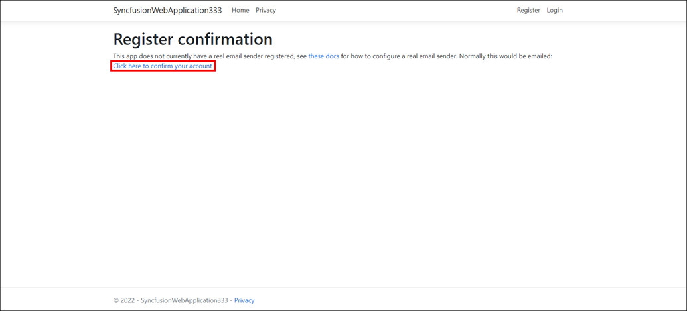

**Step:3** Submit your registered email address and password to login the application.

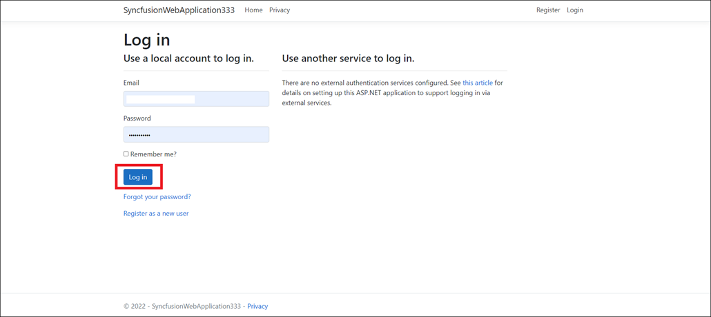

### Microsoft Identity Platform

1. Login to your application using your Microsoft account.
2. Accept permission request of your application.

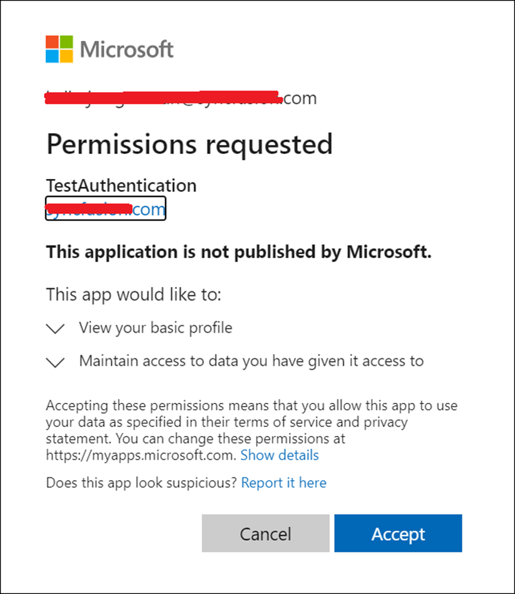