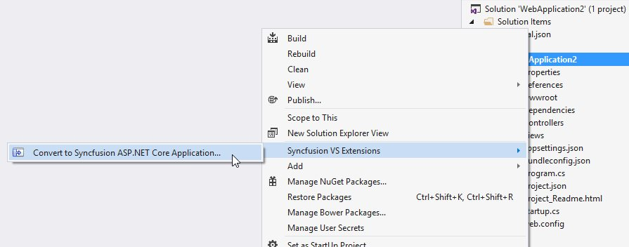
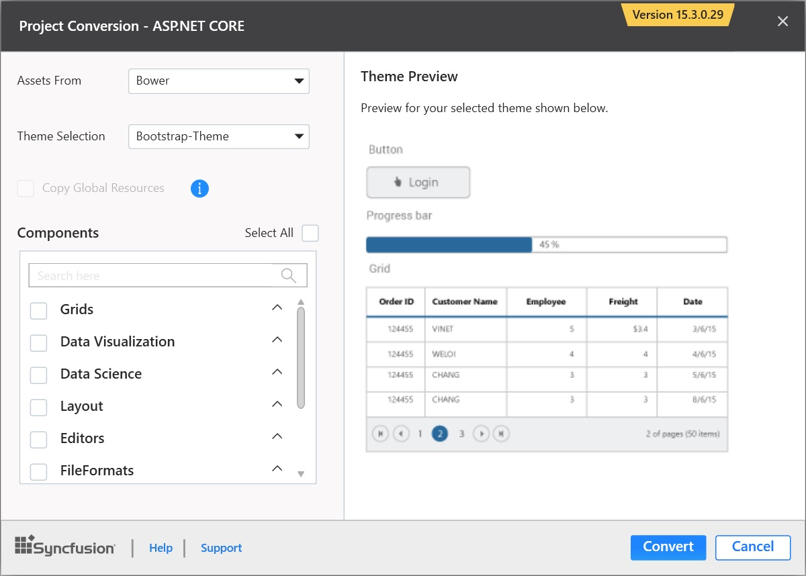
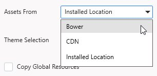
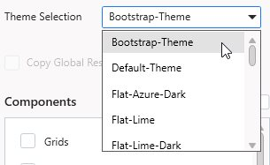
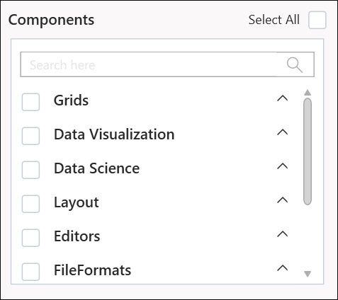
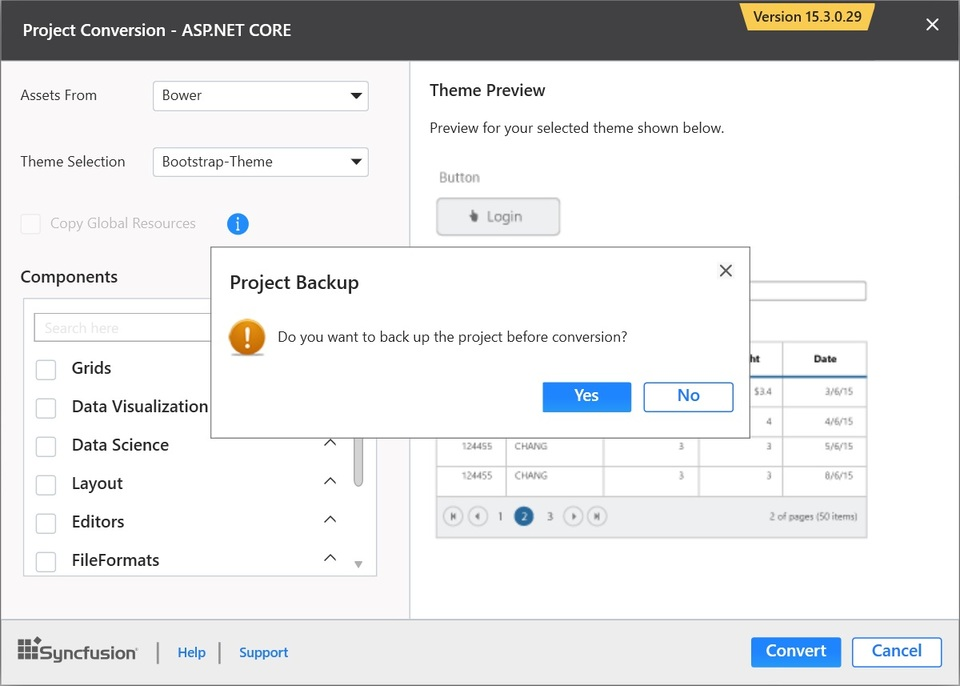
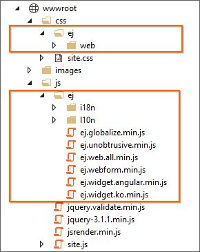

# Syncfusion Project Conversion  

Syncfusion Project Conversion is a Visual Studio add-in that converts an existing ASP.NET Core application into a Syncfusion ASP.NET Core Web application by adding the required assemblies and resource files.

I> The Syncfusion ASP.NET Core Web Application Project Conversion utility is available from v15.2.0.40. 

## Convert into Syncfusion ASP.NET Core Web Application 

The following steps direct you to use the Syncfusion Project Conversion in the existing ASP.NET Core Web Application.

1. Open an existing Microsoft ASP.NET Core Web Application or create a new Microsoft ASP.NET Core Web Application. 

2. Right-click on **Project** from Solution Explorer and select **Syncfusion VS Extensions** and choose the **Convert to Syncfusion ASP.NET Core Application**. Refer to the following screenshot for more information.

   

3. Project Conversion Wizard opens to configure the project.

   

   **Choose the assets from:**

   * Bower - Refer to the assets from Bower package manager. 

   * CDN - Refer to the assets from Syncfusion CDN links.

   * Installed Location - Refer to the assets from Syncfusion installed locations.     
   
   
   
   **Choose the Theme:**
   
   The master page of project will be updated based on selected theme. The Theme Preview section shows the controls preview before convert into a Syncfusion project
   
   

   **Choose Copy Global Resources:** 
    
   The localization culture files will be shipped into Scripts\ej\i18n directory of the project.

     
4. Choose the required controls from Components section and Click the **Convert** button to convert it into a Syncfusion Project.

   
   
   The **Project Backup** dialog will be opened. If click Yes it will backup the current project before converting it to Syncfusion project. If click No it will convert the project to Syncfusion project without backup. 
   
   

5. The required Syncfusion NuGet/Bower packages, Scripts and CSS are included in the ASP.NET Core Web Application. Refer to the following screenshots for more information.

   

   

   
## Rendering Control after Syncfusion ASP.NET Core Conversion

Once you converted your ASP.NET Core Web Application to Syncfusion ASP.NET Core Web Application using Syncfusion Visual Studio Extension, Perform the following steps to render the Syncfusion controls to your project.

1. Include the Syncfusion control snippets to any of the view page of your project. Refer the following screenshot for more information.

   

2. Then run the project and the following output will be displayed.

   
   
   
   I> Refer all the required external and internal scripts only once in the page with proper order. Refer this [link](https://help.syncfusion.com/js/control-initialization#adding-the-required-javascript-files) to know about order of script reference.