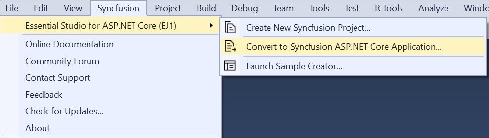
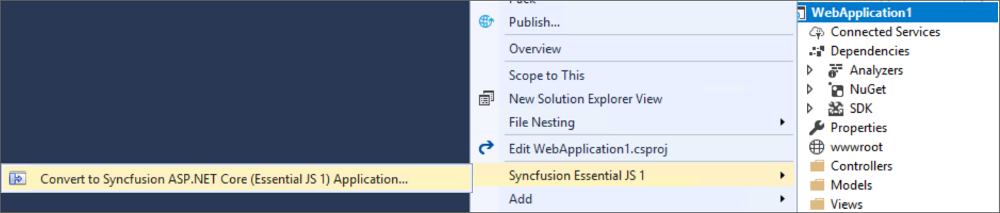

# Syncfusion&reg; Project Conversion  

Syncfusion&reg; Project Conversion is a Visual Studio add-in that converts an existing ASP.NET Core application into a Syncfusion&reg; ASP.NET Core Web application by adding the required assemblies and resource files.

I> The Syncfusion ASP.NET Core Web Application Project Conversion utility is available from v15.2.0.40. 

## Convert into Syncfusion&reg; ASP.NET Core Web Application 

The following steps help you to use the Syncfusion&reg; Project Conversion in the existing ASP.NET Core Web Application.

> Before use, the Syncfusion&reg; ASP.NET Core (Essential&reg; JS 1) Project Conversion, check whether the **Syncfusion&reg; Essential&reg; JS1 AspNet Core VSExtensions** installed or not in Visual Studio Extension Manager by clicking on the Tools -> Extensions and Updates -> Installed for Visual Studio 2017 or lower and for Visual Studio 2019 by clicking on the Extensions -> Manage Extensions -> Installed. Also, check whether the corresponding Essential Studio&reg; version build installed or not. If the Essential Studio&reg; version is not same for both the Extension and build, then the Project Conversion will not be shown.

1. Open an existing Microsoft ASP.NET Core Web Application or create a new Microsoft ASP.NET Core Web Application. 

2. To open Project Conversion Wizard, follow either one of the options below: 

   **Option 1:**  
   Click **Syncfusion&reg; Menu** and choose **Essential Studio&reg; for ASP.NET Core (EJ1) > Convert to Syncfusion&reg; ASP.NET Core Application…** in **Visual Studio**.

   

   N> In Visual Studio 2019, Syncfusion&reg; menu available under Extension in Visual Studio menu.

   **Option 2:**  
   Right-click the Project from Solution Explorer, select **Syncfusion&reg; Essential&reg; JS 1**, and then choose **Convert to Syncfusion&reg; ASP.NET Core (Essential&reg; JS 1) Application...** Refer to the following screenshot for more information.

   

3. Project Conversion Wizard opens to configure the project.

   

   **Choose the assets from:**

   * Bower - Refer to the assets from Bower package manager. 

   * CDN - Refer to the assets from Syncfusion&reg; CDN links.

   * Installed Location - Refer to the assets from Syncfusion&reg; installed locations.     
   
   
   
   **Choose the Theme:**
   
   The master page of project will be updated based on selected theme. The Theme Preview section shows the controls preview before convert into a Syncfusion&reg; project
   
   

   **Choose Copy Global Resources:** 
    
   The localization culture files will be shipped into Scripts\ej\i18n directory of the project.

     
4. Choose the required controls from Components section and Click the **Convert** button to convert it into a Syncfusion&reg; Project.

   
   
   The **Project Backup** dialog will be opened. If click Yes it will backup the current project before converting it to Syncfusion&reg; project. If click No it will convert the project to Syncfusion&reg; project without backup. 
   
   

5. The required Syncfusion&reg; NuGet/Bower packages, Scripts and CSS are included in the ASP.NET Core Web Application. Refer to the following screenshots for more information.

   

   

6. If you installed the trial setup or NuGet packages from nuget.org you have to register the Syncfusion&reg; license key to your project since Syncfusion&reg; introduced the licensing system from 2018 Volume 2 (v16.2.0.41) Essential Studio&reg; release. Navigate to the [help topic](https://help.syncfusion.com/common/essential-studio/licensing/license-key#how-to-generate-syncfusion-license-key) to generate and register the Syncfusion&reg; license key to your project. Refer to this [blog](https://blog.syncfusion.com/post/Whats-New-in-2018-Volume-2-Licensing-Changes-in-the-1620x-Version-of-Essential-Studio.aspx?_ga=2.11237684.1233358434.1587355730-230058891.1567654773) post for understanding the licensing changes introduced in Essential Studio&reg;.
   
## Rendering Control after Syncfusion&reg; ASP.NET Core Conversion

Once you converted your ASP.NET Core Web Application to Syncfusion&reg; ASP.NET Core Web Application using Syncfusion&reg; Visual Studio Extension, Perform the following steps to render the Syncfusion&reg; controls to your project.

1. Include the Syncfusion&reg; control snippets to any of the view page of your project. Refer the following screenshot for more information.

   

2. Then run the project and the following output will be displayed.

   
   
   
   I> Refer all the required external and internal scripts only once in the page with proper order. Refer this [link](https://help.syncfusion.com/js/control-initialization#adding-the-required-javascript-files) to know about order of script reference.