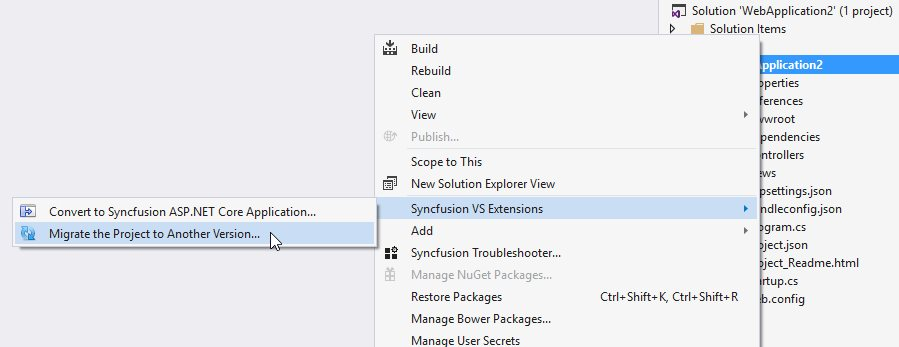
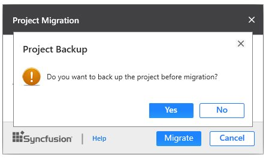

# Syncfusion Project Migration

Syncfusion Project Migration is a Visual Studio add-in that allows you to migrate the existing Syncfusion ASP.NET Core Web Application from one Essential Studio version to another version.

I> The Syncfusion ASP.NET Core Web Application Project Migration utility is available from v15.2.0.40.

## Migrate Syncfusion Project 

The following steps direct you to migrate your existing Syncfusion ASP.NET Core Web Application. 

1. Right-click on **Syncfusion ASP.NET Core Web Application** from Solution Explorer and select **Syncfusion VS Extensions**. Choose **Migrate the Project to Another version**

   

2. The **Project Migration** window appears. You can choose the required Essential Studio version that is installed in the machine. 

   

3. The **Project Migration** window allows you to configure the following options:

   i. **Essential Studio Version:** Select any version from the list of installed versions.
   
   ii. **Assets From:** Load the Syncfusion assets to ASP.NET Core Project, either Bower, CDN or Installed Location.
   
4. Click the Migrate Button. The **Project Backup** dialog will be opened. If click Yes it will backup the current project before migrate the Syncfusion project. If click No it will migrate the project to required Syncfusion version without backup
   
   
      
5. The Syncfusion NuGet/Bower Packages, Scripts and CSS are updated to the corresponding version in the project.

