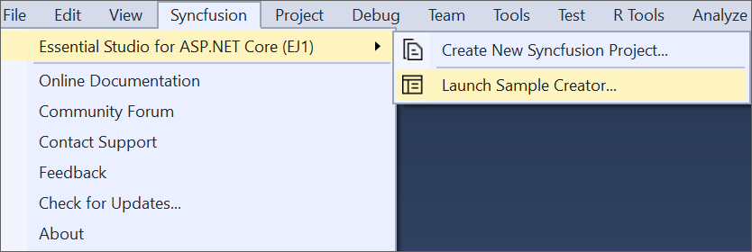
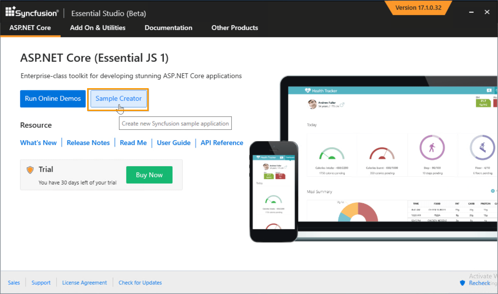
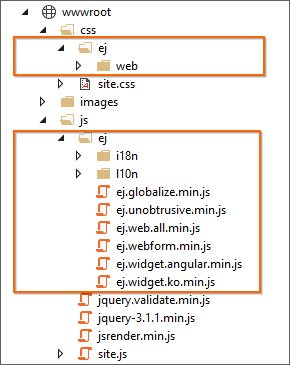
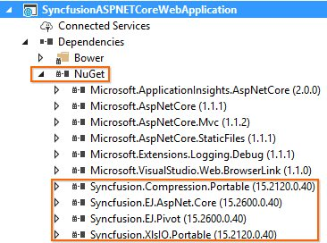

# Sample Creator

Sample Creator is the utility that allows you to create Syncfusion&reg; ASP.NET Core Projects along with the samples based on Controls and Features selection.

I> The Syncfusion&reg; ASP.NET Core Sample Creator utility is available from v15.2.0.40.

## Create Syncfusion&reg; ASP.NET Core Web Application from Sample Creator

The following steps help you to create the Syncfusion&reg; ASP.NET Core Web Application via the Sample Creator utility.

1. To launch ASP.NET Core (Essential&reg; JS 1) Sample Creator application, follow either one of the options below: 

   **Option 1:**   
   Click **Syncfusion&reg; Menu** and choose **Essential Studio&reg; for ASP.NET Core (EJ1) > Launch Sample Creator…** in **Visual Studio**.
   
   

   N> In Visual Studio 2019, Syncfusion&reg; menu available under Extension in Visual Studio menu.

   **Option 2:**  
   Launch the Syncfusion&reg; ASP.NET Core (Essential&reg; JS 1) Control Panel. Select the Sample Creator button to launch the ASP.NET Core (Essential&reg; JS 1) Sample Creator application. Refer to the following screenshot for more information.

   

2. Syncfusion&reg; Sample Creator Wizard displaying the **Controls and its Feature Selection** section

   

### Controls Selection

Listed here are the Syncfusion&reg; ASP.NET Core controls so you can choose the required controls.

   

### Feature Selection

Based on the controls, the Feature is enabled to choose the features of the corresponding controls.

   

### Project Configuration

1. You can configure the following project details in the Sample Creator.

   * Project Type – Select the type of ASP.NET Core Project, either .NET Core or .NET Framework.
   
   * ASP.NET Core Version - Select the version of ASP.NET Core Project, either ASP.NET Core 1.0 or ASP.NET Core 1.1.

   * VS Version – Choose the Visual Studio version.

   * .NET Framework – Choose the .NET Framework version.
   
   * Assets From – Load the Syncfusion&reg; assets to ASP.NET Core Project, either Bower, CDN or Installed Location.

   * Name – Name your Syncfusion&reg; ASP.NET Core Application.

   * Location – Choose the target location of your project.

   * Theme Selection – Choose the required theme.The Theme Preview section shows the controls preview before create the Syncfusion&reg; project.

   

2. When you click the Create button, the new Syncfusion&reg; ASP.NET Core project is created. The following resources are added in the project:

   * Added the required View(.cshtml) and Class files in the project.

     

   * Included the required Syncfusion&reg; scripts and themes files.

     

   * Restored the required Syncfusion&reg; NuGet/Bower packages for selected controls under dependencies.

     

3. Once the project is created you can open the project by clicking the Yes button. If you click No button the corresponding location of the project will be opened. Refer the following screenshot for more information.

   
