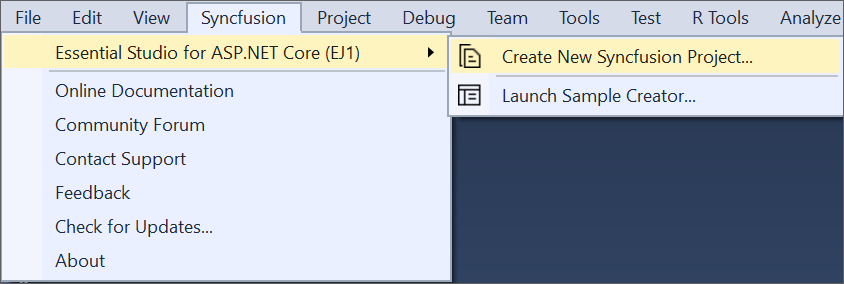
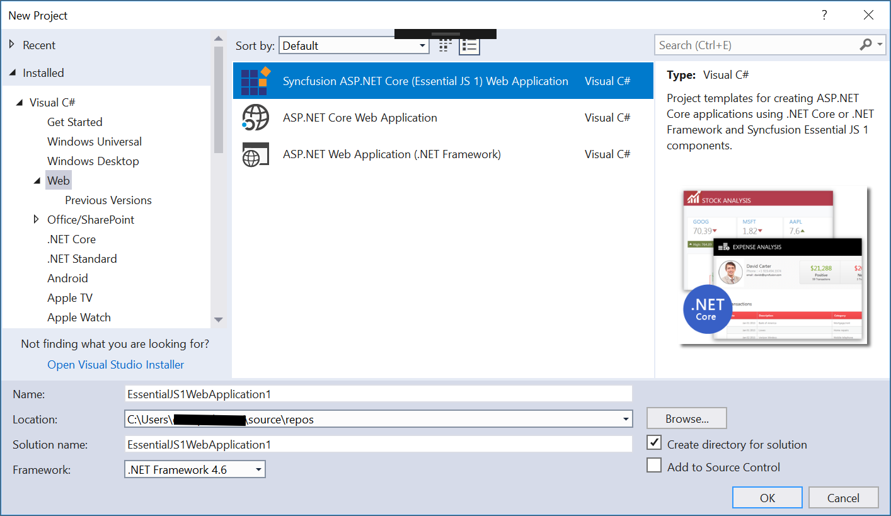

# Syncfusion&reg; Project Templates

Syncfusion&reg; provides the **Visual** **Studio** **Project** **Templates** for the Syncfusion&reg; ASP.NET Core platform to create Syncfusion&reg; ASP.NET Core Web Application.  

I> The Syncfusion&reg; ASP.NET Core project templates are available from v15.2.0.40.  

## Create Syncfusion&reg; ASP.NET Core Application

The following steps help you to create the **Syncfusion&reg;** **ASP****.****NET** **Core** **Application** through the **Visual** **Studio** **Project** **Template**.

> Before use the Syncfusion&reg; ASP.NET Core (Essential&reg; JS 1) Project Template, check whether the **Syncfusion&reg; Essential&reg; JS1 AspNet Core VSExtensions** installed or not in Visual Studio Extension Manager by clicking on the Tools -> Extensions and Updates -> Installed for Visual Studio 2017 or lower and for Visual Studio 2019 by clicking on the Extensions -> Manage Extensions -> Installed.

1. To create a Syncfusion&reg; ASP.NET Core (Essential&reg; JS 1) project, follow either one of the options below:

   **Option 1:**   
   Click **Syncfusion&reg; Menu** and choose **Essential Studio&reg; for ASP.NET Core (EJ1) > Create New Syncfusion&reg; Project…** in **Visual Studio**.

   

   N>In Visual Studio 2019, Syncfusion&reg; menu available under Extension in Visual Studio menu.

   **Option 2:**   
   Choose **File > New > Project** and navigate to **Syncfusion&reg; > .NET Core > Syncfusion&reg; ASP.NET Core (Essential&reg; JS 1) Web Application** in **Visual Studio**.

   

2. Name the **Project**, choose the destination location when required and set the Framework of the project, then click **OK**. The Project Configuration Wizard appears.

   N> Minimum target Framework is 4.5.2 for Syncfusion&reg; ASP.NET Core Project Templates.
   
3. Choose the options to configure the Syncfusion&reg; ASP.NET Core Application by using the following Project Configuration dialog.

   ### Project configurations:

   **Project Type:** Select the type of ASP.NET Core Project, either .NET Core or .NET Framework.

   **.NET Core Version:** Select the version of ASP.NET Core Project, either ASP.NET Core 1.0 or ASP.NET Core 1.1.

   **Assets From:** Load the Syncfusion&reg; assets to ASP.NET Core Project, either Bower, CDN or Installed Location.

   **Theme Selection:** Choose the required Theme.

   **Components:** Choose the Required Syncfusion&reg; components to configure.

   
   
4. Once you click Create button, the Syncfusion&reg; ASP.NET Core Application is created.

5. Required Syncfusion&reg; NuGet/Bower packages, Scripts and CSS are added to the Project.

   

   

6. Then, Syncfusion&reg; licensing registration required message box will be shown as follow, if you are installed the trial setup or NuGet packages since Syncfusion&reg; introduced the licensing system from 2018 Volume 2 (v16.2.0.41) Essential Studio&reg; release. Please navigate to the [help topic](https://help.syncfusion.com/common/essential-studio/licensing/license-key#how-to-generate-syncfusion-license-key) which is shown in the licensing message box to generate and register the Syncfusion&reg; license key to your project. Refer to this [blog](https://blog.syncfusion.com/post/Whats-New-in-2018-Volume-2-Licensing-Changes-in-the-1620x-Version-of-Essential-Studio.aspx) post for understanding the licensing changes introduced in Essential Studio&reg;.

      

