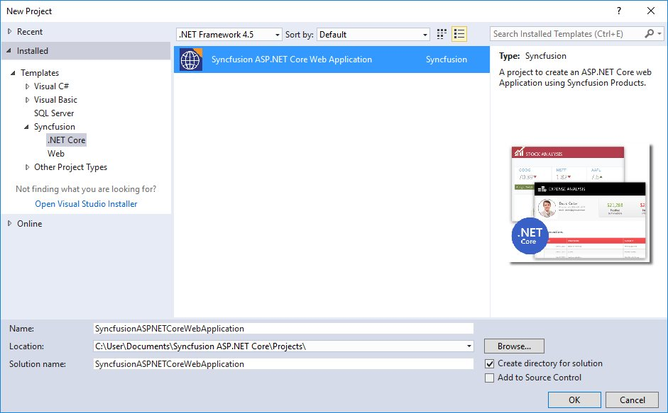

# Syncfusion Project Templates

Syncfusion provides the **Visual** **Studio** **Project** **Templates** for the Syncfusion ASP.NET Core platform to create Syncfusion ASP.NET Core Web Application.  

I> The Syncfusion ASP.NET Core project templates are available from v15.2.0.40.  

## Create Syncfusion ASP.NET Core Application

The following steps direct you to create the **Syncfusion** **ASP****.****NET** **Core** **Application** through the **Visual** **Studio** **Project** **Template**.

1. To create a Syncfusion ASP.NET Core project, choose **New** **Project****->** **Syncfusion****->****.NET** **Core****->****Syncfusion** **ASP****.****NET** **Core** **Application** from **Visual** **Studio**.

   

2. Name the **Project**, choose the destination location when required and set the Framework of the project, then click **OK**. The Project Configuration Wizard appears.

   N> Minimum target Framework is 4.5.2 for Syncfusion ASP.NET Core Project Templates.
   
3. Choose the options to configure the Syncfusion ASP.NET Core Application by using the following Project Configuration dialog.

   ### Project configurations:

   **Project Type:** Select the type of ASP.NET Core Project, either .NET Core or .NET Framework.

   **.NET Core Version:** Select the version of ASP.NET Core Project, either ASP.NET Core 1.0 or ASP.NET Core 1.1.

   **Assets From:** Load the Syncfusion assets to ASP.NET Core Project, either Bower, CDN or Installed Location.

   **Theme Selection:** Choose the required Theme.

   **Components:** Choose the Required Syncfusion components to configure.

   
   
4. Once you click Create button, the Syncfusion ASP.NET Core Application is created.

5. Required Syncfusion NuGet/Bower packages, Scripts and CSS are added to the Project.

   

   

6. Then, Syncfusion licensing registration required message box will be shown as follow, if you are installed the trial setup or NuGet packages since Syncfusion introduced the licensing system from 2018 Volume 2 (v16.2.0.41) Essential Studio release. Please navigate to the [help topic](https://help.syncfusion.com/common/essential-studio/licensing/license-key#how-to-generate-syncfusion-license-key) which is shown in the licensing message box to generate and register the Syncfusion license key to your project. Refer to this [blog](https://blog.syncfusion.com/post/Whats-New-in-2018-Volume-2-Licensing-Changes-in-the-1620x-Version-of-Essential-Studio.aspx) post for understanding the licensing changes introduced in Essential Studio.

      

