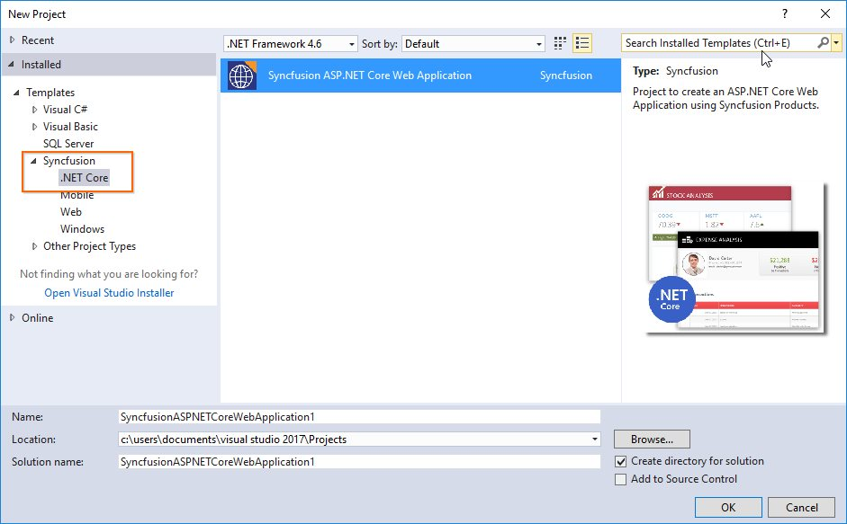
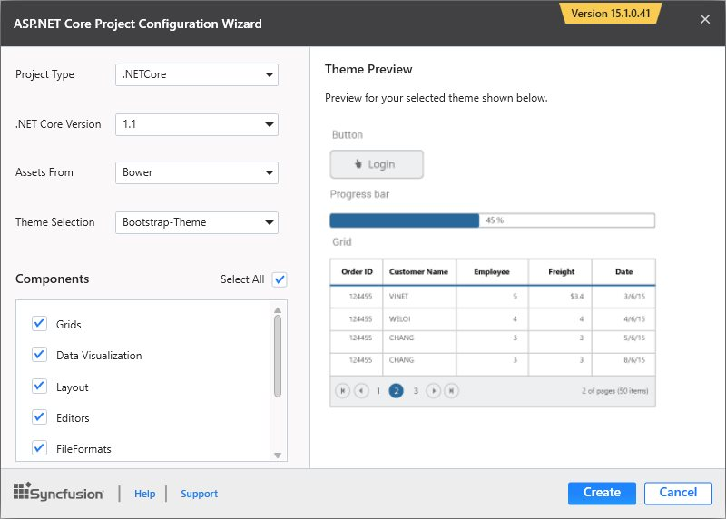
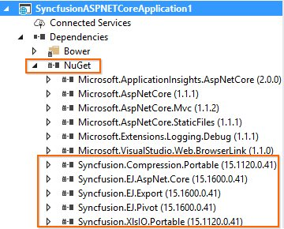
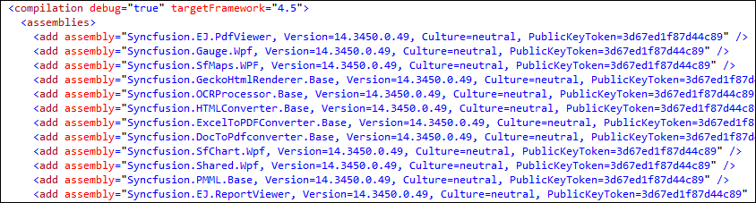

# Syncfusion Project Templates

Syncfusion provides the **Visual** **Studio** **Project** **Templates** for the Syncfusion ASP.NET Core platform to create Syncfusion ASP.NET Core Web Application.  

I> The Syncfusion ASP.NET COre templates are available from v15.2.0.x.  

## Create Syncfusion ASP.NET Core Application

The following steps direct you to create the **Syncfusion** **ASP****.****NET** **Core** **Application** through the **Visual** **Studio** **Project** **Template**.

1. To create a Syncfusion ASP.NET Core project, choose **New** **Project****->** **Syncfusion****->****.NET** **Core****->****Syncfusion** **ASP****.****NET** **Core** **Application** from **Visual** **Studio**.

   

2. Name the **Project**, choose the destination location when required and set the Framework of the project, then click **OK**. The Project Configuration Wizard appears.

   N> Minimum target Framework is 4.5 for Syncfusion ASP.NET Core Project Templates.
   
3. Choose the options to configure the Syncfusion ASP.NET Core Application by using the following Project Configuration dialog.

   ### Project configurations:

   **Project Type:** Select the type of ASP.NET Core Project, either .NET Core or .NET Framework.

   
 
   **.NET Core Version:** Select the version of ASP.NET Core Project, either ASP.NET Core 1.0 or ASP.NET Core 1.1.

   

   **Assets From:** Load the Syncfusion assets to ASP.NET Core Project, either Bower, CDN or Installed Location.

   

   **Theme Selection:** Choose the required Theme.

   
  
   **Components:** Choose the Required Syncfusion components to configure.

   
   
3. Once you click Create button, the Syncfusion ASP.NET Core Application is created.

4. Required Syncfusion NuGet/Bower packages, Scripts and CSS are added to the Project.

   

   

   

