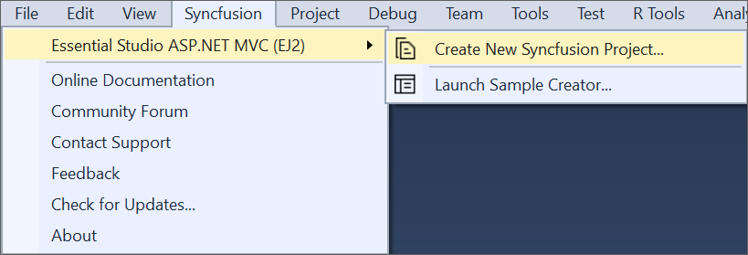
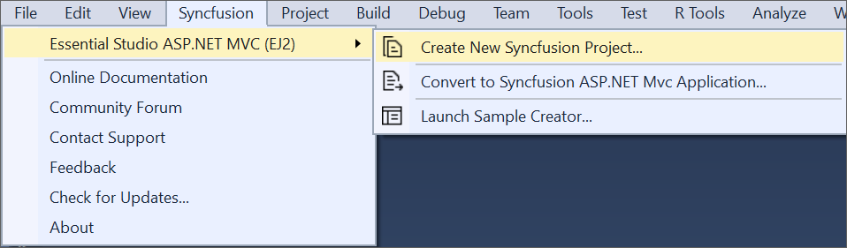
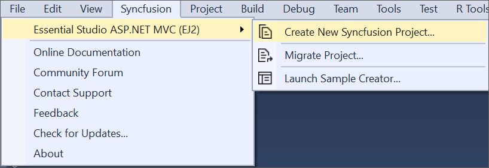

# ASP.NET MVC (Essential JS 2) Extension

## Overview

The Syncfusion ASP.NET MVC (Essential JS 2) Visual Studio Extensions can be accessed through the Syncfusion Menu to create and configure the project with Syncfusion references in Visual Studio.

I> The Syncfusion ASP.NET MVC (Essential JS 2) menu option is available from v17.1.0.32.

The Syncfusion provides the following extension supports in Visual Studio:

1.	[Syncfusion ASP.NET MVC (Essential JS 2) Project Template](https://help.syncfusion.com/extension/aspnetmvc-essentialjs2-extension/syncfusion-project-templates): To create the Syncfusion ASP.NET MVC (Essential JS 2) application by adding the required Essential JS 2 components.
2.	[Project Conversion](https://help.syncfusion.com/extension/aspnetmvc-essentialjs2-extension/project-conversion): To convert an existing ASP.NET MVC application into a Syncfusion ASP.NET MVC (Essential JS 2) application by adding the required Syncfusion assemblies and resource files.
3.	[Migrate Project](https://help.syncfusion.com/extension/aspnetmvc-essentialjs2-extension/project-migration): Migrate the existing Syncfusion ASP.NET MVC (Essential JS 2) application from one Essential Studio version to another version.
4.	[Sample Creator](https://help.syncfusion.com/extension/aspnetmvc-essentialjs2-extension/sample-creator): Create the Syncfusion ASP.NET MVC (Essential JS 2) Projects with the required Syncfusion configuration to start development with the required Syncfusion controls.

**No project selected in Visual Studio**

**Selected Microsoft ASP.NET MVC application in Visual Studio**

**Selected Syncfusion ASP.NET MVC (Essential JS2) application in Visual Studio**

N> In Visual Studio 2019, Syncfusion menu available under Extension in Visual Studio menu.
